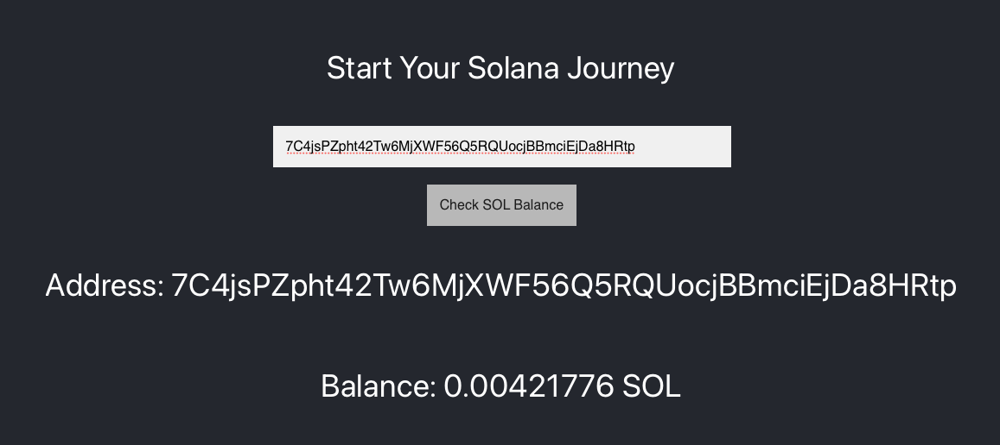

# 从 Solana 🤓 区块链读取数据

时光倒流，让我们回到那个熟悉的时刻——幼儿园时光。还记得你学到的第一件事吗？没错，字母表。当你掌握了所有26个字母后，阅读的大门就为你敞开。作为Solana开发者，这正是你学习之旅的起点。阅读英语的能力使你成为了一个能够理解和消化知识的超级大脑。

现在，是时候再次采取行动了。我们将从你幼儿园老师应该教授的基础开始——从区块链中读取数据。

## 👜 Solana上的账户

从Solana的字母表开始，我们有A代表账户。我们从账户开始，因为Solana上的智能合约（也称为“程序”）是无状态的——除了代码之外，它们不存储任何信息。一切都存储在账户中，所以账户对Solana来说至关重要。它们负责存储、合约和本地区块链程序的管理。

Solana 上有三种类型的账户：
- 数据帐户 - 嗯，这些就是用来存储数据的！
- 程序帐户 - 存储可执行程序（又称智能合约）的地方
- 原生账户 - 用于核心区块链功能，例如权益和投票的账户

至于本地账户（`native account`），是区块链运行所必需的，我们稍后会详细介绍。目前，我们只关注数据和程序账户。

在数据账户方面，还有两种进一步的类型：
- 系统拥有的帐户
- `PDA`（程序派生地址）帐户

我们很快会介绍这些具体是什么，现在请跟着一起学习。

每个账户都有一些你应该了解的字段：

| 字段 | 描述 |
| --- | --- |
| `lamports` |  账户拥有的lamports数量 |
| `owner` |  账户的所有者程序 |
| `executable` | 账户是否可以处理指令 |
| `data` |  账户存储的数据的字节码 |
| `rent_epoch` | 下一个需要付租金的`epoch`（周期） |

我们现在只关注我们需要了解的部分，所以即使有些内容不那么清晰，也请勇往直前 - 我们将在学习过程中填补这些空白。

`Lamport`是Solana的最小单位，类似于以太坊的Gwei。一个`Lamport`等于0.000000001 SOL，所以这个字段告诉我们账户拥有多少SOL。

每个账户都有一个公钥，就像账户的地址一样。你知道你的钱包有一个地址来接收那些炫酷的NFT吗？这就是同样的原理！Solana的地址只是用`base58`编码的字符串。

`executable` 是一个布尔字段，表示该帐户是否包含可执行数据。至于数据，就是存储在帐户中的内容，至于租金，我们稍后会谈到！

现在，让我们从简单的事情开始学习吧 :)

## 📫 从网络中读取

好的，我们现在明白了什么是账户，那么如何读取它们呢？我们将借助一个名为 JSON RPC 终端点的工具！你可以通过下图了解，你将在 Solana 网络中充当客户端角色，尝试获取信息。


你可以通过调用 JSON RPC 的API来获取所需的内容，它会与网络沟通并返回你所需的数据。

假设我们要查询账户的余额，API调用将如下所示：

```ts
async function getBalanceUsingJSONRPC(address: string): Promise<number> {
    const url = clusterApiUrl('devnet')
    console.log(url);
    return fetch(url, {
        method: 'POST',
        headers: { 'Content-Type': 'application/json' },
        body: JSON.stringify({
            "jsonrpc": "2.0",
            "id": 1,
            "method": "getBalance",
            "params": [
                address
            ]
        })
    }).then(response => response.json())
    .then(json => {
        if (json.error) {
            throw json.error
        }

        return json['result']['value'] as number;
    })
    .catch(error => {
        throw error
    })
}
```

这里涉及了很多步骤。我们正在进行一个POST请求，请求体中包含特定的参数来指导RPC执行什么操作。我们要指定RPC的版本、id、方法（本例中是`getBalance`），以及该方法所需的参数（本例中只有`address`）。

由于我们对一个非常简单的方法有大量的样板代码，我们可以使用Solana的Web3.js SDK。以下是所需的代码：


```ts
async function getBalanceUsingWeb3(address: PublicKey): Promise<number> {
    const connection = new Connection(clusterApiUrl('devnet'));
    return connection.getBalance(address);
}
```

是不是很美观？我们仅用三行代码就能获取某人的Solana余额。试想一下，如果获取任何人的银行余额也能如此简单。

现在你已经了解了如何从Solana的账户中读取数据！虽然这看起来可能很简单，但只要使用这个函数，你就能查询Solana上任何账户的余额。试想一下，如果你能获取地球上任何银行账户的余额，这将是多么强大的能力。

## 🤑 构建一个余额获取器

现在是时候构建一个通用的余额查询器了（假设整个宇宙都在Solana上运行）。这将是一个简洁而强大的应用程序，能查询Solana上任何账户的余额。

首先，在你的工作空间中创建一个文件夹，比如放在桌面上。[克隆起始库](https://github.com/RustyCab/solana-intro-frontend.git)并按照以下步骤设置：

```bash
git clone https://github.com/CreatorsDAO/solana-intro-frontend
cd solana-intro-frontend
git checkout starter
npm i
```

这是一个简单的Next.js应用程序，安装了所有依赖项后，你可以使用 `npm run dev` 命令启动它。你应该能在`localhost上`看到如下内容：



我们为你准备了一个基本的Next.js应用程序，并添加了一些样式。如果你在地址栏中输入并点击“检查SOL余额”按钮，你将看到1,000 SOL的余额显示。现在是时候让它真正起作用了。

首先，你需要安装`Solana/web3.js`库：

```bash
npm install @solana/web3.js
```

这将为我们提供一个非常简洁的函数来查询余额。转到 `index.tsx` 并将其导入到顶部：

```ts
import * as web3 from '@solana/web3.js'
```

接下来，我们将开始处理 `addressSubmittedHandler` 函数。首先，我们要将地址从字符串转换为公钥。记住，地址实际上并不是字符串，而是在JS中用字符串表示的。

```ts
const addressSubmittedHandler = (address: string) => {
    const key = new web3.PublicKey(address);
    setAddress(address)
    setBalance(1000)
}
```

这将验证你输入的内容是否是一个Solana地址。现在，如果你在地址栏中输入的内容不是一个密钥，应用程序会崩溃。很好！

现在，我们要使用这个密钥建立一个新的连接到JSON RPC。通过这个连接，我们将使用 `getBalance` 函数并使用 `setBalance` 设置结果！下面是完整的函数：


```ts
const addressSubmittedHandler = (address: string) => {
   const key = new web3.PublicKey(address);
   setAddress(key.toBase58())

   const connection = new web3.Connection(web3.clusterApiUrl('devnet'))

   connection.getBalance(key).then(balance => {
     setBalance(balance / web3.LAMPORTS_PER_SOL)
   })
}
```

这里有一些新元素：

- 我们正在使用 `key.toBase58` 来设置地址，这是Solana地址的字符串编码方式。
- 我们正在连接到 `devnet` 网络，有三个网络可供选择：主网、测试网和开发网。我们将在开发网上进行所有操作。
- 我们正在将余额从`Lamports`转换为SOL，因为余额是以Lamports返回的，而不是SOL。

我们做完了！如果你在这里粘贴一个地址，你会看到余额显示。确保你的账户有开发网络上的SOL！如果没有，你可以使用我的账户来测试应用 - `B1aLAAe4vW8nSQCetXnYqJfRxzTjnbooczwkUJAr7yMS`。

这个方案不错，但如果地址输入错误，就会出现一个很难处理的错误。让我们添加一些错误处理机制来解决这个问题。

```ts
const addressSubmittedHandler = (address: string) => {
  try {
    setAddress(address)
    const key = new web3.PublicKey(address)
    const connection = new web3.Connection(web3.clusterApiUrl('devnet'))
    connection.getBalance(key).then(balance => {
      setBalance(balance / web3.LAMPORTS_PER_SOL)
    })
  } catch (error) {
    setAddress('')
    setBalance(0)
    alert(error)
  }
}
```

现在，如果出现错误，你将会收到一个提示信息了 :D

哇塞，你刚刚成功发布了自己的第一个Solana应用。真棒！继续加油！


## 🚢 挑战

现在，让我们通过一个小挑战来考验一下你所学的知识。从你刚刚完成的应用出发，你需要在用户界面中添加一项功能，显示输入的地址是否为可执行账户。


要判断一个账户是否可执行，你需要执行以下操作：

1. 使用方法 `getAccountInfo` 来获取包含账户信息的JSON对象。
2. 检查该对象的属性以确定其是否可执行。
3. 在 `useState` 中添加另一个调用，允许你从账户信息中设置 `executable` 属性值，并在用户界面中展示。

下面是一个可供测试的账户地址：`ComputeBudget111111111111111111111111111111`。

请尽量自己尝试解决，不要提前查看答案！相信你会发现挑战其实并不复杂。

完成后，你可以在[这里](https://github.com/CreatorsDAO/solana-intro-frontend/tree/challenge-solution)查看挑战解决方案的参考代码。
