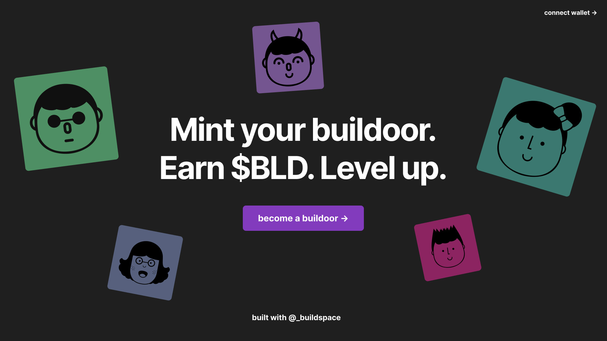

# 💻 构建 NFT 铸造者前端

欢迎来到第一周的SHIPPING环节。每周，你都会有一个特定的部分，用来将你所学的内容应用到自定义的NFT质押应用程序上，并且还有战利品箱子等你拿！

这些部分的核心目的是鼓励你走出本地开发环境，构建真实的、可以供他人使用的项目。许多成功的构建者都是通过在公众面前展示和开发他们的作品而获得成功的。这是你一直在准备的时刻——让我们开始吧🤘。

今天，我们要开始从前端制作那些炫酷的登录和铸造页面。



在第一个屏幕上，唯一的功能是连接到用户的钱包。你可以通过屏幕顶部的按钮或中间的按钮来实现。


第二个屏幕的功能将在下一个核心项目中实现，所以不必为“mint buildoor”按钮实现任何功能。

## 🕸 项目设置

我们将从零开始，没有模板！设置一个新的 Next.js 应用程序，并向其中添加 Chakra UI：

```bash
npx create-next-app --typescript
cd <you-project-name>
npm i @chakra-ui/react @emotion/react@^11 @emotion/styled@^11 framer-motion@^6 @chakra-ui/icons
npm i @solana/wallet-adapter-base @solana/wallet-adapter-react @solana/wallet-adapter-react-ui @solana/wallet-adapter-wallets @solana/web3.js
```

注意：在整个项目中，我们将使用Typescript！当然，如果你更喜欢，完全可以使用普通的Javascript :)。

如果系统要求安装 `create-next-app`，请确认安装。你可以为你的应用程序取任何你想要的名字，比如我就给我的应用程序命名为“构建器”，哈哈。

下一步，你可能想添加一些视觉素材。你可以在[这里](https://cdn.disco.co/media%2FAssets_a68f5cab-20c9-45c7-b25c-43bc9dcd9e7d.zip)找到资源包，也可以自己创建。包里有五个“头像”文件和一个背景的svg文件。请将它们放入项目的公共文件夹中。

现在，一切准备就绪，让我们开始构建吧！🚀

## ✨ 配置 Chakra UI

首个任务是配置 Chakra UI，这样我们就能避免手动编写大量的 CSS。我们将在 `pages/_app.tsx` 文件中执行此操作：

```ts
import type { AppProps } from "next/app"
import { ChakraProvider } from "@chakra-ui/react"
import { extendTheme } from "@chakra-ui/react"

const colors = {
  background: "#1F1F1F",
  accent: "#833BBE",
  bodyText: "rgba(255, 255, 255, 0.75)",
}

const theme = extendTheme({ colors })

function MyApp({ Component, pageProps }: AppProps) {
  return (
    <ChakraProvider theme={theme}>
        <Component {...pageProps} />
    </ChakraProvider>
  )
}

export default MyApp
```

这里我添加了一些自定义的颜色，你也可以根据自己的喜好进行调整！

## 🌶 添加一些样式

接下来，打开 `styles/Home.module.css` 文件并将其修改如下：

```css
.container {
  background: #1F1F1F;
}
.wallet-adapter-button-trigger {
  background-color: #833BBE;
}
```

如果样式文件夹中有 `globals.css` 文件，请将其删除。我们不会用到它！

然后，我们将处理 `index.tsx` 文件。我们将更新导入语句，以使用 Chakra UI，并修改渲染代码（只需保留一个 `<div className={styles.container}`）。然后将导入更新为：

```ts
import { Box, Center, Spacer, Stack } from "@chakra-ui/react"
import type { NextPage } from "next"
import Head from "next/head"
import styles from "../styles/Home.module.css"

const Home: NextPage = () => {

  return (
    <div className={styles.container}>
      <Head>
        <title>Buildoors</title>
        <meta name="The NFT Collection for Buildoors" />
        <link rel="icon" href="/favicon.ico" />
      </Head>

      <Box
        w="full"
        h="calc(100vh)"
        bgImage={"url(/home-background.svg)"}
        backgroundPosition="center"
      >
        <Stack w="full" h="calc(100vh)" justify="center">
          { /* 导航栏 */ }

          <Spacer />
          <Center>
            { /* 如果已连接，则显示第二个视图，否则显示第一个视图 */ }
          </Center>
          <Spacer />

          <Center>
            <Box marginBottom={4} color="white">
              <a
                href="https://twitter.com/_buildspace"
                target="_blank"
                rel="noopener noreferrer"
              >
                与 @_buildspace 一同打造
              </a>
            </Box>
          </Center>
        </Stack>
      </Box>
    </div>
  )
}

export default Home
```

这段代码设置了应用程序的主页面，并使用了Chakra UI的一些组件来简化布局和样式。现在，你的前端页面应该已经具备了基本的结构和风格，接下来你可以继续添加更多的功能和内容！🎨

## 🎫 添加导航栏

现在让我们构建导航栏（`NavBar`）。请创建一个 `components` 文件夹，并在其中添加一个新文件 `NavBar.tsx`。我们将其构建为一个水平堆栈，其中包括一个空间间隔器和一个用于连接钱包的按钮：

```ts
import { HStack, Spacer } from "@chakra-ui/react"
import { FC } from "react"
import styles from "../styles/Home.module.css"
import dynamic from "next/dynamic";

const WalletMultiButtonDynamic = dynamic(
	async () =>
		(await import("@solana/wallet-adapter-react-ui")).WalletMultiButton,
	{ ssr: false }
);

const NavBar: FC = () => {
  return (
    <HStack width="full" padding={4}>
      <Spacer />
			<WalletMultiButtonDynamic className={styles["wallet-adapter-button-trigger"]}/>
    </HStack>
  )
}

export default NavBar
```

这里我们使用 `import dynamic from "next/dynamic"` 从 `@solana/wallet-adapter-react-ui` 动态导入 `WalletMultiButton`，并将其分配给 `WalletMultiButtonDynamic`。这是必需的，因为 NextJS 是服务器端渲染的，在客户端加载之前无法访问依赖于浏览器 API（例如 window）的外部依赖项或组件。因此，通过 `{ ssr: false }`，我们禁用了导入的服务器渲染。关于动态导入的更多信息，你可以在[这里](https://nextjs.org/docs/advanced-features/dynamic-import?utm_source=buildspace.so&utm_medium=buildspace_project)阅读。

现在返回到 `index.tsx` 文件，导入 `NavBar` 并将其放在堆栈的顶部（我已留下评论说明它应该放在哪里）：

```ts
// 现有的导入
import NavBar from "../components/NavBar"

const Home: NextPage = () => {

  return (
    <div className={styles.container}>
      <Head>
      // ... 其他代码 ...

      <Box
        w="full"
        h="calc(100vh)"
        bgImage={"url(/home-background.svg)"}
        backgroundPosition="center"
      >
        <Stack w="full" h="calc(100vh)" justify="center">
         { /* NavBar */ }
          <NavBar />

// 其余的文件保持不变
```

至此，除了“连接钱包（`Connect Wallet`）”按钮外，在 `localhost:3000` 上还没有任何内容。但我们已经迈出了实现更多功能的重要一步。让我们继续前进！🚀

## 🏠 创建登录页面

在 `components` 文件夹中创建一个名为 `Disconnected.tsx` 的文件，并添加以下内容：

```ts
import { FC, MouseEventHandler, useCallback } from "react"
import {
  Button,
  Container,
  Heading,
  HStack,
  Text,
  VStack,
} from "@chakra-ui/react"
import { ArrowForwardIcon } from "@chakra-ui/icons"

const Disconnected: FC = () => {

  const handleClick: MouseEventHandler<HTMLButtonElement> = useCallback(
    (event) => {
      if (event.defaultPrevented) {
        return
      }
    },
    []
  )

  return (
    <Container>
      <VStack spacing={20}>
        <Heading
          color="white"
          as="h1"
          size="3xl"
          noOfLines={2}
          textAlign="center"
        >
          打造你的 buildoor。赚取 $BLD。升级。
        </Heading>
        <Button
          bgColor="accent"
          color="white"
          maxW="380px"
          onClick={handleClick}
        >
          <HStack>
            <Text>成为 buildoor</Text>
            <ArrowForwardIcon />
          </HStack>
        </Button>
      </VStack>
    </Container>
  )
}

export default Disconnected
```

这将是我们的登录页面 - 用户首次访问网站时会看到的视图。你需要将其导入到 `index.tsx` 中，并将其放置在渲染组件的中间位置（你可以再次查找相应的注释来找到正确的位置）。

```ts
// 现有的导入
import Disconnected from '../components/Disconnected'

const Home: NextPage = () => {

  return (
    <div className={styles.container}>
      <Head>
      // ... 其他代码 ...

      <Box
        w="full"
        h="calc(100vh)"
        bgImage={"url(/home-background.svg)"}
        backgroundPosition="center"
      >
        <Stack w="full" h="calc(100vh)" justify="center">
         { /* NavBar */ }
          <NavBar />

          <Spacer />
          <Center>
            <Disconnected />
          </Center>
          <Spacer />

// 其余的文件保持不变
```

现在，如果你访问 `localhost:3000`，你应该会看到一个带有“成为 buildoor”按钮的登录页面。如果你点击它，目前什么也不会发生。这显然不是我们想要的，所以接下来我们要处理这个问题！让我们继续！

## 🔌 连接到用户的钱包

这一部分中，我们将连接到用户的钱包，确保你的应用可以与用户的钱包互动。

首先，我们需要安装一些必要的依赖包：

```bash
npm i @solana/wallet-adapter-base @solana/wallet-adapter-react @solana/wallet-adapter-react-ui @solana/wallet-adapter-wallets @solana/web3.js
```

这些库将帮助我们与用户的Solana钱包连接。

如果你要为特定钱包构建，你可以在这里自定义设置。这里我们只是使用默认配置。

在 `components` 文件夹中，创建一个名为 `WalletContextProvider.tsx` 的文件，我们将在其中放置所有这些配置：

```ts
import { FC, ReactNode, useMemo } from "react"
import {
  ConnectionProvider,
  WalletProvider,
} from "@solana/wallet-adapter-react"
import { WalletModalProvider } from "@solana/wallet-adapter-react-ui"
import { clusterApiUrl } from "@solana/web3.js"
import { PhantomWalletAdapter } from "@solana/wallet-adapter-wallets"
require("@solana/wallet-adapter-react-ui/styles.css")

const WalletContextProvider: FC<{ children: ReactNode }> = ({ children }) => {
  const url = useMemo(() => clusterApiUrl("devnet"), [])
  const phantom = new PhantomWalletAdapter()

  return (
    <ConnectionProvider endpoint={url}>
      <WalletProvider wallets={[phantom]}>
        <WalletModalProvider>{children}</WalletModalProvider>
      </WalletProvider>
    </ConnectionProvider>
  )
}

export default WalletContextProvider
```

然后，我们需要将这个组件导入到 `_app.tsx` 文件中：

```ts
import WalletContextProvider from '../components/WalletContextProvider'

<ChakraProvider theme={theme}>
	<WalletContextProvider>
		<Component {...pageProps} />
	</WalletContextProvider>
</ChakraProvider>
```

我们现在想让“成为建造者”按钮也能连接到钱包。在 `Disconnected.tsx` 文件中，添加以下导入：

```ts
import { useWalletModal } from "@solana/wallet-adapter-react-ui"
import { useWallet } from "@solana/wallet-adapter-react"
```

然后在渲染之前，更新 `Disconnected` 组件的主体如下：

```ts
const modalState = useWalletModal()
const { wallet, connect } = useWallet()

const handleClick: MouseEventHandler<HTMLButtonElement> = useCallback(
  (event) => {
    if (event.defaultPrevented) {
      return
    }

    if (!wallet) {
      modalState.setVisible(true)
    } else {
      connect().catch(() => {})
    }
  },
  [wallet, connect, modalState]
)
```

现在一切准备就绪，你应该可以连接到用户的钱包了！这一步骤使你的应用程序能够与Solana区块链进行交互，从而为用户提供更丰富的体验。

## 🎇 创建连接视图

现在我们已经可以连接钱包了，下一步就是更新视图来展示连接状态下的用户界面。首先，在`components`文件夹中创建一个名为`Connected.tsx`的文件，它将定义连接成功后的页面。

```ts
import { FC } from "react"
import {
  Button,
  Container,
  Heading,
  HStack,
  Text,
  VStack,
  Image,
} from "@chakra-ui/react"
import { ArrowForwardIcon } from "@chakra-ui/icons"

const Connected: FC = () => {
  return (
    <VStack spacing={20}>
      <Container>
        <VStack spacing={8}>
          <Heading
            color="white"
            as="h1"
            size="2xl"
            noOfLines={1}
            textAlign="center"
          >
            欢迎，Buildoor。
          </Heading>

          <Text color="bodyText" fontSize="xl" textAlign="center">
            每个buildoor都是随机生成的，可以抵押接收
            <Text as="b"> $BLD</Text>。使用你的 <Text as="b"> $BLD</Text>
            升级你的buildoor，并在社区内获得特权！
          </Text>
        </VStack>
      </Container>

      <HStack spacing={10}>
        <Image src="avatar1.png" alt="" />
        <Image src="avatar2.png" alt="" />
        <Image src="avatar3.png" alt="" />
        <Image src="avatar4.png" alt="" />
        <Image src="avatar5.png" alt="" />
      </HStack>

      <Button bgColor="accent" color="white" maxW="380px">
        <HStack>
          <Text>铸造buildoor</Text>
          <ArrowForwardIcon />
        </HStack>
      </Button>
    </VStack>
  )
}

export default Connected
```

接下来，我们需要将该视图嵌入到主页面。回到`index.tsx`文件，添加以下导入：

```ts
import { useWallet } from "@solana/wallet-adapter-react"
import Connected from "../components/Connected"
```

然后，我们可以使用`useWallet` hooks来访问一个告诉我们是否已连接的变量。我们可以用它来有条件地渲染`Connected`和`Disconnected`视图。

```ts
const Home: NextPage = () => {
  const { connected } = useWallet()

  return (
    <div className={styles.container}>
      <Head>
        <title>Buildoors</title>
        <meta name="Buildoors的NFT收藏" />
        <link rel="icon" href="/favicon.ico" />
      </Head>

      <Box
        w="full"
        h="calc(100vh)"
        bgImage={connected ? "" : "url(/home-background.svg)"}
        backgroundPosition="center"
      >
        <Stack w="full" h="calc(100vh)" justify="center">
          <NavBar />

          <Spacer />
          <Center>{connected ? <Connected /> : <Disconnected />}</Center>
          <Spacer />
```

完成了！现在我们已经配置好了前端，并且在用户铸造buildoors时流程顺畅。这个界面不仅直观，还提供了丰富的用户体验。
