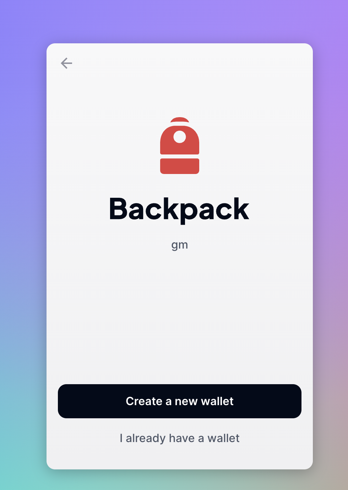
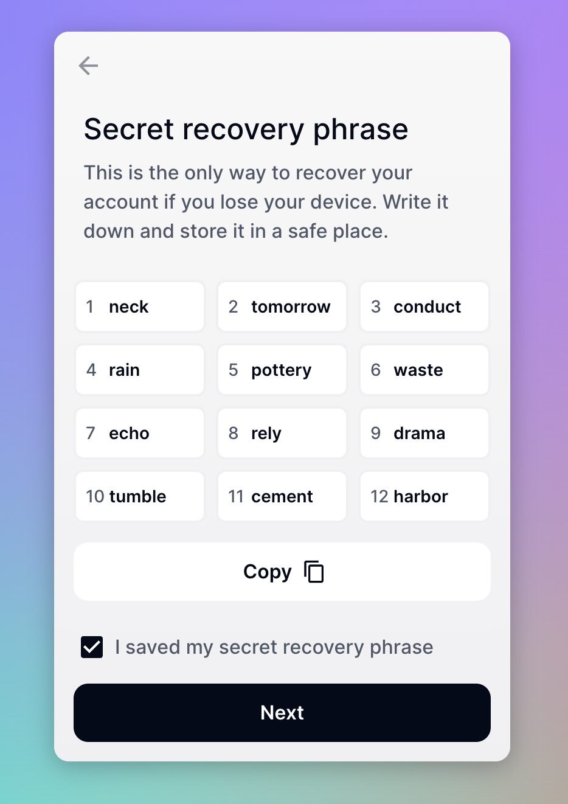
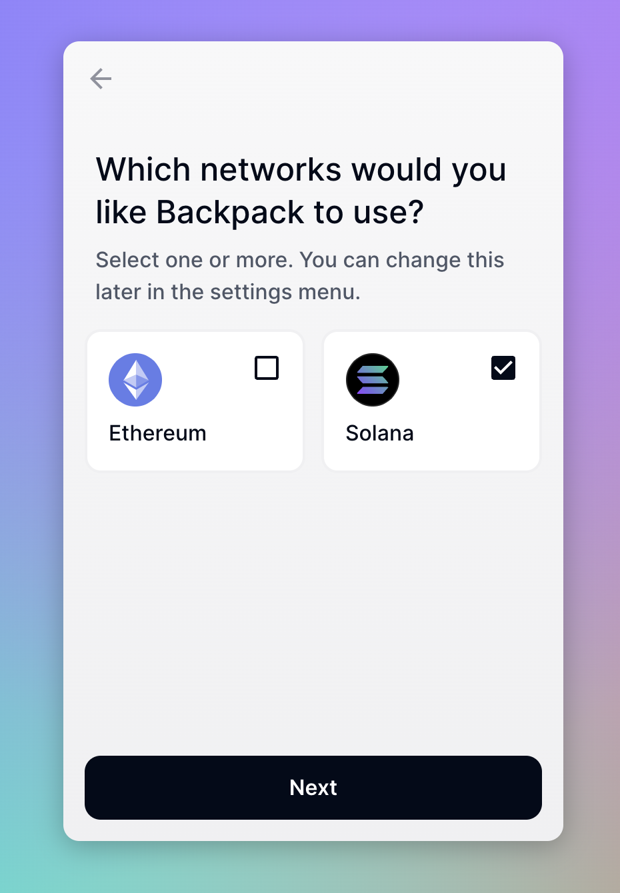
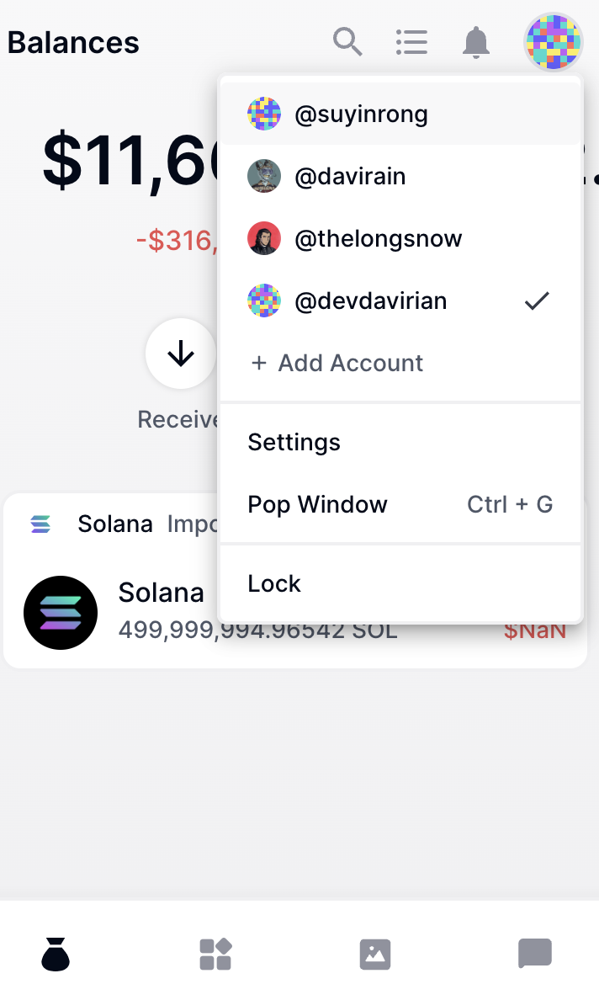
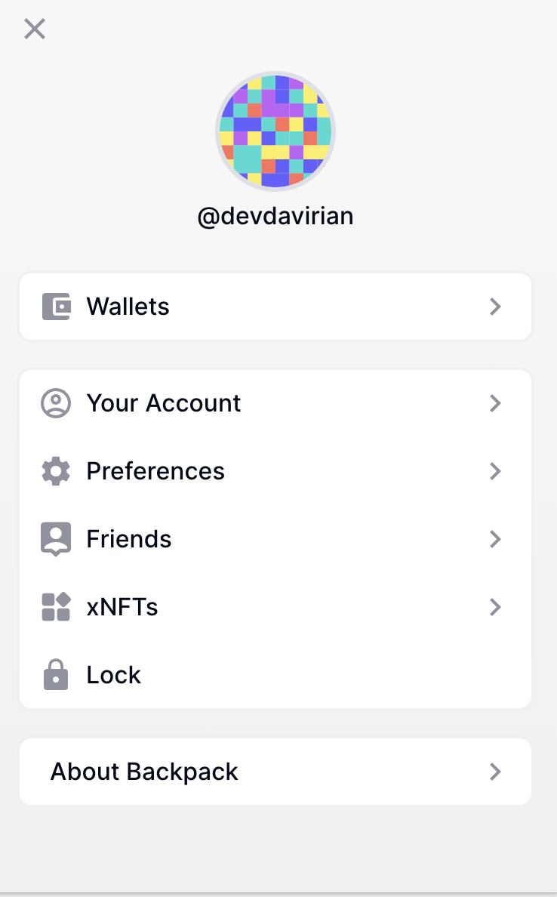
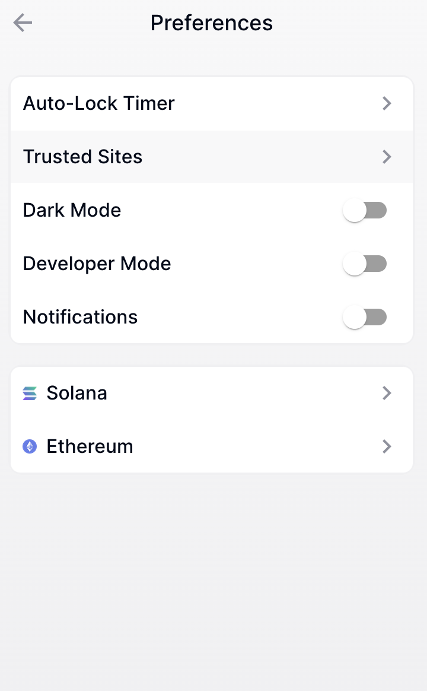

# Solana钱包使用 - Backpack 🎒

Solana的钱包种类繁多，如众所周知的Phantom钱包。然而，在此我并不推荐使用Phantom，因为对于开发者来说，它并不够友好。

在本地开发时，Phantom不支持本地RPC地址，只能使用Solana官方的测试网络。这样一来，开发者在本地开发时就会受限制。正因如此，我推荐使用`Backpack`钱包。

## 下载Backpack钱包

下载地址：[`https://www.backpack.app/`](https://www.backpack.app/)。点击页面上的“Download”按钮，然后选择适合自己浏览器的插件。

目前Backpack钱包只支持Chrome、Brave和Arc浏览器。移动端版本还在开发中。

## 创建账户

下载安装完毕后，你将看到登录界面。点击`Create Account`创建账户。

接下来是Claim账户名字的步骤，输入你想要的账户名字，然后点击`Claim Name`。

此后，系统将引导你选择创建新的钱包或导入私钥。在此我们选择创建新的钱包。

接下来将展示助记词界面，你可以将助记词保存到本地，然后继续下一步。

由于Backpack是一个多链钱包，在此我们选择Solana链，然后继续下一步。

## 设置自定义的RPC Endpoint

账户创建完毕后，我们来设置自定义的`RPC Endpoint`。点击右上角的设置按钮，然后选择`Preference`。

然后点击Preference选项。

你将看到有两个网络选项，分别是Solana和以太坊。我们在这里选择Solana。

接下来就是设置自定义rpc的环节，我们在此选择了`localnet`。

在`Custom`选项下，你可以自定义Rpc地址。除了官方提供的`testnet`或`mainbeta`地址，你还可以通过`quicknode`或`helius`申请自己的rpc地址。

## 参考资料

- Quicknode
- helius

总而言之，Backpack钱包由于其对开发者友好的特性，以及灵活的自定义RPC设置功能，成为了一款值得推荐的钱包选项。它使得开发者能够更便捷、灵活地进行Solana开发和测试工作。
