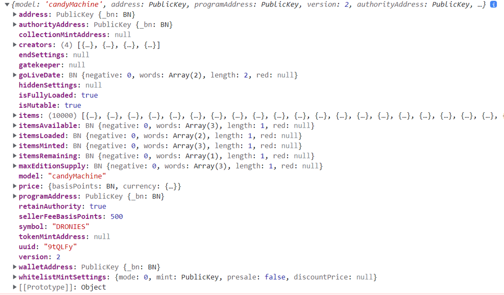
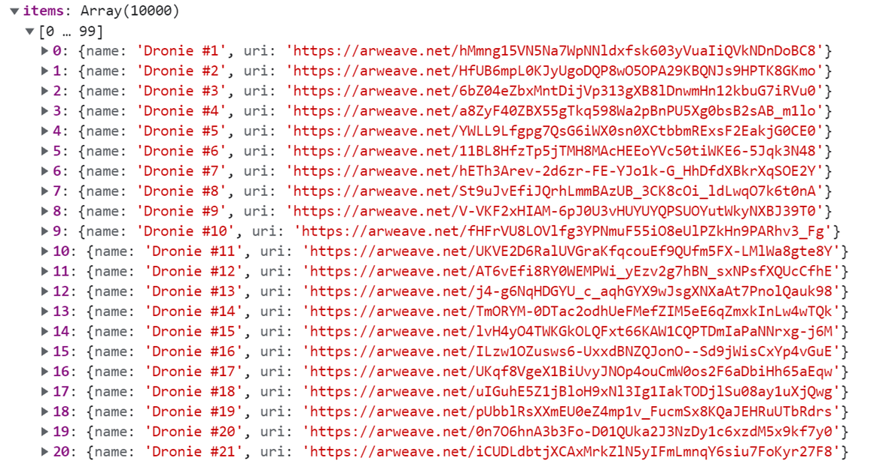

# 🖼 从糖果机展示NFTs

现在我们已经铸造了一个NFT，我们将学习如何铸造一系列的NFT。我们将使用Candy Machine来完成这个任务——这是一个Solana程序，允许创作者将他们的资产上链。这不是创建系列的唯一方式，但在Solana上它是标准的，因为它具有许多有用的功能，如机器人保护和安全随机化。你知道看到闪亮的新iPhone有多令人兴奋吗？稀有的NFT有点像那样。对于优秀的艺术家来说，即使只是看着它们也很有趣。毕竟，艺术就是用来欣赏的！让我们弄清楚如果我们只有Candy Machine的地址，我们如何展示NFTs。

你能猜到这里发生了什么不同吗？是的，我们只是在SDK上使用了一种不同的方法！


既然这里没有钱包，我们就不需要使用 `walletAdapterIdentity` ，只需要使用`metaplex`对象即可。


我们这里只有几个选择 - `findByAddress` 是我们想要的一个。



与我们为单个NFT所获得的类似，我们将获得整个糖果机实例的元数据。 `items` 字段是糖果机中所有NFT的数组。每个项目都不会包含我们想要的内容，而是会指向一个我们可以从中获取资产的URI。



由于收藏品可能非常庞大，我们不会一次性获取所有的NFT。相反，我们将根据分页系统仅获取我们想要展示的NFT。

让我们来绘制一些像素吧！

## 🥁 请拿来一个糖果机


您可以继续上一节的进度，或者使用上次我们使用的相同模板（起始分支即可）。

快进入 `FetchCandyMachine.tsx` 。你会看到一些设置已经为你准备好了。我们将使用 `getPage` 函数从糖果机上获取“页面”上的物品。在此之前，我们需要获取糖果机的元数据账户。

在空的 `fetchCandyMachine` 函数上方设置 `metaplex` 对象的连接

```js
export const FetchCandyMachine: FC = () => {
	// placeholder CMv2 address
  const [candyMachineAddress, setCandyMachineAddress] = useState("")
  const [candyMachineData, setCandyMachineData] = useState(null)
  const [pageItems, setPageItems] = useState(null)
  const [page, setPage] = useState(1)

  const { connection } = useConnection()
  const metaplex = Metaplex.make(connection)
  ```

在创建有状态变量时，请确保添加您的Candy Machine地址

```js
export const FetchCandyMachine: FC = () => {
  const [candyMachineAddress, setCandyMachineAddress] = useState("CM_ADDRESS_HERE")
  ...
```

接下来，我们将完成 `fetchCandyMachine` 。我们将使用之前看到的 `findByAddress` 方法。

```js
export const FetchCandyMachine: FC = () => {
	...

  // fetch candymachine by address
  const fetchCandyMachine = async () => {

    // Set page to 1 - we wanna be at the first page whenever we fetch a new Candy Machine
    setPage(1)

    // fetch candymachine data
    try {
      const candyMachine = await metaplex
        .candyMachinesV2()
        .findByAddress({ address: new PublicKey(candyMachineAddress) })

      setCandyMachineData(candyMachine)
    } catch (e) {
      alert("Please submit a valid CMv2 address.")
    }
  }
	...
}
```


注意：Metaplex CLI的最新版本在函数调用的末尾不需要 `run()` 。

现在是重要的部分 - 浏览我们将获得的CM数据。以下是 `getPage` 函数的样子：

```js
export const FetchCandyMachine: FC = () => {
	...

	// paging
  const getPage = async (page, perPage) => {
    const pageItems = candyMachineData.items.slice(
      (page - 1) * perPage,
      page * perPage
    )

    // fetch metadata of NFTs for page
    let nftData = []
    for (let i = 0; i < pageItems.length; i++) {
      let fetchResult = await fetch(pageItems[i].uri)
      let json = await fetchResult.json()
      nftData.push(json)
    }

    // set state
    setPageItems(nftData)
  }
	...
}

```

我们在这里做的是将 `items` 数组切割成大小为10的块。然后我们获取页面中每个NFT的元数据，并将其存储在 `nftData` 中。最后，我们将 `pageItems` 状态变量设置为刚刚获取的 `nftData` 。

这意味着我们的应用程序在任何时候只会渲染当前页面的NFT。不错！

让我们填写 `prev` 和 `next` 函数：

```js
// previous page
const prev = async () => {
  if (page - 1 < 1) {
    setPage(1)
  } else {
    setPage(page - 1)
  }
}

// next page
const next = async () => {
  setPage(page + 1)
}
```

当用户点击“上一个”和“下一个”按钮时，这些将会运行，这些按钮只会在 `pageItems` 不为空时显示（即当我们获取了一个CM的NFT时）。

现在我们需要一些 `useEffects` 来开始。整个过程一开始可能会有点困惑，所以让我们一步一步来解析。

- 1. 在页面加载时运行 `fetchCandyMachine` 函数（如果 `candyMachineAddress` 不为空）
- 2. 每当使用 `fetchCandyMachine` 获取糖果机时，将 `page` 设置为1，这样你就可以得到第一页。
- 3. 每当 `candyMachineData` 或 `page` 发生变化（即输入新的CM地址或点击下一个/上一个按钮），加载页面。

这是代码中的样子：

```js
export const FetchCandyMachine: FC = () => {
	...

  // fetch placeholder candy machine on load
  useEffect(() => {
    fetchCandyMachine()
  }, [])

  // fetch metadata for NFTs when page or candy machine changes
  useEffect(() => {
    if (!candyMachineData) {
      return
    }
    getPage(page, 9)
  }, [candyMachineData, page])

}
```

快去 `localhost:3000` 试试吧！你应该能看到你的糖果机上的NFT的第一页。
