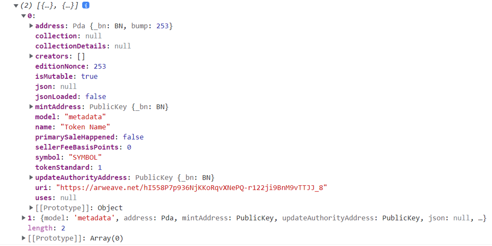

# 💃 展示`NFTs`

既然我们已经铸造了一个`NFT`，现在我们将进一步探讨如何铸造一整套`NFT`。我们将借助`Candy Machine`来实现这个任务——这是一个`Solana`程序，可以让创作者轻松地将他们的资产上链。当然，这并不是在`Solana`上创建系列的唯一方法，但它确实成为了标准，因为它具备了许多实用功能，例如防机器人保护和安全随机化。毕竟，如果你不能向人们展示你的`NFT`，那它还有什么价值呢！在这一节，我们将引导你展示你的作品——首先在钱包中展示，然后在`Candy Machine`中展示。

你可能会好奇为什么要这样做。想象一下，你的朋友在你的网站上从你的收藏中铸造了一个很酷的Pepe `NFT`。他们已经铸造了许多与`Pepe`有关的项目，因此他们的钱包中有几十个`NFT`。他们怎么知道哪一个是从你的收藏中铸造的呢？你得向他们展示！

你可能还记得，从第一周开始，我们想要的一切都存储在账户中。这意味着你可以仅通过使用钱包地址来获取他们的`NFT`，尽管这需要付出更多努力。

相反，我们将利用`Metaplex SDK`，它让一切都变得就像调用`API`一样简单。以下是它的样子：

你需要进行通常的Metaplex设置，但是我们将使用 `walletAdapterIdentity` 而不是 `keypairIdentity` 来进行连接，因为我们并不需要他们的密钥对，哈哈。一旦完成，我们只需使用Metaplex对象调用 `findAllByOwner` 方法。

下图显示了单个`NFT`的`NFT`数据在控制台上的打印结果，我们主要关注的是 `uri` 字段：

顺便提一下，还有许多其他方法可以获取`NFT`：

现在，让我们开始编写代码吧！
