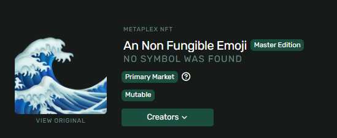

# 🤨 NFT你的脸

有什么比将你的脸做成NFT更好的选择呢？你可以将自己永恒地成为一个早期的建设者，并告诉你的妈妈你已经登上了区块链。

我们将从一个客户开始

```bash
npx create-solana-client [name] --initialize-keypair
cd [name]
```

请请大招：

```bash
npm install @metaplex-foundation/js fs
```

将两个图像添加到 `src` 文件夹中。我们将使用其中一个作为初始图像，第二个作为更新后的图像。

这是我们在 `src/index.ts` 中需要的导入项，没有什么新的东西：

```ts
import { Connection, clusterApiUrl, PublicKey } from "@solana/web3.js"
import {
  Metaplex,
  keypairIdentity,
  bundlrStorage,
  toMetaplexFile,
  NftWithToken,
} from "@metaplex-foundation/js"
import * as fs from "fs"
```

如果我们声明常量，那么在创建和更新NFT之间更改变量会更容易

```ts
const tokenName = "Token Name"
const description = "Description"
const symbol = "SYMBOL"
const sellerFeeBasisPoints = 100
const imageFile = "test.png"

async function main() {
		...
}
```

我们不会创建一个辅助函数，而是可以将所有内容放在 `main()` 中。我们将首先创建一个 Metaplex 实例：


```ts
async function main() {
  ...

  const metaplex = Metaplex.make(connection)
    .use(keypairIdentity(user))
    .use(
      bundlrStorage({
        address: "https://devnet.bundlr.network",
        providerUrl: "https://api.devnet.solana.com",
        timeout: 60000,
      })
    )
}
```

上传图片，我们需要：

- 读取图像文件
- 转换为Metaplex文件
- 上传图片

```ts
async function main() {
	...

  // file to buffer
  const buffer = fs.readFileSync("src/" + imageFile)

  // buffer to metaplex file
  const file = toMetaplexFile(buffer, imageFile)

  // upload image and get image uri
  const imageUri = await metaplex.storage().upload(file)
  console.log("image uri:", imageUri)
}
```

最后，我们可以使用我们得到的图像URI上传元数据

```ts
async function main() {
	...

  // upload metadata and get metadata uri (off chain metadata)
  const { uri } = await metaplex
    .nfts()
    .uploadMetadata({
      name: tokenName,
      description: description,
      image: imageUri,
    })

  console.log("metadata uri:", uri)
}
```

在这里，一个专门的铸币NFT功能是一个好主意，将其放在主要功能之外

```ts
// create NFT
async function createNft(
  metaplex: Metaplex,
  uri: string
): Promise<NftWithToken> {
  const { nft } = await metaplex
    .nfts()
    .create({
      uri: uri,
      name: tokenName,
      sellerFeeBasisPoints: sellerFeeBasisPoints,
      symbol: symbol,
    })

  console.log(
    `Token Mint: https://explorer.solana.com/address/${nft.address.toString()}?cluster=devnet`
  )

  return nft
}
```

现在你只需要在你的函数末尾调用它即可：

```ts
async function main() {
	...

  await createNft(metaplex, uri)
}
```

我们准备好铸造我们的NFT了！在终端中运行脚本 `npm run start` ，并点击Solana Explorer的URL，你应该会看到类似这样的内容：


我们刚在Solana上制作了一个NFT🎉🎉🎉。这就像热一热现成的饭菜一样简单。

## 🤯 更新你的NFT

总结一下，让我们快速看一下如何更新刚刚铸造的NFT。

在你的脚本顶部，将 imageFile 常量更新为你的NFT最终图像的名称。

唯一改变的是我们称之为Metaplex的方法。将其添加到main之外的任何位置。

```ts
async function updateNft(
  metaplex: Metaplex,
  uri: string,
  mintAddress: PublicKey
) {
  // get "NftWithToken" type from mint address
  const nft = await metaplex.nfts().findByMint({ mintAddress })

  // omit any fields to keep unchanged
  await metaplex
    .nfts()
    .update({
      nftOrSft: nft,
      name: tokenName,
      symbol: symbol,
      uri: uri,
      sellerFeeBasisPoints: sellerFeeBasisPoints,
    })

  console.log(
    `Token Mint: https://explorer.solana.com/address/${nft.address.toString()}?cluster=devnet`
  )
}
```

现在在主函数中，你可以注释掉 `createNFT` 的调用，并使用 `updateNFT` 辅助函数：

```ts
async function main() {

  ...

  // await createNft(metaplex, uri)

  // You can get this from the Solana Explorer URL
  const mintAddress = new PublicKey("EPd324PkQx53Cx2g2B9ZfxVmu6m6gyneMaoWTy2hk2bW")
  await updateNft(metaplex, uri, mintAddress)
}
```

您可以从在铸造NFT时记录的URL中获取薄荷地址。它出现在多个位置 - URL本身、"地址"属性和元数据选项卡中。



