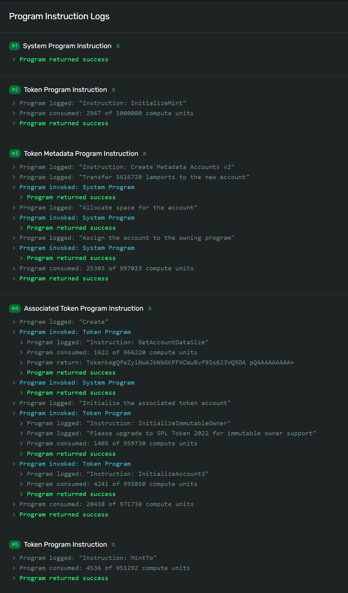

# 🧬 为你的代币赋予身份

现在是时候让代币与它们的创造者（也就是你）相遇了。我们将在之前构建的基础上继续前进。如果需要，你可以从[这个链接获取起始代码](https://github.com/buildspace/solana-token-client/tree/solution-without-burn)（确保你处于 `solution-without-burn` 分支）。

首先，我们要添加新的依赖项：

```bash
npm install @metaplex-foundation/js fs
npm install @metaplex-foundation/mpl-token-metadata
```

我们将借助Metaplex SDK添加元数据，并使用 `fs` 库来读取代币的标志图片。接下来，创建一个名为 `assets` 的新文件夹，并添加你的标志。这将在测试网络上进行，所以尽情玩乐吧！我选了一个比萨饼的表情符号，所以我把文件命名为`pizza.png`，哈哈。

Metaplex将负责所有繁重的工作，所以请在`index.ts`文件顶部添加以下导入语句：

```ts
import {
  Metaplex,
  keypairIdentity,
  bundlrStorage,
  toMetaplexFile,
} from "@metaplex-foundation/js"
import {
  DataV2,
  createCreateMetadataAccountV3Instruction,
} from "@metaplex-foundation/mpl-token-metadata"
import * as fs from "fs"
```

现在我们已经做好了一切准备，我们将开始处理元数据部分。首先进行链下操作，然后创建代币元数据账户。

从高层次来看，这里需要执行的步骤包括：

1. 使用 `toMetaplexFile()` 方法将图像文件转换为Metaplex文件。
2. 使用 `metaplex.storage().upload` 方法上传图片。
3. 使用 `metaplex.uploadMetadata()` 方法上传链下元数据。
4. 使用 `findMetadataPda()` 方法推导出元数据账户的程序派生地址（PDA）。
5. 构建类型为 `DataV2` 的链上数据格式。
6. 使用 `createCreateMetadataAccountV2Instruction` 方法创建元数据账户的构建指令（不是拼写错误哦，哈哈）。
7. 发送带有指令的交易，以创建令牌元数据账户。

这里涉及许多步骤，但都是基础操作。花一点时间仔细阅读，你就能完全理解正在发生的事情！

我们将创建一个单一的函数来完成所有这些操作：

```ts
async function createTokenMetadata(
  connection: web3.Connection,
  metaplex: Metaplex,
  mint: web3.PublicKey,
  user: web3.Keypair,
  name: string,
  symbol: string,
  description: string
) {
  // file to buffer
  const buffer = fs.readFileSync("assets/1203.png")

  // buffer to metaplex file
  const file = toMetaplexFile(buffer, "1203.png")

  // upload image and get image uri
  const imageUri = await metaplex.storage().upload(file)
  console.log("image uri:", imageUri)

  // upload metadata and get metadata uri (off chain metadata)
  const { uri } = await metaplex
    .nfts()
    .uploadMetadata({
      name: name,
      description: description,
      image: imageUri,
    })

  console.log("metadata uri:", uri)

  // get metadata account address
  const metadataPDA = metaplex.nfts().pdas().metadata({ mint })

  // onchain metadata format
  const tokenMetadata = {
    name: name,
    symbol: symbol,
    uri: uri,
    sellerFeeBasisPoints: 0,
    creators: null,
    collection: null,
    uses: null,
  } as DataV2

  // transaction to create metadata account
  const transaction = new web3.Transaction().add(
    createCreateMetadataAccountV3Instruction(
      {
        metadata: metadataPDA,
        mint: mint,
        mintAuthority: user.publicKey,
        payer: user.publicKey,
        updateAuthority: user.publicKey,
      },
      {
        createMetadataAccountArgsV3: {
          data: tokenMetadata,
          isMutable: true,
          collectionDetails: null
        },
      }
    )
  )

  // send transaction
  const transactionSignature = await web3.sendAndConfirmTransaction(
    connection,
    transaction,
    [user]
  )

  console.log(
    `Create Metadata Account: https://explorer.solana.com/tx/${transactionSignature}?cluster=devnet`
  )
}
```

确保你更新了文件名！此外，不必担心 `nfts()` 的调用 - 最初，Metaplex是为NFT构建的，但最近它扩展到了可替代代币的工作。

你会注意到我们在这里留下了许多空白的地方 - 那是因为在创建可替代代币时，我们并不需要设置这些内容。非可替代代币则需要定义更具体的行为特性。

我可以逐个解释这个函数，但实际上我只是在重复自己，哈哈。了解它的工作原理固然重要，但更重要的是知道如何使用它。你需要阅读文档来学习如何使用API，从而创建像这样的函数。

我在讨论学会钓鱼的技能，而不仅仅是获取一条鱼。

你的首选资源应始终是官方文档。但有时，新编写的代码可能还没有文档。所以你可以这样做 - 在代码被编写时查看它。如果你查看Metaplex的存储库，你会找到以下资源：

- [用于createMetadataAccountV2指令的函数定义文档](https://metaplex-foundation.github.io/metaplex-program-library/docs/token-metadata/index.html#createCreateMetadataAccountV2Instruction?utm_source=buildspace.so&utm_medium=buildspace_project)
- [createCreateMetadataAccountV2Instruction指令的实际函数定义](https://github.com/metaplex-foundation/metaplex-program-library/blob/caeab0f7/token-metadata/js/src/generated/instructions/CreateMetadataAccountV2.ts#L73?utm_source=buildspace.so&utm_medium=buildspace_project)
- [createMetadataAccountV2指令的测试](https://github.com/metaplex-foundation/js/blob/c171e1e31d9fe12852afb39e449123339848180e/packages/js/test/plugins/nftModule/createNft.test.ts#L465?utm_source=buildspace.so&utm_medium=buildspace_project)

这并不是什么深奥的科学，你只需要深入代码，找到你所需要的。理解代码构建的基本元素（在这种情况下是Solana指令）可能需要几次尝试，但回报是巨大的。

通常，我会尝试以下操作：

- 在`Discord`中搜索或询问（如`Metaplex`、`Anchor`等）。
- 在`Stack Exchange`上搜索或提问。
- 浏览项目或程序存储库，如果你想了解如何为程序设置指令，请参考测试。
- 或者，如果没有可参考的测试，你可以在`GitHub`中复制/粘贴，并希望在某处找到参考。

希望这能给你一些关于如何成为先驱者的启示：)

现在，让我们回到按计划进行的建设！

还记得之前保存的代币铸造地址吗？在调用这个新函数时，我们将使用它。如果你忘记了代币铸造账户的地址，你可以随时通过[浏览器](https://explorer.solana.com/?cluster=devnet)查找钱包地址，并检查代币选项卡。


下面是我们更新后的 `main()` 函数，在调用 `createTokenMetadata` 函数时的样子：

```ts
async function main() {
  const connection = new web3.Connection(web3.clusterApiUrl("devnet"))
  const user = await initializeKeypair(connection)

  console.log("PublicKey:", user.publicKey.toBase58())

  // MAKE SURE YOU REPLACE THIS ADDRESS WITH YOURS!
  const MINT_ADDRESS = "87MGWR6EbAqegYXr3LoZmKKC9fSFXQx4EwJEAczcMpMF"

  // metaplex setup
  const metaplex = Metaplex.make(connection)
    .use(keypairIdentity(user))
    .use(
      bundlrStorage({
        address: "https://devnet.bundlr.network",
        providerUrl: "https://api.devnet.solana.com",
        timeout: 60000,
      })
    )

  // Calling the token
  await createTokenMetadata(
    connection,
    metaplex,
    new web3.PublicKey(MINT_ADDRESS),
    user,
    "Pizza", // Token name - REPLACE THIS WITH YOURS
    "PZA",     // Token symbol - REPLACE THIS WITH YOURS
    "Whoever holds this token is invited to my pizza party" // Token description - REPLACE THIS WITH YOURS
  )
}
```

更新`Mnint`地址和代币详情，然后运行 `npm run start`，你会看到类似下面的输出：

```bash
> solana-course-client@1.0.0 start
> ts-node src/index.ts

Current balance is 1.996472479
PublicKey: 5y3G3Rz5vgK9rKRxu3BaC3PvhsMKGyAmtcizgrxojYAA
image uri: https://arweave.net/7sDCnvGRJAqfgEuGOYWhIshfgTC-hNfG4NSjwsKunQs
metadata uri: https://arweave.net/-2vGrM69PNtb2YaHnOErh1_006D28JJa825CIcEGIok
Create Metadata Account: https://explorer.solana.com/tx/4w8XEGCJY82MnBnErW9F5r1i5UL5ffJCCujcgFeXS8TTdZ6tHBEMznWnPoQXVcsPY3WoPbL2Nb1ubXCUJWWt2GWi?cluster=devnet
Finished successfully
```

所有必要的步骤都已一次性完成！你可以随意点击Arweave链接，就像去中心化和永久的AWS S3/Google Cloud存储一样，它会展示你上传的资产是什么样子的。

如果你回到浏览器上的代币铸造账户，你会看到一个漂亮的新图标和名称。这是我的样子：


正如一位智者曾经说过，


你的代币已经准备就绪！记得传播一些爱心。也许你可以给你的朋友或者Discord服务器中的其他建设者发送一些代币。在 #progress 频道分享你的地址，这样别人就可以给你空投他们的代币了。加油，你做得很好！:D

## 🚢 船舶挑战

年轻的区块链探索者，现在是时候重新运用所学的课程概念从头开始构建了。

你的挑战是尝试构建一个包含以下指令的单个交易：

- 创建一个新的代币铸造；
- 为代币铸造创建一个元数据账户；
- 创建一个代币账户；
    - 如果可能，请尝试有条件地添加此指令；
    - 请参考 `getOrCreateAssociatedTokenAccount` 的实现方案；
    - 提示：[链接](https://github.com/solana-labs/solana-program-library/blob/48fbb5b7c49ea35848442bba470b89331dea2b2b/token/js/src/actions/getOrCreateAssociatedTokenAccount.ts#L35)。
- 铸造代币。

这基本上就是你在生产环境中要完成的任务 - 将所有操作一次性地整合到一起。

> 注意
> 这个挑战比平常更自由。挑战自己，尝试并真正努力理解每个拼图的组成部分。

要按照我们设想的方式进行操作，你需要逐步构建每个指令，然后将它们全部添加到一个事务中。在你自己尝试解决这个问题后，你可以在[此存储库](https://github.com/Unboxed-Software/solana-token-metadata?utm_source=buildspace.so&utm_medium=buildspace_project)的挑战分支中查看一个可能的实现。



额外的提示：[链接](https://solana-labs.github.io/solana-program-library/token/js/modules.html) - 直接查看源代码，不要依赖辅助函数。让这个挑战成为你Solana技能的飞跃！加油！

## Reference

- [How to Create a Fungible SPL token with the New Metaplex Token Standard
](https://www.quicknode.com/guides/solana-development/spl-tokens/how-to-create-a-fungible-spl-token-with-the-new-metaplex-token-standard)
- [Token Program](https://spl.solana.com/token)
- [与代币交互](https://davirain-su.github.io/solana-cookbook-zh/references/token.html)
