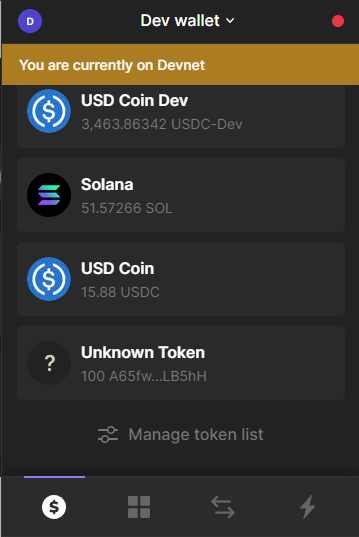

# 🏧 在Solana上铸造代币

话不多说，让我们来创造一些神奇的互联网货币吧。在我们的最终项目中，我们将创建一个代币，你将随着抵押你的社区`NFT`而逐渐获得它。在那之前，让我们先玩一下这个铸币过程的实际构建部分。现在是激发你的想象力，尽情享受的好时机。也许你一直想创建自己的模因币——现在是你的机会了 🚀。

我们将从一个全新的`Solana`客户端开始。导航到你的`Solana`工作区，并运行以下命令：

```bash
npx create-solana-client [name] --initialize-keypair
cd [name]
npm i
```

请以你想创建的代币来命名你的客户端。我要创建`Pizzacoin`，因为我昨天吃了一些非常美味的披萨。现在是发挥你的创意的时候了。也许你想将时间本身进行代币化？你可以创建`HokageCoin`，甚至是`TwitterThreadCoin`。可能性无穷无尽！

`--initialize-keypair`标志位完成了我们上次使用`initalizeKeypair`进行的所有准备工作。运行`npm run start`，你将获得一对新的密钥，并获得一些SOL空投。让我们打开货币印刷机，让它开始运作吧。


图片：美国联邦储备银行行长杰罗姆·鲍威尔让印刷机开始运作。

## 🎁 构建代币铸造器

请按照以下步骤来操作：

1. 创建一个名为`Token Mint`的账户
2. 为特定钱包创建关联的token账户
3. 将`Mint`代币发送到该钱包

下面是`src/index.ts`文件中的第一步，可以在导入之后、`main()`函数之前加入如下代码：

```ts
// 在文件顶部添加spl-token导入
import * as token from "@solana/spl-token"

async function createNewMint(
    connection: web3.Connection,
    payer: web3.Keypair,
    mintAuthority: web3.PublicKey,
    freezeAuthority: web3.PublicKey,
    decimals: number
): Promise<web3.PublicKey> {

    const tokenMint = await token.createMint(
        connection,
        payer,
        mintAuthority,
        freezeAuthority,
        decimals
    );

    console.log(`代币铸造账户地址为 ${tokenMint}`)
    console.log(
        `Token Mint: https://explorer.solana.com/address/${tokenMint}?cluster=devnet`
    );

    return tokenMint;
}
```

这段代码应该看起来很熟悉。如果不是，请回头再阅读一遍上一节的内容 😠。

接下来，我们需要创建关联的令牌账户，在`createNewMint`函数之后添加以下内容：

```ts
async function createTokenAccount(
    connection: web3.Connection,
    payer: web3.Keypair,
    mint: web3.PublicKey,
    owner: web3.PublicKey
) {
    const tokenAccount = await token.getOrCreateAssociatedTokenAccount(
        connection,
        payer,
        mint,
        owner
    )

    console.log(
        `Token Account: https://explorer.solana.com/address/${tokenAccount.address}?cluster=devnet`
    )

    return tokenAccount
}
```

这里没有新的内容。但需注意的是，`payer`和`owner`可能不同 - 你可以为他人的账户支付费用。这可能相当昂贵，因为你将为他们的账户支付“租金”，所以在进行此操作之前，请确保计算好费用。

最后，铸币功能的实现：

```ts
async function mintTokens(
  connection: web3.Connection,
  payer: web3.Keypair,
  mint: web3.PublicKey,
  destination: web3.PublicKey,
  authority: web3.Keypair,
  amount: number
) {
  const mintInfo = await token.getMint(connection, mint)

  const transactionSignature = await token.mintTo(
    connection,
    payer,
    mint,
    destination,
    authority,
    amount * 10 ** mintInfo.decimals
  )

  console.log(
    `铸币交易链接：https://explorer.solana.com/tx/${transactionSignature}?cluster=devnet`
  )
}
```

接下来的部分描述了如何在主函数中调用这些函数，包括创建代币`Mint`账户、运行程序、查看结果以及在`Solana`区块链上转移和销毁代币的示例代码。

让我们在主函数中集成这些功能，以下是我编写的代码：

```ts
async function main() {
  const connection = new web3.Connection(web3.clusterApiUrl("devnet"));
  const user = await initializeKeypair(connection);

  console.log("公钥:", user.publicKey.toBase58());

  const mint = await createNewMint(
    connection,
    user,           // 我们支付费用
    user.publicKey, // 我们是铸币权限者
    user.publicKey, // 以及冻结权限者 >:)
    2               // 只有两个小数位！
  );

  const tokenAccount = await createTokenAccount(
    connection,
    user,
    mint,
    user.publicKey   // 将我们的地址与代币账户关联
  );

  // 向我们的地址铸造100个代币
  await mintTokens(connection, user, mint, tokenAccount.address, user, 100);
}

// ... 其他代码 ...

```

执行 `npm run start`，你应在终端中看到三个浏览器链接被记录下来。**注意：**请确保你已经安装了`@solana/spl-token`，否则会出现错误。要安装，请在终端中输入 `npm uninstall @solana/spl-token` 和 `npm install @solana/spl-token`。保存代币`Mint`账户地址，稍后将会用到。打开最后一个链接，然后向下滚动到代币余额部分。


恭喜你，你刚刚铸造了一些代币！这些代币可以代表任何你想要的东西。每个代币价值100美元？100分钟时间？100张猫咪表情包？100片12英寸黄油鸡肉薄饼披萨？这全都由你决定。你是唯一控制铸币账户的人，因此代币供应的价值完全取决于你，无价还是珍贵都可。

在你开始在`Solana`区块链上重新塑造现代金融之前，让我们学习如何转移和销毁代币：

```ts
async function transferTokens(
  connection: web3.Connection,
  payer: web3.Keypair,
  source: web3.PublicKey,
  destination: web3.PublicKey,
  owner: web3.PublicKey,
  amount: number,
  mint: web3.PublicKey
) {
  const mintInfo = await token.getMint(connection, mint)

  const transactionSignature = await token.transfer(
    connection,
    payer,
    source,
    destination,
    owner,
    amount * 10 ** mintInfo.decimals
  )

  console.log(
    `Transfer Transaction: https://explorer.solana.com/tx/${transactionSignature}?cluster=devnet`
  )
}

async function burnTokens(
    connection: web3.Connection,
    payer: web3.Keypair,
    account: web3.PublicKey,
    mint: web3.PublicKey,
    owner: web3.Keypair,
    amount: number
) {

    const mintInfo = await token.getMint(connection, mint)

    const transactionSignature = await token.burn(
        connection,
        payer,
        account,
        mint,
        owner,
        amount * 10 ** mintInfo.decimals
    )

    console.log(
        `Burn Transaction: https://explorer.solana.com/tx/${transactionSignature}?cluster=devnet`
    )
}
```

虽然这些函数看起来很长，但其实只是因为我给每个参数都单独占了一行，实际上它们只有三行代码，哈哈。

调用它们也同样简单：

```ts
async function main() {
    const receiver = web3.Keypair.generate().publicKey

    const receiverTokenAccount = await createTokenAccount(
        connection,
        user,
        mint,
        receiver
    )

    await transferTokens(
            connection,
            user,
            tokenAccount.address,
            receiverTokenAccount.address,
            user.publicKey,
            50,
            mint
    )

    await burnTokens(connection, user, tokenAccount.address, mint, user, 25)
}
```

现在你可以自由玩弄转账功能，向你的钱包地址发送一些代币，看看效果如何。这是我看到的界面：



嗯...显示为未知？让我们一起来修复这个问题吧！
