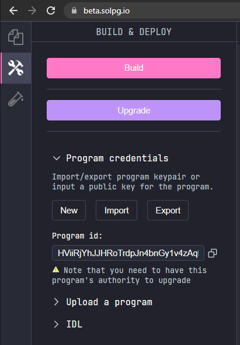

# 👋 与您部署的程序进行交互


我们将在游乐场上创建一个简单的Hello World程序。它只会在交易日志中记录一条消息。现在我们已经部署了我们的程序，我们可以与之交互。在之前的部分中，你已经做过很多次了！你可以像以前一样`create-solana-client`设置一个本地客户端，也可以使用游乐场。

我会选择操场，因为那里更快 :P

首先，您需要获取您的程序ID。您可以在“程序凭证”选项卡下找到它：




现在让我们来看一下我们的TS脚本。回到“资源管理器”选项卡，然后在左侧的 `Client` 部分下打开 `client.ts` 。以下是我们所需要的内容：

```ts
const programId = new web3.PublicKey(
  "REPLACE_WITH_YOUR_PROGRAM_ID"
);

async function sayHello(
  payer: web3.Keypair
): Promise<web3.TransactionSignature> {
  const transaction = new web3.Transaction();

  const instruction = new web3.TransactionInstruction({
    keys: [], // We're not using any accounts yet
    programId,
    // No need to add data here!
  });

  transaction.add(instruction);

  const transactionSignature = await web3.sendAndConfirmTransaction(
    pg.connection,
    transaction,
    [payer]
  );

  return transactionSignature;
}

async function main() {
  const transactionSignature = await sayHello(pg.wallet.keypair);

  console.log(
    `Transaction: https://explorer.solana.com/tx/${transactionSignature}?cluster=devnet`
  );
}

main();
```

这应该看起来很熟悉。在游乐场中，与密钥对的访问方式和与开发网络的连接方式是两个变化的要点。全局可用的 `pg` 对象包含了这两个要素。

当你运行这个脚本时，你应该在控制台中看到一条已记录的交易。打开链接并向下滚动，你会看到你的消息！


# 🚢 船舶挑战

现在轮到你独立构建一些东西了。由于我们从非常简单的程序开始，你所创建的程序几乎与我们刚刚创建的程序完全相同。尽量达到能够独立编写代码而无需参考之前的代码的程度，所以请尽量不要在这里复制粘贴。

在Solana Playground中编写一个新的程序，使用`msg!`宏将自己的消息打印到程序日志中。像我们在演示中所做的那样构建和部署你的程序。编写一个客户端脚本来调用你新部署的程序，然后使用Solana Explorer来检查你的消息是否已经打印在程序日志中。

除了创建一个简单的程序之外，花点时间去尝试一下Rust也是值得的。查看一下[Rust书籍](https://doc.rust-lang.org/book/)，并使用[Rust Playground](https://play.rust-lang.org/)来更好地了解这门语言的工作原理，这样当我们深入探讨更具挑战性的Solana程序主题时，你就能走在前面。

也许可以让程序使用一组词语的组合来随机生成登出时的消息，而不是固定的消息？
