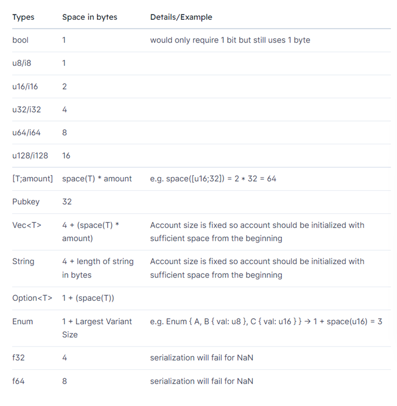
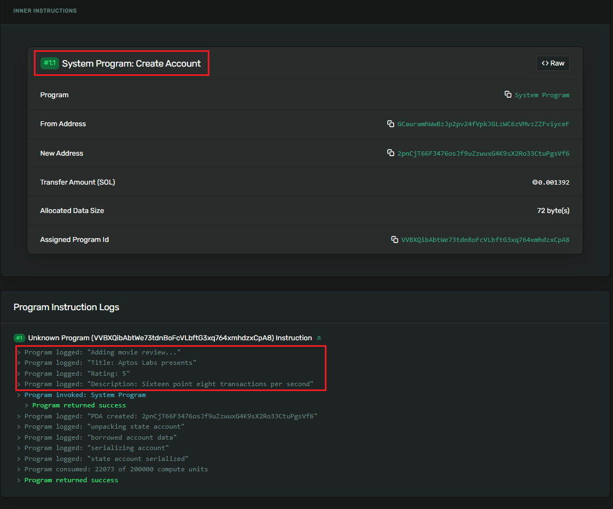

# 🤠 状态管理

你还记得我们在第一节中互动的电影评论程序吗？现在我们要在这里构建它。你想评论的不一定只是电影，我可不会限制你。状态是指存储在链上的程序数据。

我们已经有了一个可靠的程序，它接收指令数据并做好了处理准备。要执行这些指令，我们需要学习更多关于 `Rust` 的知识。

## 📝 将程序状态作为 Rust 数据类型

`Solana` 之所以保持其速度和效率，部分原因是程序是无状态的。这意味着你无法更改程序上的数据——所有数据都存储在外部账户中，通常是由程序拥有的账户。这些账户中的大部分是 `PDA`（`Program Derived Accounts`）——现在我们将研究它们的数据存储元素，并稍后深入了解其余部分。

正如我们将指令数据转换为 `Rust` 类型一样，我们也将把程序状态转换为 `Rust` 类型，以便更容易处理。

回想一下 `Solana` 账户中的 `data` 字段——它存储了一个原始字节数组。我们可以通过序列化和反序列化来表示它在 `Rust` 类型中的形式。


我们将再次使用 `borsh macro`：

```rust
use borsh::{BorshDeserialize, BorshSerialize};

#[derive(BorshSerialize, BorshDeserialize, Debug)]
struct NoteState {
    title: String,
    body: String,
    id: u64,
}
```

数据在传输和存储时以原始字节的形式存在，但当我们想要处理数据时，会将其转换为 `Rust` 类型。听起来很有道理，不是吗？


## 🏠 空间与租金

没错，`Solana` 也有房东：那就是将区块链状态存储在自己机器上的验证者。

租金以 `Lamports` 为单位支付，其中 `Lamport` 是 `SOL` 的最小单位（`0.000000001 SOL = 1 Lamport`），根据账户占用的空间大小计算。下面是一个显示常见类型所占用的字节空间的表格：



付房租有两种方式：

- 按每个时期支付租金。这就像每月支付房租一样——只要你继续支付，你就能继续居住。如果账户没有足够的 `SOL`，它将被清零，数据将丢失。
- 保持等于 `2` 年租金的最低余额。这样账户就免除了租金。这里的逻辑是硬件成本每 `2` 年下降 `50%`，所以如果你有足够的 `SOL` 支付 `2` 年的租金，你就再也不用担心了！

现在要求免租金，所以只有选项 `#2`。这种方法的最大优点是，当你不再需要存储数据时，可以销毁账户并取回你的 `SOL`！区块链上的免费存储（减去交易费用）🥳。

那么，为什么要在区块链上支付租金呢？嗯，这是一种防止人们大量创建但从未使用的账户的方式。这会浪费空间和验证者的资源。这个机制也是 `Solana` 上存储如此便宜的原因之一——与以太坊不同，我的那些愚蠢的 `Hello World NFT` 收藏会被所有验证者永久存储。

你可以在[这里](https://docs.solana.com/implemented-proposals/rent)阅读更多有关的内容，我觉得这真的很酷！


## 📊 租金计算

计算租金其实非常简单——有一个非常有用的功能可以帮助你。难的部分是弄清楚你需要多少空间。

以下是我们超级笔记程序的代码示例：

```rust
// 计算存储结构体 NoteState 所需的账户大小
// 4字节用于存储后续动态数据（字符串）的大小
// 8字节用于存储64位整数ID
let account_len: usize = (4 + title.len()) + (4 + body.len()) + 8;

// 计算所需租金
let rent = Rent::get()?;
let rent_lamports = rent.minimum_balance(account_len);
```

首先，我们需要计算存储的数据的总长度。这可以通过将字符串的长度和`8`字节的`id`相加来实现。

在我们的情况下，`title` 和 `body` 是动态数据类型（字符串）——它们可以是任意长度。我们使用前`4`个字节来存储每个项目的长度，因此我们将每个字符串的长度加上`4`。

接着我们可以使用 `Rent::get()` 函数来获取账户的租金。非常直接轻松！

## 📜 程序派生地址

我们已经从指令中提取了数据，计算出了需要支付的租金，现在我们需要一个账户来存储它。`PDAs`！我们将从程序`ID`和一组种子中推导出账户地址。


我们将在将来深入探讨`PDA`的工作原理，但现在你只需了解 `find_program_address` 功能，并且只有 `program_id` 中的程序才能为`PDA`签名。就像安全存储一样，不需要密码。

## 🛫 跨程序调用

最后一步是初始化`PDA`（我们才刚刚找到地址）。我们将使用跨程序调用（`CPI`）来完成此操作。正如其名字所示，我们将在我们的程序中与`Solana`网络上的另一个程序进行交互。

`CPI`可以使用 `invoke` 或 `invoke_signed` 来实现。

```rust
pub fn invoke(
    instruction: &Instruction,
    account_infos: &[AccountInfo],
) -> ProgramResult
```

```rust
pub fn invoke_signed(
    instruction: &Instruction,
    account_infos: &[AccountInfo],
    signers_seeds: &[&[u8]],
) -> ProgramResult
```

当你不需要签署交易时，使用 `invoke`。当你需要签署交易时，使用 `invoke_signed`。在我们的例子中，我们是唯一可以为`PDA`签署的人，因此我们将使用 `invoke_signed`。


这就是它的样子。你可能会想：“这到底是什么？”——别担心，我们接下来会进行练习，一切都会变得清晰的 :)

我们在这里所做的只是使用 `Rust` 在程序中创建一个交易，这与我们在客户端使用 `TypeScript` 时的做法类似。这里有一个特殊的 `signers_seeds` 事项，这对于`PDA`是必需的。

## ✂ 账户数据的序列化和反序列化

一旦我们创建了一个新账户，我们需要访问并更新该账户的数据字段（目前为空字节）。这就涉及将其字节数组反序列化为我们创建的类型实例，更新该实例上的字段，然后将该实例重新序列化为字节数组。

### 账户数据的反序列化

更新账户数据的第一步是将其数据字节数组反序列化为`Rust`类型。你可以首先借用账户上的数据字段来实现此操作，这样可以在不获取所有权的情况下访问数据。

然后，你可以使用`try_from_slice_unchecked`函数来反序列化借用的账户数据字段，根据你创建的类型来表示数据格式。这将提供一个`Rust`类型的实例，使你可以轻松使用点符号来更新字段。如果我们采用我们一直在使用的笔记应用程序示例，它的形式如下：

```rust
let mut account_data = try_from_slice_unchecked::<NoteState>(note_pda_account.data.borrow()).unwrap();

account_data.title = title;
account_data.body = body;
account_data.id = id;
```

### 账户数据的序列化

一旦`Rust`实例更新了账户数据的合适值，你就可以将数据“保存”到账户上。

这通过对你创建的`Rust`类型实例使用`serialize`函数完成。你需要传入账户数据的可变引用。这里的语法有些复杂，所以如果你不完全理解也不必担心。借用和引用是`Rust`中最复杂的概念之一。

```rust
account_data.serialize(&mut &mut note_pda_account.data.borrow_mut()[..])?;
```

上面的示例将`account_data`对象转换为字节数组，并设置为`note_pda_account`上的`data`属性。这实际上将更新后的`account_data`变量保存到新账户的数据字段中。现在，当用户获取`note_pda_account`并反序列化数据时，它将显示我们序列化到账户中的更新数据。

## 📼 总结 - 将所有内容整合在一起

让我们回顾一下整个过程：

1. 用户通过发送包含标题、正文和字节`ID`的交易来创建笔记。
2. 我们的程序接收指令，提取数据并将其格式化为`Rust`类型。
3. 我们使用`Rust`类型计算账户需要多少空间以及我们需要支付多少租金。
4. 我们从程序`ID`和一组种子中推导出账户的地址。
5. 我们使用`CPI`创建一个空白数据的账户。
6. 我们将账户数据反序列化为`Rust`类型。
7. 我们使用指令中的数据来更新`Rust`类型的账户数据。
8. 我们将`Rust`类型序列化为原始字节，并将其保存到账户中。

你现在了解了如何在`Solana`上向账户写入数据。

## 🎥 构建一个电影评论程序

到了真正付诸实践的时候了。我们的史诗级电影评论将不再仅仅记录在控制台上，而是将它们存储在区块链上！

我们将使用与之前相同的程序，你可以[从头开始设置](https://beta.solpg.io/6295b25b0e6ab1eb92d947f7)它，或者使用上一节的那个。

# 📝 账户数据的表示

我们需要一个新的`Rust`类型来表示我们要存储的数据。创建一个名为 `state.rs` 的新文件，并在其中定义 `MovieAccountState`。

```rust
use borsh::{BorshSerialize, BorshDeserialize};

#[derive(BorshSerialize, BorshDeserialize)]
pub struct MovieAccountState {
    pub is_initialized: bool,
    pub rating: u8,
    pub title: String,
    pub description: String,
}
```

这里我们使用了 `BorshSerialize` 和 `BorshDeserialize` 两个trait :)

接下来，我们需要更新 `lib.rs`，以便将我们需要的所有内容引入范围。将文件顶部更新为以下内容：

```rust
use solana_program::{
    entrypoint,
    entrypoint::ProgramResult,
    pubkey::Pubkey,
    msg,
    account_info::{next_account_info, AccountInfo},
    system_instruction,
    sysvar::{rent::Rent, Sysvar},
    program::{invoke_signed},
    borsh::try_from_slice_unchecked,
};
use std::convert::TryInto;
pub mod instruction;
pub mod state;
use instruction::MovieInstruction;
use state::MovieAccountState;
use borsh::BorshSerialize;
```

好的，到目前为止一切顺利。当需要时，我会解释新添加的内容。现在，让我们回到我们的 `add_movie_review` 函数，用实际的逻辑填充它，而不仅仅是打印输出。

### ⏩ 迭代账户

在我们的 `add_movie_review` 函数中传入的第二个参数是一个账户数组。我们可以遍历这些账户，获取它们的数据并执行相应的操作。我们可以借助 `next_account_info` 函数（需要引入`use solana_program::account_info::next_account_info;`）来实现这一点 - 它是一个接受迭代器并安全返回列表中下一个项的函数。我们可以像下面这样使用它：

```rust
// 获取账户迭代器
let account_info_iter = &mut accounts.iter();

// 获取账户
let initializer = next_account_info(account_info_iter)?;
let pda_account = next_account_info(account_info_iter)?;
let system_program = next_account_info(account_info_iter)?;
```

挺酷的，对吧？如果列表为空，我们将收到 `ProgramError::NotEnoughAccountKeys` 错误。如果我们试图访问不存在的账户，将会收到 `ProgramError::MissingRequiredSignature` 错误。

### 🥚 生成PDA地址

我们只需要一行代码就可以实现（继续添加到 `add_movie_review` 函数中）：

```rust
let (pda, bump_seed) = Pubkey::find_program_address(&[initializer.key.as_ref(), title.as_bytes().as_ref(),], program_id);
```

其中的种子包括：

1. 初始化器的公钥
2. 电影的标题

### 🧮 计算空间和租金

我们之前已经讨论过这个了 :)

```rust
// 计算所需的账户大小
let account_len: usize = 1 + 1 + (4 + title.len()) + (4 + description.len());

// 计算所需的租金
let rent = Rent::get()?;
let rent_lamports = rent.minimum_balance(account_len);
```

你的 `add_movie_review` 函数现在应该看起来相当长了。我们还剩下两个小部分——创建账户和更新数据。继续前进吧！

### 📝 创建账户

是时候进行一些跨程序调用了！

```rust
// 创建账户
invoke_signed(
    &system_instruction::create_account(
        initializer.key,
        pda_account.key,
        rent_lamports,
        account_len.try_into().unwrap(),
        program_id,
    ),
    &[initializer.clone(), pda_account.clone(), system_program.clone()],
    &[&[initializer.key.as_ref(), title.as_bytes().as_ref(), &[bump_seed]]],
)?;

msg!("创建PDA: {}", pda);
```

`invoke_signed` 是创建账户的交易。我们传入了 `create_account` 指令，我们所使用的账户，以及用于派生`PDA`地址的种子。

我们需要做的最后一件事是更新账户数据：

```rust
msg!("解包状态账户");
let mut account_data = try_from_slice_unchecked::<MovieAccountState>(&pda_account.data.borrow()).unwrap();
msg!("借用账户数据");

account_data.title = title;
account_data.rating = rating;
account_data.description = description;
account_data.is_initialized = true;

msg!("序列化账户");
account_data.serialize(&mut &mut pda_account.data.borrow_mut()[..])?;
msg!("状态账户序列化");
```

我们使用 `try_from_slice_unchecked` 将原始字节转换为`Rust`类型。然后我们更新数据，并将其序列化回原始字节。

我们已经准备好升级并部署了！（可能需要几分钟时间）


### 🎉 试一试

你知道该如何操作了。复制地址，设置一个脚本来调用程序（你可以使用上次的脚本，无需更改），运行它，然后在`Solana Explorer`上查看这个新账户。

如果你需要一个新的设置，可以执行以下操作：

```bash
git clone https://github.com/CreatorsDAO/solana-movie-client
cd solana-movie-client
npm install
```

更新 `index.ts` 文件中的 `programId` 为你程序的地址，然后运行 `npm run start` 。

在终端中点击浏览器链接，并向下滚动到程序日志部分，你会看到类似的内容：



我们可以看到，我们的程序通过`CPI`与系统程序进行交互，创建了一个账户（`PDA`），并将我们的评论添加到其中！如果我可以自夸一下的话，这绝对是一篇很棒的评论。 😉


## 🚢 挑战

现在轮到你独立创建一些东西了。

回想一下，学生介绍程序需要用户提供姓名和简短留言作为输入`instruction_data`，并创建一个账户来将数据存储在区块链上。

借助你在本课程中学到的知识，尝试重新创建完整的学生介绍程序。

:::info
提示：
除了接收一个名称和一个简短的消息作为指令数据外，程序还应该：
1. 为每个学生创建一个独立的账户
2. 在每个账户中存储 `is_initialized` 为布尔值，`name` 为字符串，`msg` 为字符串
:::

**解决方案代码：**

你可以使用[这个链接](https://github.com/buildspace/solana-student-intros-frontend)的前端来测试你的程序。记得用你部署的程序`ID`替换前端代码中的那个。

如果可能的话，请尽量独立完成这个任务！但如果遇到困难，你可以参考[解决方案代码](https://beta.solpg.io/62b11ce4f6273245aca4f5b2)。
