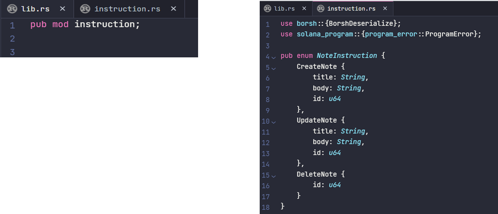

# 🎂 Rust的分层蛋糕

我们将在游乐场上制作一个简单的`Hello World`程序，仅仅会在交易日志中记录一条消息。哈哈，招呼已经打过了。现在是时候学习如何处理指令数据，就像在客户端开发中一样。

在开始构建之前，我想先给你介绍一些即将使用的概念。还记得我提到的规则、能力和互动吗？我会带你了解一下编写本地`Solana`程序所需的能力和规则。这里的“本地”非常重要 - 我们将在后续部分借助`Anchor`来处理我们现在所学的许多内容。

我们学习原生开发的原因是因为了解底层工作原理是非常重要的。一旦你理解了事物是如何在最基本的层面上运作的，就能够借助像`Anchor`这样的工具来构建更强大的程序。你可以把这个过程想象成与不同类型的敌人进行首领战 ， 你需要先学会如何逐一对抗每个个体怪物（以及了解你自己的能力）。

当我刚开始学习的时候，我发现很难理解自己缺少了什么。所以我将其分解成了“层次”。每一个你学习的主题都建立在一层知识的基础之上。如果遇到不明白的地方，回到之前的层次，确保你真正理解了它们。

## Rust的分层蛋糕


这是一个由`Rust`制作的蛋糕。

> 注意：图层代表重量，哈哈！

## 👶 变量声明和可变性

变量。你了解它们。你使用过它们。你甚至可能拼写错误过它们。在`Rust`中关于变量唯一的新概念就是可变性。所有变量默认都是不可变的 ， 一旦声明了变量，就不能改变其值。你只需通过添加`mut`关键字告诉编译器你想要一个可变的变量。就是这么简单。如果我们不指定类型，编译器会根据提供的数据进行推断，并强制我们保持该类型。

```rust
// compiler will throw error
let age = 33;
age = 34;

// this is allowed
let mut mutable_age = 33;
mutable_age = 34;
```

## 🍱 结构体

结构体是自定义的数据结构，一种将数据组织在一起的方式。它们是你定义的自定义数据类型，类似于`JavaScript`中的对象。`Rust`并不是完全面向对象的 - 结构体本身除了保存有组织的数据外，无法执行任何操作。但你可以向结构体添加方法，使其表现得更像对象。

```rust
Struct User {
    active: bool,
    email: String,
    age: u64
}

let mut user1 = User {
    active: true,
    email: String::from("test@test.com"),
    age: 33
};

user1.age = 34;
```

## 📜 枚举、变体和匹配

枚举很简单 - 它们就像代码中的下拉列表。它们限制你从几个可能的变体中选择一个。


```rust
enum LightStatus {
    On,
    Off
}
```
```rust
enum LightStatus {
    On {
        color: String
    },
    Off
}

let light_status = LightStatus::On {
    color: String::from("red")
};
```

`Rust`中枚举的酷炫之处在于你可以（可选地）向其中添加数据，使其几乎像一个迷你的`if`语句。在这个例子中，你正在选择交通信号灯的状态。如果它是开启的，你需要指定颜色 - 是红色、黄色还是绿色？

```rust
enum Coin {
    Penny,
    Nickel,
    Dime,
    Quarter,
}

fn value_in_cents(coin: Coin) -> u8 {
    match coin {
        Coin::Penny => 1,
        Coin::Nickel => 5,
        Coin::Dime => 10,
        Coin::Quarter => 25,
    }
}
```

> source code: https://kaisery.github.io/trpl-zh-cn/ch06-02-match.html

当与匹配语句结合使用时，枚举非常有用。它们是一种检查变量值并根据该值执行代码的方式，与`JavaScript`中的`switch`语句类似。

## 📦 实现

结构体本身很有用，但如果你能为它们添加函数，效果将如何呢？下面我们来介绍实现（`Implementations`），它让你可以给结构体添加方法，使其更接近面向对象的设计。

```rust
#[derive(Debug)]
struct Rectangle {
    width: u32,
    height: u32,
}

impl Rectangle {
    fn area(&self) -> u32 {
        self.width * self.height
    }
}

fn main() {
    let rect1 = Rectangle {
        width: 30,
        height: 50,
    };

    println!(
        "The area of the rectangle is {} square pixels.",
        rect1.area()
    );
}
```

> source code: https://kaisery.github.io/trpl-zh-cn/ch05-03-method-syntax.html

如果你对“向结构体添加方法”感到困惑，可以理解为赋予结构体特殊能力。例如，你可能有一个简单的`user`结构体，拥有速度、健康和伤害属性。通过使用 `impl` 关键字添加一个 `wordPerMinute` 方法，你就可以计算用户的打字速度⌨️。

## 🎁 特征（`Traits`）

现在，我们来谈谈这个“蛋糕”的顶层部分 - `Traits`。`Traits`和实现类似，也是为类型增添功能。你可以把它看作类型能具备的一种能力。

回到我们的 `user` 结构体例子，如果我添加了一个名为 `ThreeArms` 的`trait`，用户将能够以更快的速度输入文字，因为他们将拥有额外的手臂！`Traits`这个概念可能有点抽象，所以我们来看一个具体的例子：

```rust
pub triat BorshDeserialize : Sized {
    fn deserialize(buf: &mut &[u8]) -> Result<Self, Error>;
    fn try_from_slice(buf: &[u8]) -> Result<Self, Error> { ... }
}
```

如你所知，我们的指令数据以字节数组（由`1`和`0`组成）的形式提供，我们需要在程序中对其进行反序列化（转换成`Rust`类型）。我们将使用名为 `BorshDeserialize` 的`Traits`来完成这一任务：它包括一个 `deserialize` 方法，可以将数据转换为所需类型。这意味着，如果我们将 `BorshDeserialize Traits` 添加到指令结构体中，我们就可以使用 `deserialize` 方法将指令数据实例转换为`Rust`类型。

如果你对这部分内容感到困惑，不妨再读一遍，哈哈，我自己也花了一些时间才弄清楚。

实际操作示例如下：

```rust
#[derive(BorshDeserialize)]
struct InstructionData {
    input: String,
}
```

> 注意：可能有一个你已经忽略的层面——宏。它们用来生成代码。

在我们的场景中，特质和宏通常一起使用。例如，`BorshDeserialize Traits`有两个必须实现的函数：`deserialize` 和 `try_from_slice`。我们可以使用 `#[derive(BorshDeserialize)]` 属性，让编译器在给定类型上（即指令数据结构）为我们实现这两个函数。
整个流程是这样的：

- 通过宏将`Trait`添加到结构体中
- 编译器会查找`Trait`的定义
- 编译器会为该`Trait`实现底层函数
- 你的结构体现在具备了`Trait`的功能

实际上，宏在编译时生成了用于反序列化字符串的函数。通过使用这个`Trait`，我们可以告诉`Rust`：“嘿，我想能反序列化字符串，请为我生成相应的代码。”

对于我们的情况，唯一的要求是`Borsh`必须支持所有的结构数据类型（在我们的场景中是字符串）。如果你有一个`Borsh`不支持的自定义数据类型，就需要在宏中自己实现这些功能。

如果你还未完全理解，不用担心！我自己也是在看到整个流程后才理解的，所以现在让我们一起实践一下！

## 🎂 把所有元素整合在一起

我们刚刚讨论了一系列相互关联的抽象主题。如果只描述每一层，可能难以想象整个“蛋糕”的样子，所以我们现在就将它们整合起来。

假设我们正在构建一个链上的笔记程序，我们将保持它的简单性：你只能创建、更新和删除笔记。我们需要一条指令来完成这些操作，所以让我们创建一个枚举类型来代表它：

```rust
enum NoteInstruction {
    CreateNote {
        id: u64,
        title: String,
        body: String
    },
    UpdateNote {
        id: u64,
        title: String,
        body: String
    },
    DeleteNote {
        id: u64
    }
}
```

每个指令变体的字节数组都有自己的数据类型，我们在这里有它们！

既然我们知道指令数据的样子，我们需要将其从字节转换为这些类型。第一步是反序列化，我们将使用一个专门为有效负载创建的新结构体上的 `BorshDeserialize Traits` 来完成。

```rust
#[derive(BorshDeserialize)]
struct NoteInstructionPayload {
    id: u64,
    title: String,
    body: String
}
```

我们在这里处理了`title`和`body`，这就是字节数组中的内容。`Borsh`的工作仅仅是添加反序列化的支持，它实际上并没有进行反序列化，而是仅提供了我们可以调用的反序列化函数。

下一步，我们要实际使用这些函数来反序列化数据。我们将在一个实现中定义这个行为，这是一个手动的过程（至少暂时是这样）！

```rust
impl NoteInstruction {
    // 将传入的缓冲区解包到相关的指令
    // 输入的预期格式是一个用Borsh序列化的向量
    pub fn unpack(input: &[u8]) -> Result<Self, ProgramError> {
        // 采用第一个字节作为变体来确定要执行哪个指令
        let (&variant, rest) = input.split_first().ok_or(ProgramError::InvalidInstructionData)?;
        // 使用临时有效载荷结构体进行反序列化
        let payload = NoteInstructionPayload::try_from_slice(rest).unwrap();
        // 通过变体匹配，确定函数所期望的数据结构，然后返回TestStruct或错误
        Ok(match variant {
            0 => Self::CreateNote {
                title: payload.title,
                body: payload.body,
                id: payload.id
            },
            1 => Self::UpdateNote {
                title: payload.title,
                body: payload.body,
                id: payload.id
            },
            2 => Self::DeleteNote {
                id: payload.id
            },
            _ => return Err(ProgramError::InvalidInstructionData)
        })
    }
}
```


这部分内容可能一开始看起来有点吓人，但你很快就会觉得它其实非常直接和简单！让我们一起来深入分析一下 🕺💃👯‍♂️

```rust
pub fn unpack(input: &[u8]) -> Result<Self, ProgramError> {
```

我们的解包函数从指令中获取字节，并返回一个`NoteInstruction`类型（即 `Self`）或一个`ProgramError`。

```rust
let (&variant, rest) = input.split_first().ok_or(ProgramError::InvalidInstructionData)?;
```

现在是时候从字节中解包数据并调用反序列化函数了。我们的指令数据的第一个字节是一个整数，它告诉我们正在处理哪个指令。我们这样做的方式是使用`Rust`的内置函数`split_first`。如果切片为空，`ok_or`将返回`ProgramError`枚举中的`InvalidInstructionData`错误。

```rust
let payload = NoteInstructionPayload::try_from_slice(rest).unwrap();
```

现在我们有了两个变量要处理：指令指示器和指令的有效载荷（数据）。`Borsh`在我们的有效载荷结构中添加了`try_from_slice`函数，使我们可以在有效载荷变量`rest`上调用它。这就是反序列化的过程！

接下来的步骤包括：

- 将指令数据定义为`Rust`类型中的枚举。
- 定义负载结构体。
- 在负载结构体上声明`BorshDeserialize`宏。
- 为负载结构体创建一个实现（字节 -> 结构体）。
- 创建`unpack`函数，该函数接收指令数据并对其进行反序列化。

我们`unpack`函数的最后一步是将反序列化的数据转换为枚举变体（即指令数据类型）。我们将使用匹配语句来完成这个任务，通过匹配指令指示器，我们可以返回枚举的正确变体。

```rust
Ok(match variant {
    0 => Self::CreateNote {
        title: payload.title,
        body: payload.body,
        id: payload.id
    },
    1 => Self::UpdateNote {
        title: payload.title,
        body: payload.body,
        id: payload.id
    },
    2 => Self::DeleteNote {
        id: payload.id
    },
    _ => return Err(ProgramError::InvalidInstructionData)
})
```

现在你已经知道了整个过程！理解这一切确实需要集中精力，所以如果你需要多读几遍，也完全没关系。

这部分内容信息量较大，可能会让人觉得有些复杂。但别担心，我们会通过大量的练习来逐渐熟悉它们。随着时间的推移和反复练习，你会发现这些内容开始变得更加直观和易懂。

## 🚀 程序逻辑

我们已经解压了指令数据，准备投入实际使用。现在，我们需要针对每个指令编写相应的逻辑处理。这部分其实是最为直观和简单的！相对于复杂的反序列化处理，这一部分就像吃蛋糕一样轻松了（`Anchor`会为你处理大部分反序列化工作）。

```rust
entrypoint!(process_instruction);

pub fn process_instruction(
    program_id: &Pubkey,
    accounts: &[AccountInfo],
    instruction_data: &[u8]
) -> ProgramResult {

    // 解压指令数据
    let instruction = NoteInstruction::unpack(instruction_data)?;

    // 匹配指令并执行相应的逻辑
    match instruction {
        NoteInstruction::CreateNote { title, body, id } => {
            msg!("Instruction: CreateNote");
            create_note(accounts, title, body, id, program_id)
        }
        NoteInstruction::UpdateNote { title, body, id } => {
            msg!("Instruction: UpdateNote");
            update_note(accounts, title, body, id)
        }
        NoteInstruction::DeleteNote { id } => {
            msg!("Instruction: DeleteNote");
            delete_note(accounts, id)
        }
    }
}
```

首先，我们要做的是定义程序的入口函数。`process_instruction` 函数的定义与我们之前的 “`Hello World`” 程序一样。接着，我们将在 `NoteInstruction` 的实现中使用 `unpack` 函数来提取指令数据。然后，我们可以依靠 `NoteInstruction` 枚举来确定指令的具体类型。

在本阶段，我们还没有涉及具体的逻辑处理，真正的构建将在后续阶段展开。

## 📂 文件结构说明

编写自定义程序时，将代码划分为不同的文件结构会非常有助于管理。这样做不仅方便代码重用，还能让你更快速地找到所需的内容。



除了 `lib.rs` 文件外，我们还会把程序的各个部分放入不同的文件。最明显的一个例子就是 `instruction.rs` 文件。在这里，我们将定义指令数据类型并实现对指令数据的解包功能。

**你做得真棒👏👏👏**

我想借此机会对你的努力付出表示赞赏。你正在学习一些强大且实用的技能，这些技能不仅在 `Solana` 领域有用，`Rust` 的应用也非常广泛。尽管学习 `Solana` 可能会有一些困难，但请记住，这样的困难也有人曾经经历并战胜。例如，`FormFunction` 的创始人在大约一年前的推文中提到了他是如何找到困难的：


`FormFunction` 已经筹集了超过 `470` 万美元，是我心目中 `Solana` 上最优秀的 `1/1 NFT` 平台。`Matt` 凭借坚持不懈的努力建立了一些令人难以置信的东西。试想一下，如果你掌握了这些技能，一年后你会站在哪里呢？
