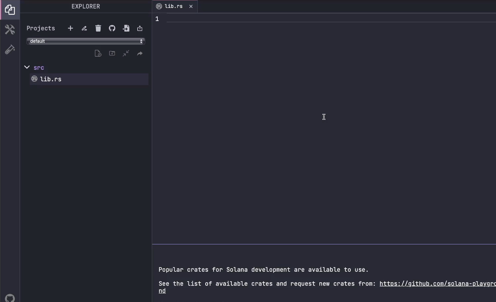
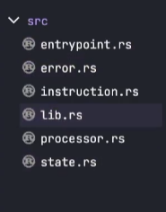

# 🛠️ 构建一个NFT质押程序


今天，我们将编写我们的质押程序，并编写所有必要的质押功能，而不进行任何代币转账。我将与您一起逐步讲解整个过程，解释每个步骤，以便您了解正在发生的事情。让我们首先进入[Solana Playground](https://beta.solpg.io/?utm_source=buildspace.so&utm_medium=buildspace_project)，在 `create a new project` 上点击，并创建一个名为 `src` 的新文件夹，其中包含一个名为 `lib.rs` 的文件。

这就是你的集成开发环境应该看起来的样子

目前，主要目标是编写一个程序，跟踪每个用户的质押状态。以下是一些大致的步骤：



现在你已经准备好了，我们将继续创建剩余的文件，就像我们在之前的课程中所做的那样。让我们继续在你的 `src` 文件夹中创建以下5个文件。这些文件是 `entrypoint.rs` ， `error.rs` ， `instruction.rs` ， `processor.rs` 和 `state.rs` 。

现在应该是这个样子



我们已经准备好了！现在让我们用以下代码填充我们的 `lib.rs` ：

```rust
// Lib.rs
pub mod entrypoint;
pub mod error;
pub mod instruction;
pub mod processor;
pub mod state;
```

进入 entrypoint.rs 并添加以下代码

```rust
// Entrypoint.rs
use solana_program::{
    account_info::AccountInfo,
    entrypoint,
    entrypoint::ProgramResult,
    pubkey::Pubkey
};
use crate::processor;

// This macro will help process all incoming instructions
entrypoint!(process_instruction);

pub fn process_instruction(
    program_id: &Pubkey,
    accounts: &[AccountInfo],
    instruction_data: &[u8]
) -> ProgramResult {
    processor::process_instruction(program_id, accounts, instruction_data)?;
    Ok(())
}
```

当你运行代码时，你会注意到这会抛出一个错误，因为我们没有在 `processor.rs` 中定义 `process_instruction` 函数。现在让我们创建这个函数。转到 `processor.rs` 并添加以下代码。


```rust
// Processor.rs
use solana_program::{
    account_info::AccountInfo,
    entrypoint::ProgramResult,
    pubkey::Pubkey
};

pub fn process_instruction(
    program_id: &Pubkey,
    accounts: &[AccountInfo],
    instruction_data: &[u8]
) -> ProgramResult {
    Ok(())
}
```

现在我们已经修复了 `processor.rs` 的错误，你会注意到在编译代码时仍然存在错误。这是因为在你的 `lib.rs` 中，我们导入了一些空模块。不过不用担心，我们会在下一节中修复它们 😊 在我们开始处理 `process_instruction` 中的任何内容之前，我们需要在 `instruction.rs` 中编写出我们的指令，所以让我们开始定义我们的指令吧。

让我们继续创建一个枚举 `StakeInstruction` 并向其中添加四个指令。基本上，这是定义我们的指令应该做什么的操作。继续将这段代码复制粘贴到你的 `instruction.rs` 中。

```rust
// Instruction.rs
use solana_program::{ program_error::ProgramError };

pub enum StakeInstruction {
    InitializeStakeAccount,
    Stake,
    Redeem,
    Unstake
}

impl StakeInstruction {
    pub fn unpack(input: &[u8]) -> Result<Self, ProgramError> {
        let (&variant, _rest) = input.split_first().ok_or(ProgramError::InvalidInstructionData)?;
        Ok(match variant {
            0 => Self::InitializeStakeAccount,
            1 => Self::Stake,
            2 => Self::Redeem,
            3 => Self::Unstake,
            _ => return Err(ProgramError::InvalidInstructionData)
        })
    }
}
```

所以让我们来分解一下我们在这里做的事情。在 `instruction.rs` 中，我们创建了一个枚举来表示每个离散的指令，并创建了一个解包函数来反序列化数据，这里的数据是一个整数。

让我们回到 `processor.rs` 并定义我们的 `process_instruction` 函数：


```rust
// processor.rs
use solana_program:: {
    account_info:: { AccountInfo, next_account_info },
    entrypoint::ProgramResult,
    pubkey::Pubkey,
}
use crate::instruction::StakeInstruction;

pub fn process_instruction(
    program_id: &Pubkey,
    accounts: &[AccountInfo],
    instruction_data: &[u8]
) -> ProgramResult {
    let instruction = StakeInstruction::unpack(instruction_data)?;

    match instruction {
        StakeInstruction::InitializeStakeAccount => process_initialize_stake_account(program_id, accounts),
        StakeInstruction::Stake => process_stake(program_id, accounts),
        StakeInstruction::Redeem => process_redeem(program_id, accounts),
        StakeInstruction::Unstake => process_unstake(program_id, accounts)
    }
}

/**
What this function does is to create a new PDA account that's unique to you
and your NFT. This will store the information about the state of your program
which will determine whether it's staked or not staked.
**/
fn process_initialize_stake_account(
    program_id: &Pubkey,
    accounts: &[AccountInfo]
) -> ProgramResult {
    let account_info_iter = &mut accounts.iter();
    let user = next_account_info(account_info_iter)?;
    let nft_token = next_account_info(account_info_iter)?;
    let stake_state = next_account_info(account_info_iter)?;
    let system_program = next_account_info(account_info_iter)?;

    Ok(())
}

fn process_stake(
    program_id: &Pubkey,
    accounts: &[AccountInfo]
) -> ProgramResult {
    Ok(())
}

fn process_redeem(
    program_id: &Pubkey,
    accounts: &[AccountInfo]
) -> ProgramResult {
    Ok(())
}

fn process_unstake(
    program_id: &Pubkey,
    accounts: &[AccountInfo]
) -> ProgramResult {
    Ok(())
}
```

注意我们在 `process_initialize_stake_account` 函数中定义了变量，但是它在任何地方都没有被使用？这是因为我们需要一个结构体来表示程序的当前状态。所以让我们转到 `state.rs` 并定义我们的结构体。

```rust
// state.rs
use borsh:: { BorshSerialize, BorshDeserialize };
use solana_program:: {
    program_pack::{ IsInitialized, Sealed },
    pubkey::Pubkey,
    clock::UnixTimestamp
};

#[derive(BorshSerialize, BorshDeserialize, Debug)]
pub struct UserStakeInfo {
    pub is_initialized: bool,
    pub token_account: Pubkey,
    pub stake_start_time: UnixTimestamp,
    pub last_stake_redeem: UnixTimestamp,
    pub user_pubkey: Pubkey,
    pub stake_state: StakeState,
}

impl Sealed for UserStakeInfo { }
impl IsInitialized for UserStakeInfo {
    fn is_initialized(&self) -> bool {
        self.is_initialized
    }
}

#[derive(BorshSerialize, BorshDeserialize, Debug, PartialEq)]
pub enum StakeState {
    Staked,
    Unstaked
}
```

## 🚫自定义错误

现在让我们转到 `error.rs` 来为我们的程序定义自定义错误。

```rust
// error.rs
use solana_program::{ program_error::ProgramError };
use thiserror::Error;

#[derive(Debug, Error)]
pub enum StakeError {
    #[error("Account not initialized yet")]
    UninitializedAccount,

    #[error("PDA derived does not equal PDA passed in")]
    InvalidPda,

    #[error("Invalid token account")]
    InvalidTokenAccount,

    #[error("Invalid stake account")]
    InvalidStakeAccount
}

impl From<StakeError> for ProgramError {
    fn from(e: StakeError) -> Self {
        ProgramError::Custom(e as u32)
    }
}
```

太棒了，现在你已经成功在 `error.rs` 中创建了枚举，当你运行程序时不应该再出现任何错误。

## 🫙 完成代码

让我们回到 `processor.rs` 并完成 `process_initialize_stake_account` 函数。

```rust
// processor.rs
use solana_program::{
    account_info::{ AccountInfo, next_account_info },
    entrypoint::ProgramResult,
    pubkey::Pubkey,
    msg,
    sysvar::{ rent::Rent, Sysvar },
    clock::Clock,
    program_pack::IsInitialized,
    system_instruction,
    program::invoke_signed,
    borsh::try_from_slice_unchecked,
    program_error::ProgramError
};
use borsh::BorshSerialize;
use crate::instruction::StakeInstruction;
use crate::error::StakeError;
use crate::state::{ UserStakeInfo, StakeState };

fn process_initialize_stake_account(
    program_id: &Pubkey,
    accounts: &[AccountInfo]
) -> ProgramResult {
    let account_info_iter = &mut accounts.iter();
    let user = next_account_info(account_info_iter)?;
    let nft_token_account = next_account_info(account_info_iter)?;
    let stake_state = next_account_info(account_info_iter)?;
    let system_program = next_account_info(account_info_iter)?;

    let (stake_state_pda, bump_seed) = Pubkey::find_program_address(
        &[user.key.as_ref(), nft_token_account.key.as_ref()],
        program_id
    );

    // Check to ensure that you're using the right PDA
    if stake_state_pda != *stake_state.key {
        msg!("Invalid seeds for PDA");
        return Err(StakeError::InvalidPda.into());
    }

    let rent = Rent::get()?;
    let rent_lamports = rent.minimum_balance(UserStakeInfo::SIZE);

    msg!("Creating state account at {:?}", stake_state_pda);
    invoke_signed(
        &system_instruction::create_account(
            user.key,
            stake_state.key,
            rent_lamports,
            UserStakeInfo::SIZE.try_into().unwrap(),
            program_id
        ),
        &[user.clone(), stake_state.clone(), system_program.clone()],
        &[&[
            user.key.as_ref(),
            nft_token_account.key.as_ref(),
            &[bump_seed],
        ]],
    )?;

    // Let's create account
    let mut account_data = try_from_slice_unchecked::<UserStakeInfo>(&stake_state.data.borrow()).unwrap();

    if account_data.is_initialized() {
        msg!("Account already initialized");
        return Err(ProgramError::AccountAlreadyInitialized);
    }

    account_data.token_account = *nft_token_account.key;
    account_data.user_pubkey = *user.key;
    account_data.stake_state = StakeState::Unstaked;
    account_data.is_initialized = true;

    account_data.serialize(&mut &mut stake_state.data.borrow_mut()[..])?;

    Ok(())
}
```

让我们转到 `state.rs` 并存储用户的接收信息，使用适当的数据大小。您可以将此代码放在 `impl Sealed` 之上。

```rust
// state.rs

impl UserStakeInfo {
    /**
        Here's how we determine the size of the data. In your UserStakeInfo in struct in state.rs, we have the following data.

        pub is_initialized: bool,                 // 1 bit
        pub token_account: Pubkey,                // 32 bits
        pub stake_start_time: UnixTimestamp,      // 64 bits
        pub last_stake_redeem: UnixTimestamp,     // 64 bits
        pub user_pubkey: Pubkey,                  // 32 bits
        pub stake_state: StakeState,              // 1 bit
    **/
    pub const SIZE: usize = 1 + 32 + 64 + 64 + 32 + 1;
}
```

现在我们刚刚写了很多代码给 `process_initialize_stake_account` 。如果你还不明白，不要担心。我们将会添加更多的代码来填充其他的功能。让我们进入 `process_stake` 函数并使用这段代码。请记住，这只是代码的一部分，请不要盲目复制粘贴。


```rust
// processor.rs

fn process_stake(
    program_id: &Pubkey,
    accounts: &[AccountInfo]
) -> ProgramResult {
    let account_info_iter = &mut accounts.iter();
    let user = next_account_info(account_info_iter)?;
    let nft_token_account = next_account_info(account_info_iter)?;
    let stake_state = next_account_info(account_info_iter)?;

    let (stake_state_pda, _bump_seed) = Pubkey::find_program_address(
        &[user.key.as_ref(), nft_token_account.key.as_ref()],
        program_id,
    );

    if stake_state_pda != *stake_state.key {
        msg!("Invalid seeds for PDA");
        return Err(StakeError::InvalidPda.into());
    }

     // Let's create account
    let mut account_data = try_from_slice_unchecked::<UserStakeInfo>(&stake_state.data.borrow()).unwrap();

    if !account_data.is_initialized() {
        msg!("Account not initialized");
        return Err(ProgramError::UninitializedAccount.into());
    }

    let clock = Clock::get()?;

    account_data.token_account = *nft_token_account.key;
    account_data.user_pubkey = *user.key;
    account_data.stake_state = StakeState::Staked;
    account_data.stake_start_time = clock.unix_timestamp;
    account_data.last_stake_redeem = clock.unix_timestamp;
    account_data.is_initialized = true;

    account_data.serialize(&mut &mut stake_state.data.borrow_mut()[..])?;

    Ok(())
}
```

就是这样！我们现在已经完成了我们的 `process_stake` 函数。现在让我们继续 `process_redeem` 。代码将与前两个函数非常相似。

```rust
// process.rs

fn process_redeem(
    program_id: &Pubkey,
    accounts: &[AccountInfo]
) -> ProgramResult {
    let account_info_iter = &mut accounts.iter();
    let user = next_account_info(account_info_iter)?;
    let nft_token_account = next_account_info(account_info_iter)?;
    let stake_state = next_account_info(account_info_iter)?;

    let (stake_state_pda, _bump_seed) = Pubkey::find_program_address(
        &[user.key.as_ref(), nft_token_account.key.as_ref()],
        program_id,
    );

    if stake_state_pda != *stake_state.key {
        msg!("Invalid seeds for PDA");
        return Err(StakeError::InvalidPda.into());
    }

    // For verification, we need to make sure it's the right signer
    if !user.is_signer {
        msg!("Missing required signature");
        return Err(ProgramError::MissingRequiredSignature);
    }

     // Let's create account
    let mut account_data = try_from_slice_unchecked::<UserStakeInfo>(&stake_state.data.borrow()).unwrap();

    if !account_data.is_initialized() {
        msg!("Account not initialized");
        return Err(ProgramError::UninitializedAccount.into());
    }

    if account_data.stake_state != StakeState::Staked {
        msg!("Stake account is not staking anything");
        return Err(ProgramError::InvalidArgument);
    }

    if *user.key != account_data.user_pubkey {
        msg!("Incorrect stake account for user");
        return Err(StakeError::InvalidStakeAccount.into());
    }

    if *nft_token_account.key != account_data.token_account {
        msg!("NFT Token account do not match");
        return Err(StakeError::InvalidTokenAccount.into());
    }

    let clock = Clock::get()?;
    let unix_time = clock.unix_timestamp - account_data.last_stake_redeem;
    let redeem_amount = unix_time;
    msg!("Redeeming {} tokens", redeem_amount);

    account_data.last_stake_redeem = clock.unix_timestamp;
    account_data.serialize(&mut &mut stake_state.data.borrow_mut()[..])?;

    Ok(())
}
```

太棒了！我们现在就快到了。接下来进入最后一个功能 `process_unstake` 。

```rust
// process.rs

fn process_unstake(
    program_id: &Pubkey,
    accounts: &[AccountInfo]
) -> ProgramResult {
    let account_info_iter = &mut accounts.iter();
    let user = next_account_info(account_info_iter)?;
    let nft_token_account = next_account_info(account_info_iter)?;
    let stake_state = next_account_info(account_info_iter)?;

    let (stake_state_pda, _bump_seed) = Pubkey::find_program_address(
        &[user.key.as_ref(), nft_token_account.key.as_ref()],
        program_id,
    );

    if stake_state_pda != *stake_state.key {
        msg!("Invalid seeds for PDA");
        return Err(StakeError::InvalidPda.into());
    }

    // For verification, we need to make sure it's the right signer
    if !user.is_signer {
        msg!("Missing required signature");
        return Err(ProgramError::MissingRequiredSignature);
    }

     // Let's create account
    let mut account_data = try_from_slice_unchecked::<UserStakeInfo>(&stake_state.data.borrow()).unwrap();

    if !account_data.is_initialized() {
        msg!("Account not initialized");
        return Err(ProgramError::UninitializedAccount.into());
    }

    if account_data.stake_state != StakeState::Staked {
        msg!("Stake account is not staking anything");
        return Err(ProgramError::InvalidArgument)
    }

    let clock = Clock::get()?;
    let unix_time = clock.unix_timestamp - account_data.last_stake_redeem;
    let redeem_amount = unix_time;
    msg!("Redeeming {} tokens", redeem_amount);

    msg!("Setting stake state to unstaked");
    account_data.stake_state = StakeState::Unstaked;
    account_data.serialize(&mut &mut stake_state.data.borrow_mut()[..]);

    Ok(())
}
```

LFG!!! 我们终于完成了所有的函数定义。现在如果你运行程序，它应该会显示 Build successful 。太棒了！我们已经完成了第三周！HALFWAYYYYYYYYYYYYYYYYYYYYYYYYYYYYYY
