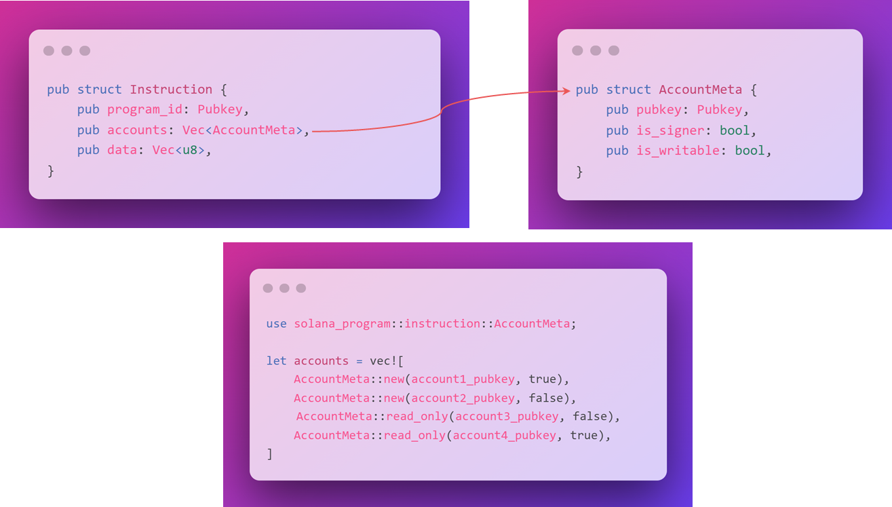

当然，以下是润色后的中文版本：

# ⚔ 跨项目的Boss战斗

如果你是一位玩家，可能曾经玩过那些具有庞大Boss战的游戏。这类Boss通常强大到个人难以战胜，因此你必须与朋友们联手攻击它们。就像灭霸与复仇者联盟的战斗一样。

战胜这些Boss的秘诀在于合作。每个人共同出力，施展自己的能力。Solana为你提供了合作的超能力：[可组合性](https://en.wikipedia.org/wiki/Composability?utm_source=buildspace.so&utm_medium=buildspace_project)是其架构的核心设计原则。


能够释放这种力量的是什么呢？那就是跨程序调用，或者称作`CPIs`。

想象一下你的终极NFT质押项目。在这里，我们将进行许多与代币相关的操作（质押、赎回、解质押），无需自己从头构建，只需调用代币程序，它就会为我们处理这些操作。

## 🔀 跨程序调用

跨程序调用是一种程序直接调用另一个程序的方式。就如同任何客户端可以通过JSON RPC调用任何程序，任何程序也可以直接调用其他程序。

`CPIs`将整个Solana生态系统本质上转变为一个巨大的API，作为开发者，你可以随意发挥。

## 🤔 如何制作一个CPI

你之前已经操作过几次CPI，所以这应该看起来非常熟悉！

CPIs是通过使用 `solana_program` 库中的[`invoke`](https://docs.rs/solana-program/1.10.19/solana_program/program/fn.invoke.html?utm_source=buildspace.so&utm_medium=buildspace_project)或[`invoke_signed`](https://docs.rs/solana-program/1.10.19/solana_program/program/fn.invoke_signed.html?utm_source=buildspace.so&utm_medium=buildspace_project)函数创建的。

`CPIs`能够将调用者的签名权限赋予被调用者。

- `invoke`将原始交易签名传递给你想要调用的程序。
- `invoke_signed`允许你的程序通过所谓的`PDA`（程序派生地址）“签署”指令。


```rust
// Used when there are not signatures for PDAs needed
pub fn invoke(
    instruction: &Instruction,
    account_infos: &[AccountInfo<'_>]
) -> ProgramResult

// Used when a program must provide a 'signature' for a PDA, hence the signer_seeds parameter
pub fn invoke_signed(
    instruction: &Instruction,
    account_infos: &[AccountInfo<'_>],
    signers_seeds: &[&[&[u8]]]
) -> ProgramResult
```


`Instruction` 类型的定义如下：

- `program_id` - 指定要调用的程序的公钥。
- `accounts` - 一个包含账户元数据的向量列表，你需要将被调用程序将要读取或写入的所有账户都包括进去。
- `data` - 一个字节缓冲区，代表作为向被调用程序传递的数据的向量。

根据你所调用的程序的不同，可能会有一个特定的 `crate` 包含辅助函数来创建 `Instruction` 对象。`accounts` 和 `data` 字段都是 `Vec` 类型，即向量。你可以使用 [vec](https://doc.rust-lang.org/std/macro.vec.html?utm_source=buildspace.so&utm_medium=buildspace_project#) 宏，利用数组表示法构建一个向量。

```rust
pub struct Instruction {
    pub program_id: Pubkey,
    pub accounts: Vec<AccountMeta>,
    pub data: Vec<u8>,
}
```



`accounts` 字段需要一个类型为`AccountMeta`的向量。`Instruction` 结构的以下字段详细展示了 `AccountMeta` 的内容：

```rust
pub struct AccountMeta {
    pub pubkey: Pubkey,
    pub is_signer: bool,
    pub is_writable: bool,
}
```

例如：

- `AccountMeta::new` - 表示账户可写。
- `AccountMeta::read_only` - 表示账户不可写入。
- `(account1_pubkey, true)` - 表示账户是签署人。
- `(account2_pubkey, false)` - 表示账户不是签署人。

```rust
use solana_program::instruction::AccountMeta;

let accounts = vec![
    AccountMeta::new(account1_pubkey, true),
    AccountMeta::new(account2_pubkey, false),
    AccountMeta::read_only(account3_pubkey, false),
    AccountMeta::read_only(account4_pubkey, true),
];
```

以下是一个创建 `Instruction` 的示例：

- `accounts` - 指令所需的 `AccountMeta` 的向量。
- `data` - 指令所需的序列化指令数据。
- `programId` - 被调用的程序。
- 使用 `solana_program::instruction::Instruction` 来创建新的 `Instruction`。

```rust
use solana_program::instruction::{AccountMeta, Instruction};

let accounts = vec![
    AccountMeta::new(account1_pubkey, true),
    AccountMeta::new(account2_pubkey, false),
    AccountMeta::read_only(account3_pubkey, false),
    AccountMeta::read_only(account4_pubkey, true),
];

struct InstructionData {
    amount: u8,
}

let data = BorshSerialize.try_to_vec(InstructionData { amount: 1 });

let instruction = Instruction {
    program_id: *program_id,
    accounts,
    data,
};
```

## 📜 传递账户列表

在底层，`invoke` 和 `invoke_signed` 实质上都是交易，所以我们需要传入一个 `account_info` 对象的列表。

你可以使用在 `solana_program` 包中的 `account_info` 结构体上实现的 `Clone Trait` 来复制每个需要传递到CPI的 `account_info` 对象。


`Clone trait` 会返回一个 `account_info` 实例的副本。

```rust
&[first_account.clone(), second_account.clone(), third_account.clone()]
```

## 🏒 `CPI` 与 `invoke`


请记住 - 调用其实就是像传递交易一样，执行这个操作的程序并不会真正接触到它。这意味着无需包含签名，因为Solana的运行时会将原始签名传递给你的程序。

## 🏑 `CPI` 与 `invoke_signed`


每当我们使用PDA时，我们会使用 `invoke_signed` 并传入种子。

Solana运行时将使用提供的种子和调用程序的 `program_id` 内部调用[`create_program_address`](https://docs.rs/solana-program/1.4.4/solana_program/pubkey/struct.Pubkey.html#method.create_program_address?utm_source=buildspace.so&utm_medium=buildspace_project)，然后将结果与指令中提供的地址进行比较。如果有任何账户地址与PDA匹配，该账户上的 `is_signer` 标志将被设置为 `true`。

这就像一条效率的捷径！

## 😲 最佳实践与常见陷阱


执行`CPI`时，你可能会遇到一些常见错误，通常表明你在构建`CPI`时使用了错误的信息。

例如，“签名者权限升级”表示你在指示中错误地代签地址。如果你在使用 `invoke_signed` 并收到此错误，可能是你提供的种子不正确。

```bash
EF1M4SPfKcchb6scq297y8FPCaLvj5kGjwMzjTM68wjA's signer privilege escalated
Program returned error: "Cross-program invocation with unauthorized signer or writable account"
```

还有其他可能导致问题的情况，包括：
- 任何可能被程序修改的账户必须指定为可写入。
- 写入未指定为可写的账户会导致交易失败。
- 写入不属于该程序的账户也会导致交易失败。
- 任何可能在程序执行期间被修改的`Lamport`余额的账户也必须被指定为可写入。
- 等等。

```bash
2qoeXa9fo8xVHzd2h9mVcueh6oK3zmAiJxCTySM5rbLZ's writable privilege escalated
Program returned error: "Cross-program invocation with unauthorized signer or writable account"
```

这里的核心概念是，如果你不在交易中明确声明你要操作这些账户，那么你就不能随意对其进行操作。

## 🤔 意义何在

`CPI`是Solana生态系统的一项关键特性，它允许所有部署的程序之间互操作。这为在现有基础上构建新协议和应用提供了可能，就像搭积木一样。

可组合性是加密货币的一个重要组成部分，而`CPI`则使其在Solana上成为可能。

`CPI`的另一重要方面是它们允许程序为其`PDAs`签名。正如你可能已经注意到的，`PDAs`在Solana开发中被广泛使用，因为它们允许程序以特定方式控制特定地址，以便没有外部用户能够为这些地址生成有效签名的交易。

通过这些解释，希望对Solana中的`CPI`技术有更深入的理解。如果你还有任何问题或需要进一步解释，请随时提问。
