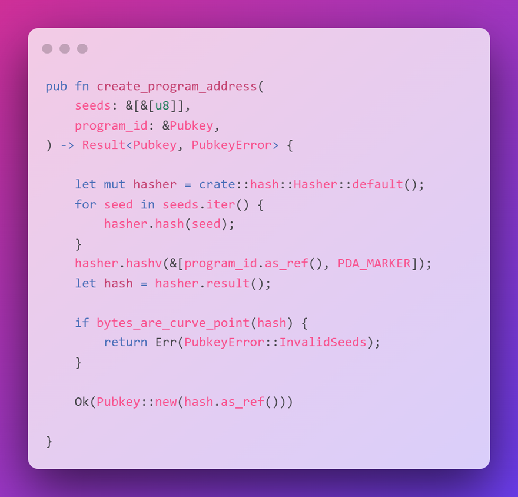

# 🧐 PDA 深入探究

啊，鸡蛋。或者正式称之为：程序派生地址。我们之前已经用它们烹饪过。让我们打开它们看看它们是如何工作的。

PDA主要有两个主要功能：

- 提供一种[确定性](https://www.google.com.hk/search?q=define+deterministic&utm_source=buildspace.so&utm_medium=buildspace_project)的方法来查找程序拥有的账户的地址
- 授权派生自PDA的程序代表其签署，就像用户可以使用他们的私钥签署一样

换句话说，它们是Solana网络上用于存储的安全键值存储。

## 🔎 寻找 PDAs (PDAs)

到目前为止，每当我们需要派生一个地址时，我们都使用了一个方便的函数。这个函数到底是做什么的呢？要找出答案，我们需要了解Solana密钥对是如何生成的。

回想一下密钥对的作用。它是一种证明你是你所说的那个人的方式。我们使用数字签名系统来实现这一点。Solana的密钥对是基于所谓的Ed25519椭圆曲线（你不需要知道这是什么鬼东西）。


由于`PDAs`是由程序控制的，所以它们不需要私钥。因此，我们使用不在Ed25519曲线上的地址来创建PDAs。这实际上意味着它们是没有相应私钥的公钥。

就是这样。你不需要理解Ed25519，甚至不需要知道数字签名算法是什么。你只需要知道PDA看起来像普通的Solana地址，并且由程序控制。如果你想进一步了解，可以看看Computerphile关于[数字签名](https://www.youtube.com/watch?v=s22eJ1eVLTU&utm_source=buildspace.so&utm_medium=buildspace_project)的酷炫视频。


要在Solana程序中找到一个PDA，我们将使用 find_program_address 函数。

“种子”是用于派生PDA的 find_program_address 函数的可选输入。例如，种子可以是任意组合：

- 指令数据
- 硬编码的值
- 其他账户的公钥

find_program_address 函数提供了一个额外的种子，称为“bump seed”，以确保结果不在Ed25519曲线上

一旦找到有效的PDA，该函数将返回两个值：

- PDA
- the bump that was used to derive the PDA


```rust
let (pda, bump_seed) = Pubkey::find_program_address(&[user.key.as_ref(), user_input.as_bytes().as_ref(), "SEED".as_bytes()], program_id)
```


## 🍳 Under the hood of find_program_address

find_program_address 是一个冒牌货 - 它实际上将输入 seeds 和 program_id 传递给 try_find_program_address 函数


```rust
pub fn find_program_address(seeds: &[&[u8]], program_id: &Pubkey) -> (Pubkey, u8) {
    Self::try_find_program_address(seeds, program_id)
        .unwrap_or_else(|| panic!("Unable to find a viable program address bump seed"))
}
```

然后， try_find_program_address 函数引入了 bump_seed 。

bump_seed 是一个 u8 变量，其值范围在0到255之间，它被附加到可选的输入种子中，然后传递给 create_program_address 函数


```rust
pub fn try_find_program_address(seeds: &[&[u8]], program_id: &Pubkey) -> Option<(Pubkey, u8)> {

    let mut bump_seed = [std::u8::MAX];
    for _ in 0..std::u8::MAX {
        {
            let mut seeds_with_bump = seeds.to_vec();
            seeds_with_bump.push(&bump_seed);
            match Self::create_program_address(&seeds_with_bump, program_id) {
                Ok(address) => return Some((address, bump_seed[0])),
                Err(PubkeyError::InvalidSeeds) => (),
                _ => break,
            }
        }
        bump_seed[0] -= 1;
    }
    None

}
```

create_program_address 函数对种子和 program_id 执行一系列哈希操作。这些操作计算一个密钥，然后验证计算出的密钥是否位于Ed25519椭圆曲线上。

如果找到一个有效的PDA（即一个不在曲线上的地址），则返回该PDA。否则，返回一个错误。



```rust
pub fn create_program_address(
    seeds: &[&[u8]],
    program_id: &Pubkey,
) -> Result<Pubkey, PubkeyError> {

    let mut hasher = crate::hash::Hasher::default();
    for seed in seeds.iter() {
        hasher.hash(seed);
    }
    hasher.hashv(&[program_id.as_ref(), PDA_MARKER]);
    let hash = hasher.result();

    if bytes_are_curve_point(hash) {
        return Err(PubkeyError::InvalidSeeds);
    }

    Ok(Pubkey::new(hash.as_ref()))

}
```

总结一下：

- 该函数将我们的输入种子和 program_id 传递给 try_find_program_address 函数。
- try_find_program_address 函数将一个 bump_seed （从255开始）添加到我们的输入种子中，然后调用 create_program_address 函数，直到找到一个有效的PDA。
- 一旦找到，PDA和 bump_seed 都会被归还。

你不需要记住所有的细节！重要的是要理解在高层次上调用 find_program_address 函数时发生了什么。

## 🤔 关于（PDA）的注意事项
