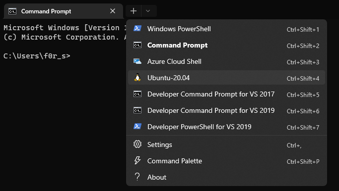

# 👀 本地设置

是时候进入专业领域了。Solana游乐场是一个令人惊叹的工具，可以帮助你入门并部署到开发网络。然而，它还不适合本地开发，而这正是专业人士的做法。

本地设置需要几个步骤，但它更加强大 - 你基本上将在你的设备上运行一个本地版本的Solana网络。这带来了许多好处，包括几乎无限的SOL。

这个设置有两个主要部分

- Rust编译器
- Solana命令行界面


**Windows用户**

虽然Solana CLI可以在Windows上运行，但在Linux上运行会有更好的体验 - 您不会遇到Windows特定的问题，并且可以使用与MacOS/Linux用户相同的命令。

你在这里想要做的是安装Windows子系统用于Linux。在[这里](https://learn.microsoft.com/en-us/windows/wsl/install?utm_source=buildspace.so&utm_medium=buildspace_project)查看相关文档，它们非常有帮助。

从现在开始，每次我要求你运行Solana命令时，你应该在WSL2中运行它。我强烈推荐安装[Windows终端](https://apps.microsoft.com/store/detail/windows-terminal/9N0DX20HK701?hl=en-nz&gl=nz&utm_source=buildspace.so&utm_medium=buildspace_project)应用程序，它具有漂亮的用户界面，并且可以轻松切换到WSL2。




你要在WSL2中安装Solana CLI和Rust编译器。这是一个与你的Windows安装分开的环境，所以如果你试图在错误的位置运行命令，会出现错误！！！

## 🦀 安装 Rust 编译器

最好的方法是按照官方指南进行操作。在[这里](https://www.rust-lang.org/tools/install?utm_source=buildspace.so&utm_medium=buildspace_project)查看它们。


## 🏄‍♂️ 安装 Solana 命令行界面 (CLI)

我还记得以前启动Solana CLI需要几个小时的时间。如今只需要几个命令！


您可以在[这里](https://docs.solana.com/cli/install-solana-cli-tools?utm_source=buildspace.so&utm_medium=buildspace_project)找到适用于您特定操作系统的版本。


**Windows用户应该按照Linux安装说明进行操作！**

安装完成后，您应该得到一个版本的打印输出，而不是运行时出现错误

```bash
solana --version
```

如果你确定已经安装了所有的东西，但仍然出现错误，请关闭所有的终端窗口，然后在一个新的窗口中再次尝试。


##  ⚙ Solana配置

Solana CLI有一些可以配置的选项，比如你想连接的网络和你的密钥对所在的位置。你可以使用以下命令获取当前配置的报告：

```bash
solana config get
```

这是我看到的：


```bash
Config File: /home/endgame/.config/solana/cli/config.yml
RPC URL: http://localhost:8899
WebSocket URL: ws://localhost:8900/ (computed)
Keypair Path: /home/endgame/.config/solana/id.json
Commitment: confirmed
```

有趣！以下是每个词的意思：

- `Config File` - Solana CLI 文件位于您的计算机上
- `RPC URL` - 您正在使用的终端点，将您连接到本地主机、开发网络或主网络
- `WebSocket URL` - 监听来自目标集群的事件的 WebSocket（在设置 RPC URL 时计算）
- `Keypair Path` - 运行Solana CLI子命令时使用的密钥对路径
- `Commitment` - 提供了网络确认的度量，并描述了一个区块在特定时间点上的最终性程度

您可以使用 `config set --url` 命令来更改 RPC URL ：


```bash
solana config set --url localhost

solana config set --url devnet

solana config set --url mainnet-beta
```

我们开发人员在生活中需要按键较少，因此可以将它们缩短为：

```bash
solana config set --u l

solana config set --u d

solana config set --u m
```

哇，节省了这么多时间，走起来吧！

**密钥对**


你经常需要使用不同的密钥对来测试交互，所以命令行界面（CLI）提供了一种简单的方式来管理你的密钥对。它将它们存储在你的文件夹中的JSON文件中。以下是你需要了解的所有与密钥对相关的命令

**生成一个新的密钥对**

```bash
solana-keygen new --outfile ~/<FILE_PATH>
```

**设置默认密钥对**

```bash
solana config set --keypair ~/<FILE_PATH>
```

获取当前默认密钥对的 `publickey`

```bash
solana address
```

获取当前默认密钥对的SOL余额

```bash
solana balance
```

空投到当前默认密钥对

```bash
solana airdrop 2
```

确保你将这些密钥文件保存安全，不要在测试和部署中使用相同的密钥对！你可不想因为不小心将密钥对推送到公共的 GitHub 仓库而丢失所有精美的 NFT。

**本地验证器**

Solana CLI带有一个方便的命令，可以快速启动本地验证节点。这类似于Solana网络的本地版本，您可以用它来测试您的程序。与部署到Devnet相比，它速度更快，而且您可以在不花费任何Devnet SOL的情况下使用它来测试您的程序。

您可以使用以下命令启动本地验证器：

```bash
solana-test-validator
```

在Windows上的WSL中，在尝试运行验证器之前，您需要运行此命令：

```bash
cd ~
```

我们正在切换目录到 `~` ，这样我们就不会在WSL内部的已挂载的Windows映像中了。这样修复了一些会出错的路径问题。


接下来，打开另一个终端窗口并输入

```bash
solana logs
```

这将为您提供本地网络的所有交易日志。在您进行交易之前，这里不会发生任何事情，所以打开第三个终端窗口并运行。


```bash
solana address
solana airdrop 999 YOUR_ADDRESS
```

你应该能看到空投交易的到来！挺酷的，对吧？

你可以通过日志和本地验证器做很多酷炫的事情，比如筛选特定程序的日志。点击[这里](https://docs.solana.com/cli?utm_source=buildspace.so&utm_medium=buildspace_project)查看更多酷炫的内容。

需要记住的一件事是，只要你需要网络运行，就必须保持终端窗口 `solana-test-validator` 一直运行。如果关闭它，网络也会关闭。在Windows上，您可以使用 `CTRL + C` 退出，而在Mac上，您可以使用 `CMD + C` 退出。

## 🦾 本地程序部署

既然你已经掌握了所有本地开发工具，那么让我们试着在本地部署一个程序吧！

首先，我们需要创建一个Solana程序。这就是我们安装Rust的原因。我们只需要一个简单的Rust项目：

```bash
cargo new --lib local-program
cd local-program
code .
```

Cargo就像Rust的NPM。它会生成我们所需的所有样板代码。如果 `code .` 无法打开VS Code，请不要担心，只需在代码编辑器中打开该目录的根目录即可。


打开 `Cargo.toml` 并添加Solana依赖项，将这个Rust项目变成一个Solana程序：

```toml
[package]
name = "<PROJECT_DIRECTORY_NAME>"
version = "0.1.0"
edition = "2021"

[features]
no-entrypoint = []

[dependencies]
solana-program = "~1.8.14"

[lib]
crate-type = ["cdylib", "lib"]
```

我们不能只部署一个空文件，所以打开 `lib.rs` 并添加以下内容：

```rust
use solana_program::{
    account_info::AccountInfo,
    entrypoint,
    entrypoint::ProgramResult,
    pubkey::Pubkey,
    msg,
};

entrypoint!(process_instruction);

pub fn process_instruction(
    _program_id: &Pubkey,
    _accounts: &[AccountInfo],
    _instruction_data: &[u8],
    ) -> ProgramResult {
        msg!("Hello local Solana network!!");
        Ok(())
}
```

这就是我们所需要的！接下来，我们需要构建这个。Cargo配备了一种特殊类型的构建命令，与Solana加载器相匹配：

```bash
cargo build-sbf
```


第一次可能需要几分钟，之后速度会更快。你会注意到出现了一个名为“target”的新文件夹。这是编译好的代码，准备好部署。要部署这个程序，你可以使用命令 `solana program deploy <PATH>` ，指向你的“target”文件夹，对我来说是

```bash
solana program deploy ~/Desktop/solana-core/local-program/target/deploy/local_program.so
```
