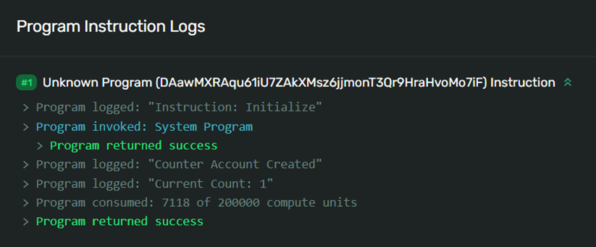

# 🧪 测试 Solana 程序

上节课的全部内容都是为了准备好Mint账户。预备阶段已经结束，现在是正式表演的时候了。一个强大的测试流程可以通过在问题真正出现之前捕捉到开发人员引入的错误来最大程度地减少生产代码中的bug数量。

在本课程中，我们将涵盖两种类型的测试：单元测试和集成测试。

单元测试是小而更专注的，一次只测试一个模块的隔离，并且可以测试私有接口。

集成测试完全与您的库外部无关，并以与任何其他外部代码相同的方式使用您的代码，仅使用公共接口，并可能在每个测试中使用多个模块。

## 🔢 单元测试

单元测试的目的是在与其他代码隔离的情况下测试每个代码单元，以快速确定代码是否按预期工作。

在Rust中，单元测试通常与它们所测试的代码位于同一个文件中。

单元测试在一个名为 `tests` 的模块内声明，该模块带有 `cfg(test)` 的注解

- 测试在 `tests` 模块中使用 `#[test]` 属性进行定义。
- `cfg` 属性代表配置，告诉Rust只有在特定的配置选项下才应包含后续的项目。
- `#[cfg(test)]` 注解告诉Cargo只在我们运行 `cargo test-sbf` 时编译我们的测试代码。
- 运行 `cargo test-sbf` 时，该模块中标记为测试的每个函数都将被运行。

您还可以在模块中创建非测试的辅助函数

```rust
// Example testing module with a single test
#[cfg(test)]
mod tests {
    #[test]
    fn it_works() {
        let result = 2 + 2;
        assert_eq!(result, 4);
    }

    fn helper_function() {
        doSomething()
    }
}
```

## ❓ 如何构建单元测试

使用 [solana_sdk](https://docs.rs/solana-sdk/latest/solana_sdk/) 创建 Solana 程序的单元测试。

这个木箱本质上是Rust语言中与 `@solana/web3.js` Typescript包相对应的东西。

 [solana_program_test](https://docs.rs/solana-program-test/latest/solana_program_test/#) 也用于测试 Solana 程序，并包含一个基于 `BanksClient` 的测试框架。

 在代码片段中，我们创建了一个公钥作为我们的 `program_id` ，然后初始化了一个 `ProgramTest` 。

 从 `banks_client` 返回的 `ProgramTest` 将作为我们进入测试环境的接口

 该 payer 变量是一个使用 SOL 生成的新密钥对，将用于签名/支付交易。


 然后，我们创建一个第二个 `Keypair` 并使用适当的参数构建我们的 `Transaction` 。

 最后，我们使用调用 `banks_client` 时返回的 `ProgramTest::new` 来处理此交易，并检查返回值是否等于 `Ok(_)` 。

 该函数使用 `#[tokio::test]` 属性进行注释。

 Tokio是一个用于编写异步代码的Rust crate。这只是将我们的测试函数标记为`async`。


 ```rust
 // Inside processor.rs
 #[cfg(test)]
 mod tests {
     use {
         super::*,
         assert_matches::*,
         solana_program::instruction::{AccountMeta, Instruction},
         solana_program_test::*,
         solana_sdk::{signature::Signer, transaction::Transaction, signer::keypair::Keypair},
     };

     #[tokio::test]
     async fn it_works() {
         let program_id = Pubkey::new_unique();

         let (mut banks_client, payer, recent_blockhash) = ProgramTest::new(
             "program_name",
             program_id,
             processor!(process_instruction),
         )
         .start()
         .await;

         let test_acct = Keypair::new();

         let mut transaction = Transaction::new_with_payer(
             &[Instruction {
                 program_id,
                 accounts: vec![
                     AccountMeta::new(payer.pubkey(), true),
                     AccountMeta::new(test_acct.pubkey(), true)
                 ],
                 data: vec![1, 2, 3],
             }],
             Some(&payer.pubkey()),
         );
         transaction.sign(&[&payer, &test_acct], recent_blockhash);

         assert_matches!(banks_client.process_transaction(transaction).await, Ok(_);
     }
 }
 ```

## 集成测试

集成测试的目的是完全与其测试的代码分离。

这些测试旨在通过公共接口与您的代码进行交互，以便其他人可以按照预期的方式访问它。

他们的目的是测试你的库的许多部分是否能正确地协同工作。

在单独运行时正常工作的代码单元，在集成时可能会出现问题，因此集成代码的测试覆盖率也很重要。

## ❓ 如何构建集成测试

要创建集成测试，首先需要在项目目录的顶层创建一个 `tests` 目录。

我们可以在这个目录下创建任意数量的测试文件，每个文件都将作为自己的集成测试。

- 每个 `tests` 目录中的文件都是一个独立的 crate，因此我们需要将我们想要测试的代码库引入到每个文件的作用域中 - 这就是 `use example_lib` 行的作用。
- 我们不需要用 #[cfg(test)] 来注释 tests 目录中的测试，因为当我们运行 `cargo test-sbf` 时，Cargo只会编译 `tests` 目录中的文件。

```rust
// Example of integration test inside /tests/integration_test.rs file
use example_lib;

#[test]
fn it_adds_two() {
    assert_eq!(4, example_lib::add_two(2));
}
```

一旦你编写好测试（单元测试、集成测试或两者兼有），你只需要运行`cargo test-bpf`，它们就会执行。

输出的三个部分包括：
- 单元测试
- 集成测试
- doc tests
    - 在这节课中，我们不会涉及到文档测试，但是在你的代码库中，有额外的功能可以执行文档中的代码示例。

```bash
cargo test
   Compiling adder v0.1.0 (file:///projects/adder)
    Finished test [unoptimized + debuginfo] target(s) in 1.31s
     Running unittests (target/debug/deps/adder-1082c4b063a8fbe6)

running 1 test
test tests::it_works ... ok

test result: ok. 1 passed; 0 failed; 0 ignored; 0 measured; 0 filtered out; finished in 0.00s

     Running tests/integration_test.rs (target/debug/deps/integration_test-1082c4b063a8fbe6)

running 1 test
test it_adds_two ... ok

test result: ok. 1 passed; 0 failed; 0 ignored; 0 measured; 0 filtered out; finished in 0.00s

   Doc-tests adder

running 0 tests

test result: ok. 0 passed; 0 failed; 0 ignored; 0 measured; 0 filtered out; finished in 0.00s
```


## 🔌 使用Typescript进行集成测试

测试程序的另一种方法是将其部署到Devnet或本地验证器，并从您创建的某个客户端向其发送交易。

使用Typescript编写客户端测试脚本：

- [Mocha 测试框架](https://mochajs.org/?utm_source=buildspace.so&utm_medium=buildspace_project)

- [使用Chai断言库](https://www.chaijs.com/?utm_source=buildspace.so&utm_medium=buildspace_project)

使用 `npm install mocha chai` 安装 `Mocha` 和 `Chai`

然后在您的TypeScript项目中更新 `package.json` 文件。这会告诉编译器在运行命令 `npm run test` 时执行 `/test` 目录中的TypeScript文件或文件。

你需要确保这里的路径是指向你的测试脚本所在的正确路径。

```json
// Inside package.json
"scripts": {
        "test": "mocha -r ts-node/register ./test/*.ts"
},
```

`Mocha`测试部分使用“`describe`”关键字声明，告诉编译器其中包含了`Mocha`测试。

- 在 `describe` 部分内，每个测试都用 it 指定
- `Chai`包用于确定每个测试是否通过，它具有一个`expect`函数，可以轻松比较值。

```typescript
describe("begin tests", async () => {
    // First Mocha test
    it('first test', async () => {
        // Initialization code here to send the transaction
        ...
        // Fetch account info and deserialize
        const acct_info = await connection.getAccountInfo(pda)
        const acct = acct_struct.decode(acct_info.data)

        // Compare the value in the account to what you expect it to be
        chai.expect(acct.num).to.equal(1)
    }
})
```

运行 `npm run test` 将执行 `describe` 块中的所有测试，并返回类似以下的结果，指示每个测试是否通过或失败。

```bash
> scripts@1.0.0 test
> mocha -r ts-node/register ./test/*.ts

    ✔ first test (1308ms)
    ✔ second test

    2 passing (1s)
```

## ❌ 错误代码

程序错误通常以程序返回的错误枚举中错误的十进制索引的十六进制表示形式显示。

例如，如果您在向SPL代币程序发送交易时遇到错误，错误代码 `0x01` 的十进制等价值为1。

查看[Token程序](https://github.com/solana-labs/solana-program-library/blob/master/token/program/src/error.rs?utm_source=buildspace.so&utm_medium=buildspace_project)的源代码，我们可以看到程序错误枚举中该索引处的错误是 `InsufficientFunds` 。


您需要能够访问任何返回自定义程序错误代码的程序的源代码来进行翻译。

## 📜 程序日志

Solana使创建新的自定义日志变得非常简单，只需使用 `msg!()` 宏即可



在 Rust 中编写单元测试时，请注意不能在测试本身中使用 `msg!()` 宏来记录信息。

你需要使用Rust的本地 `println!()` 宏。

程序代码中的语句仍然有效，只是你不能在测试中使用它进行日志记录。

## 🧮 计算预算

在区块链上进行开发会面临一些独特的限制，其中之一是 Solana 上的计算预算。

计算预算的目的是防止程序滥用资源。

当程序消耗完整个预算或超过限制时，运行时会停止程序并返回一个错误。

默认情况下，计算预算设置为200k计算单元乘以指令数量，最多不超过1.4M计算单元。

基础费用为5,000 Lamports。一个微`Lamport`等于`0.000001 Lamports`。

使用 `ComputeBudgetProgram.setComputeUnitLimit({ units: number })` 来设置新的计算预算。

`ComputeBudgetProgram.setComputeUnitPrice({ microLamports: number })` 将会将交易费用提高到基本费用（5,000 Lamports）之上。

- 以微Lamports提供的价值将乘以CU预算，以确定`Lamports`s中的优先费用。
- 例如，如果您的CU预算为1M CU，并且您增加了1微Lamport/CU，那么优先级费用将为1 Lamport（1M * 0.000001）。
- 总费用将为`5001 Lamports`。


要更改交易的计算预算，您必须将交易的前三条指令之一设置为设置预算的指令。

```ts
const modifyComputeUnits = ComputeBudgetProgram.setComputeUnitLimit({
  units: 1000000
});

const addPriorityFee = ComputeBudgetProgram.setComputeUnitPrice({
  microLamports: 1
});

const transaction = new Transaction()
.add(modifyComputeUnits)
.add(addPriorityFee)
.add(
    SystemProgram.transfer({
      fromPubkey: payer.publicKey,
      toPubkey: toAccount,
      lamports: 10000000,
    })
  );
```

可以使用函数 `sol_log_compute_units()` 来打印当前指令中程序剩余的计算单元数量。

```rust
use solana_program::log::sol_log_compute_units;

pub fn process_instruction(
    program_id: &Pubkey,
    accounts: &[AccountInfo],
    instruction_data: &[u8],
) -> ProgramResult {

    sol_log_compute_units();

...
}
```

## 📦 堆栈大小

每个程序在执行时都可以访问4KB的堆栈帧大小。Rust中的所有值默认都是堆栈分配的。

在像Rust这样的系统编程语言中，一个值是在栈上还是堆上的区别可能很大，尤其是在像区块链这样受限环境中工作时。

当处理更大、更复杂的程序时，您将开始遇到使用完整的4KB内存的问题。

这通常被称为"[堆栈溢出](https://en.wikipedia.org/wiki/Stack_overflow?utm_source=buildspace.so&utm_medium=buildspace_project)"或"栈溢出"。

程序可以通过两种方式达到堆栈限制：

- 一些依赖的包可能包含违反堆栈帧限制的功能
- 或者程序本身在运行时可以达到堆栈限制。

以下是一个示例，当堆栈违规是由依赖的包引起时，您可能会看到的错误消息。

```bash
Error: Function _ZN16curve25519_dalek7edwards21EdwardsBasepointTable6create17h178b3d2411f7f082E Stack offset of -30728 exceeded max offset of -4096 by 26632 bytes, please minimize large stack variables
```

如果一个程序在运行时达到了它的4KB堆栈，它将停止并返回一个错误： AccessViolation

```bash
Program failed to complete: Access violation in stack frame 3 at address 0x200003f70 of size 8 by instruction #5128
```

为了解决这个问题，你可以重构你的代码，使其更加节省内存，或者将一些内存分配给堆。

所有程序都可以访问一个`32KB`的运行时堆，可以帮助你释放一些堆栈上的内存。

要做到这一点，您需要使用[Box](https://doc.rust-lang.org/std/boxed/struct.Box.html?utm_source=buildspace.so&utm_medium=buildspace_project)结构体。

一个 `box` 是指向堆分配的类型为 `T` 的值的智能指针。

可以使用解引用运算符来解引用封装的值。

在这个例子中，从`Pubkey::create_program_address`返回的值，即一个公钥，将被存储在堆上，而`authority_pubkey`变量将持有指向存储公钥位置的堆上指针。

```rust
let authority_pubkey = Box::new(Pubkey::create_program_address(authority_signer_seeds, program_id)?);

if *authority_pubkey != *authority_info.key {
      msg!("Derived lending market authority {} does not match the lending market authority provided {}");
      return Err();
}
```
