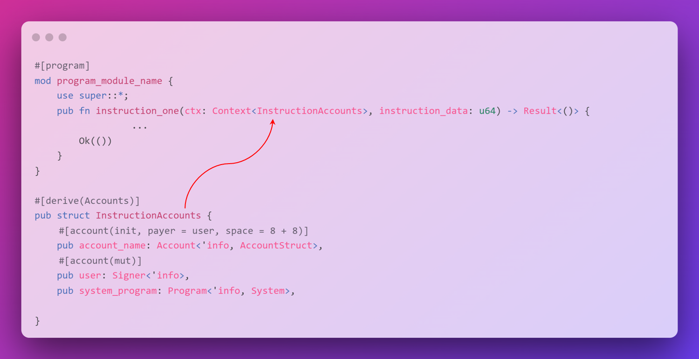
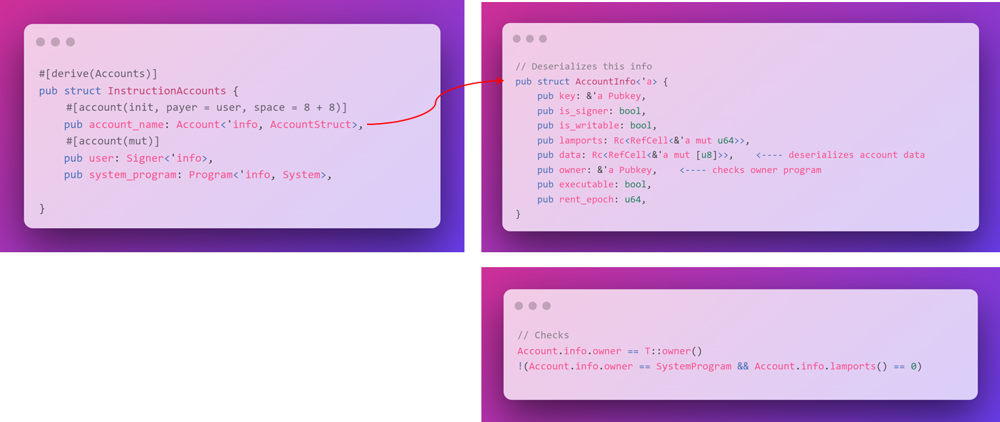

# 🐟 Anchor 框架

当进行本地构建时，我们会将程序分解为多个文件，每个文件负责特定的任务。但由于 `Anchor` 大大精简了代码量，我们现在可以学习如何将程序组织到单一文件的不同部分中 😎。

我们可以将所有内容整合到一个文件中，这得益于 `Anchor` 使用宏来抽象各种重复任务。只需在文件中放置一个宏，让 `Anchor` 替我们处理，无需编写大量的代码。这也意味着我们能将指令逻辑与账户验证和安全检查分开。

在我们继续之前，先快速回顾一下过去必须编写许多样板代码的那些无趣部分：

- 账户验证
- 安全检查
- 序列化/反序列化

`Anchor` 使用一些 `Rust` 的巧妙技巧来解决所有这些问题✨。它被设计为处理许多常见的安全问题，使你能够构建更安全的程序！

## 🍱 `Anchor Program` 的结构

让我们一起深入了解 `Anchor program` 的结构。


这是一个相当简洁的程序 — 它初始化一个新账户，并使用从指令中传入的数据更新账户的数据字段。

你会注意到每个部分都是以宏或属性开始的，这些都有助于扩展你所编写的代码。

我们有四个主要部分：

- `declare_id!` - 程序的链上地址（这取代了 `entrypoint!`）
- `#[program]` - 程序的指令逻辑
- `#[derive(Accounts)]` - `list`、验证和反序列化传入指令的账户
- `#[account]` - 为程序定义自定义账户类型

### 🗿 `declare_id!`

让我们先来了解 `declare_id!` 宏，因为它非常简单：


这用于指定程序的链上地址（即 `PROGRAM_ID`）。当你第一次构建 `Anchor` 程序时，会生成一个新的密钥对（可以使用 `anchor keys list` 获取）。这个密钥对会作为部署程序的默认密钥对（除非你另外指定）。该密钥对的公钥被用作 `PROGRAM_ID` 并在 `declare_id!` 宏中定义。

### 👑 `#[program]`


`#[program]` 属性定义了包含所有程序指令的模块（因此是 `mod`）。这就是你将实现程序中每个指令逻辑的地方。你将为程序支持的每个指令创建一个公共函数。账户验证和安全检查与程序逻辑分离，因此不会出现在此处！

每个指令都需要两个参数：一个 `Context` 和指令数据。`Anchor` 会自动反序列化指令数据，所以我们无需为此担心！

在我们深入了解这些宏的其他部分之前，我们需要先了解指令逻辑中这个新的 `Context` 是什么。我们将深入探讨三个层次：`Native` 层、`Rust` 层和 `Anchor` 层，请紧随我来！

### 📝 `Context`

回想我们在本地处理指令时的工作流程。我们在 `process_instruction` 函数中传入了 `program_id`、`accounts` 和 `instruction_data`。除了指令数据外，其余部分可以统称为指令的“`Context`”。由于程序无状态，因此必须知道指令的上下文。在`Anchor`中，处理指令只需要`Context`和数据两部分。

`Context`是一个结构体，承载着当前事务的所有信息。它传递到每个指令处理程序中，并包含以下字段：

```rust
pub struct Context<'a, 'b, 'c, 'info, T> {
    /// 当前正在执行的程序ID
    pub program_id: &'a Pubkey,
    /// 反序列化的账户
    pub accounts: &'b mut T,
    /// 剩下的账户信息，但未被反序列化或验证
    /// 直接使用时需小心。
    pub remaining_accounts: &'c [AccountInfo<'info>],
    /// 在约束验证期间找到的Bump种子
    /// 提供此项便利，以便处理程序
    /// 不必重新计算Bump种子或
    /// 将它们作为参数传入。
    pub bumps: BTreeMap<String, u8>
}
```

#### 第二层：Rust。

我们之前没在`Rust`中谈论过“生命周期”，这在参数`'a, 'b, 'c, 'info`的 `'` 符号中体现。生命周期是`Rust`用来追踪引用有效期的机制。每个带生命周期标记的属性都与`Context`的生命周期关联。简而言之，它的意思是，在`Context`的其他属性消失前，不要释放或解引用它，以免出现悬挂引用。但现阶段我们无需过多深究，因为这对我们即将要做的事情影响不大。

```rust
pub accounts: &'b mut T,
```

重要的是 `T`，这是一个通用占位符，代表一种类型。这意味着`Context`将包含一个类型，并且该类型可以在运行时确定。

简单来说，我们告诉`Rust`：“嘿，我现在还不知道`accounts`的确切类型，我会在实际使用时告诉你。”

#### 第三层：`Anchor`。

在运行时，`accounts`的类型变为我们在`InstructionAccounts`中定义的类型。这意味着我们的`instruction_one`函数现在能够访问在`InstructionAccounts`中声明的账户。

- 执行程序的`PROGRAM_ID`（`ctx.program_id`）
- 传递到指令中的账户（`ctx.accounts`）
- 剩余的账户（`ctx.remaining_accounts`），包括所有传入指令但未在`Accounts`结构中声明的账户。这是不常用的。
- 任何`PDA`账户的`Bump`（`ctx.bumps`）。把它们放在这里，就不必在指令处理程序内重新计算。

### ⌨ `#[derive(Accounts)]`

让我们回归主题，探讨与`#[derive(Accounts)]`部分有关的`Context`类型。



这是我们定义传入指令的账户的地方。`#[derive(Accounts)]`宏让`Anchor`创建了解析和验证这些账户所需的实现。

例如，`instruction_one`需要一个类型为`InstructionAccounts`的`Context`参数。`#[derive(Accounts)]`宏实现了`InstructionAccounts`结构，其中包括三个账户：

- `account_name`
- `user`
- `system_program`

当`instruction_one`被调用时，程序会：

- 核对传入指令的账户是否与`InstructionAccounts`结构中规定的账户类型匹配。
- 检查账户是否满足指定的附加约束（这是`#[account]`行的作用）。

最后，我想强调一下。在一行代码中，我们就执行了一个`CPI`到系统程序来创建一个账户！是不是有点疯狂？我们无需编写任何创建账户的代码，只需声明要创建的账户，`Anchor`就会完成剩下的工作！

最后，对于用户账户，有一个“`mut`”属性，它标记了账户为可变。由于用户将为此付费（余额会有所变化），因此它必须是可变的。

### 🔎 在Anchor中的账户类型

或许你还记得上周我们使用的`AccountInfo`类型，当在编写`native`程序时。每当需要处理账户时，我们都会使用这个类型 - 处理指令、创建交易、进行`CPI`等。这个类型覆盖了我们可能会用到的各种账户类型，比如`PDA`、用户账户，甚至系统程序。想想看，使用同一个类型来描述如此多样的参数，的确有些奇特。

`Anchor`将原生类型包裹起来，提供了一系列新类型，每个都带有不同的验证。我们不再需要在指令中检查是否拥有一个账户，因为我们可以声明它为特定类型，`Anchor`会为我们进行验证！

下面让我们了解一下几种常见的类型，首先是`Account`：



你会注意到`account_name`是`Account`类型的，它基本上是对`AccountInfo`的扩展，我们在原生开发中已经用过了。那么它在这里的作用是什么呢？

对于`account_name`账户，`Account`包装器会：

- 以`AccountStruct`的格式反序列化`data`。
- 检查账户的程序所有者是否与指定的账户类型匹配。
- 当在`Accounts`包装器中指定的账户类型是使用`#[account]`宏在同一个`crate`中定义的时候，程序的所有权检查是针对`declare_id!`宏中定义的`programId`进行的。

简直省了不少力气！

### 🖖 `Signer`类型

接下来是`Signer`类型。


这个类型用来确认账户是否已经签署了交易。

例如，我们可以要求`user`账户必须是指令的签署者。我们不检查其他任何内容 - 我们不关心账户的类型或签署者是否拥有该账户。

如果他们没有签署交易，指令就会失败！

### 💻 `Program` 输入类型


最后，`Program`类型确保传入的账户符合我们的预期，并且确实是一个程序（可执行文件）。

你可能已经开始注意到`Anchor`是如何让事情变得简单的。这段代码不仅更简洁，还更易于理解！因为每个元素都有自己的类型，所以你能够更快地理解程序的功能。只需掌握几个额外的“规则”就行了 :)

### 🤔 额外的限制条件

到现在为止，我们唯一还没有涉及的是`#[account]`位，无论是在`InstructionAccounts`结构体内还是外部。

让我们先看看`#[account]`结构体内部：


这就是我们为账户指定额外限制条件的地方。`Anchor`在基本验证方面做得很好，但它还能帮我们检查一些其他特定的东西！

对于`account_name`属性，它通过`#[account(..)]`指定了：

- `init` - 通过`CPI`创建和初始化账户，将其设置为账户的`discriminator`。
- `payer` - 指定`payer`为结构中定义的`user`账户的初始化值。
- `space` - 指定为账户分配的`space`的大小为8 + 8字节。
    - 前`8`个字节是一个`discriminator`，`Anchor`会自动添加以识别账户类型。
    - 接下来的`8`个字节为账户中存储的数据分配空间，其定义在`AccountStruct`类型中。
    - 更多细节请参考：[Space Reference](https://www.anchor-lang.com/docs/space)。

再来复习一遍。我们在一行代码中执行一个`CPI`到系统程序来创建一个账户！想想看，这有多简便？我们不需要手动编写代码来创建账户，我们只需指定要创建的账户，`Anchor`就会完成剩下的工作！

最后，对于用户账户，有一个`mut`属性，表示账户是可变的。因为用户会为此付费，余额可能会变化，所以它必须是可变的。

### `#[account]`

再多陪我一会儿，我们已经到了最后的部分！


`#[account]`属性用于表现`Solana`账户的数据结构，并且实现了以下几个`Trait`：

- `AccountSerialize`
- `AccountDeserialize`
- `AnchorSerialize`
- `AnchorDeserialize`
- `Clone`
- `Discriminator`
- `Owner`

简单来说，`#[account]`属性实现了序列化和反序列化功能，并为账户实现了`discriminator`和`Owner trait`。

- `discriminator`是一个`8`字节的唯一标识符，代表账户类型，并由账户结构名称的`SHA256`的前8字节派生。
- 任何对`AccountDeserialize`的`try_deserialize`的调用都会检查这个`discriminator`。
- 如果不匹配，那么账户就会被视为无效，并且账户反序列化会以错误退出。

该`#[account]`属性还实现了`Owner Trait`：

- 使用`programId`由`declareId`声明的`crate`中`#[account]`的使用。
- 使用程序中定义的`#[account]`属性初始化的帐户归程序所有

就是这样，`Anchor`程序的构建结构就介绍完了。虽然有些复杂，但这些都是我们后续使用`Anchor`的必要知识。休息一下吧，很快就回来，是时候开始构建了！

## ‼ 赶快回来！

这真的非常重要——你现在可能无法完全理解其中的全部内容。

没关系，我也是。我花了整整两天的时间来写这一页。一旦你用`Anchor`构建了一个程序，再回来重新阅读一遍。你会发现更容易理解，一切都会变得更有意义。

学习并不是一个线性的过程，它会有高潮和低谷。你不能仅仅通过一次阅读就掌握宇宙中最困难的主题。不断学习，不断建立，你会学得更精，建得更好。
