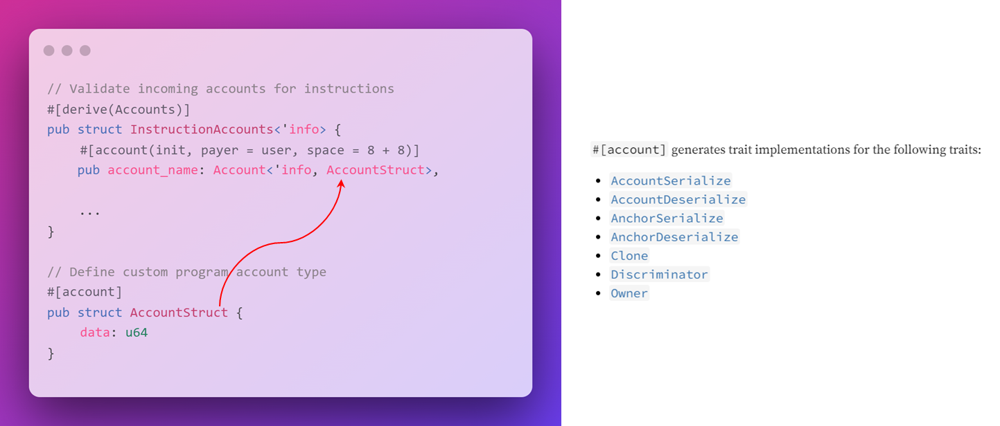

# 🐟 Anchor 框架

我们从零开始。我们与Solana互动的第一个程序是Ping程序。让我们使用Anchor从头开始构建它。你可以在playground上做这个，但我会在本地设置它，因为测试更容易。在本地构建时，我们将程序组织成多个文件，每个文件对应一个关注点。由于Anchor减少了很多代码，我们现在将学习它如何将程序组织成单个文件中的不同部分 😎

我们可以将所有内容合并到一个文件中，因为Anchor使用宏来抽象出各种重复的任务。我们只需在其中放置一个宏，让Anchor为我们完成，而不是写大量的代码。这也意味着我们可以将指令逻辑与账户验证和安全检查分开。

在我们继续之前，快速提醒一下我们不得不写很多样板文件的一些无聊的事情：

- 账户验证
- 安全检查
- 序列化/反序列化

Anchor使用一些Rust的魔法来处理所有这些问题✨，它被设计用于处理许多常见的安全问题，让您能够构建更安全的程序！

## 🍱 Anchor Program 结构

让我们来看一下`Anchor program`的结构


这是一个相当简单的程序 - 它初始化一个新账户，并使用从指令中传入的数据更新账户的数据字段。


你会注意到每个部分都以宏或属性开头，它们都有助于扩展你所编写的代码。

我们有四个部分：


- `declare_id!` - 程序的链上地址（这取代了我们的入口点）
- `#[program]` - 程序的指令逻辑
- `#[derive(Accounts)]` 列出、验证和反序列化传入指令的账户
- `#[account]` 为程序定义自定义账户类型

### 🗿 declare_id!

让我们先把 `declare_id!` 宏搞定，因为它非常简单：


这用于指定程序的链上地址（即 `programId` ）。当第一次构建Anchor程序时，会生成一个新的密钥对（可以使用 `anchor keys list` 获取）。该密钥对将作为部署程序的默认密钥对（除非另有指定）。该密钥对的公钥被用作 `programId` 并在 `declare_id!` 宏中指定。

### 👑 #[program]


`#[program]` 属性定义了包含所有程序指令的模块（因此是 `mod` ）。这是您实现程序中每个指令逻辑的地方。您将为程序支持的每个指令创建一个公共函数。帐户验证和安全检查与程序逻辑分开，所以它们不在这里！

每个指令都需要两个参数，一个是“上下文”和指令数据。Anchor会自动反序列化指令数据，所以我们不需要担心这个！

在我们继续深入了解这些宏的其他部分之前，我们需要看一下指令逻辑中的这个新的 `Context` 是什么。我们将深入了解三个层次 - 本地层、Rust层和Anchor层，所以请跟上我！

### 📝 上下文

回想一下我们在本地处理指令时需要做的事情。在我们的 `process_instruction` 函数中，我们传入 `program_id` 、 `accounts` 和 `instruction_data` 。除了指令数据之外，你可以将其他所有内容都归为指令的“上下文”。由于我们的程序是无状态的，它们需要知道指令的上下文。这意味着在Anchor中，我们只需要两样东西来处理指令——上下文和数据。

上下文是一个结构体，包含有关当前事务的所有信息。它被传递到每个指令处理程序中，并包含以下字段：

```rust
pub struct Context<'a, 'b, 'c, 'info, T> {
    /// Currently executing program ID
    pub program_id: &'a Pubkey,
    /// Deserialized accounts
    pub accounts: &'b mut T,
    /// Remaining accounts given, but not deserialized or validated
    /// Be very careful when using this directly.
    pub remaining_accounts: &'c [AccountInfo<'info>],
    /// Bumps seeds found during constraint validation.
    /// This is provided as a convenience so that handlers
    /// don't have to recalculate bump seeds or
    /// pass them in as arguments.
    pub bumps: BTreeMap<String, u8>
}

```

第二层 - Rust。

我们在Rust中没有谈论过“生命周期”，这是我们参数中的 `'` 。生命周期是Rust编译器用来跟踪引用有效期的机制。每个带有生命周期标记的属性都与 `Context` 的生命周期相关联。它基本上是在说，在其他属性消失之前，不要释放或解引用 `Context` ，以避免出现悬空引用。我们现在不需要担心理解这些，因为它对我们将要做的事情影响不大。

```rust
pub accounts: &'b mut T,
```

重要的是 `T` ，它是一个通用的占位符：用于表示一种类型。它表示 `Context` 将包含一个类型，并且该类型可以是许多事物之一，这将在运行时决定。

在这种情况下，它是一种通用的账户类型。我们将稍后定义一个账户结构体，来定义进入该指令的账户，这样在指令逻辑的开始，我们就不必遍历所有的账户。这是Anchor的另一个伟大抽象。

简单来说，我们告诉Rust：“嘿，我不知道 `accounts` 的类型会是什么，我会在实际使用它时告诉你。”

第三层 - anchor。

在运行时， `accounts` 类型从 T 变为我们在 `InstructionAccounts` 中定义的任何类型。这意味着我们的 `instruction_one` 函数现在可以访问在 `InstructionAccounts` 中声明的账户。

- 执行程序的程序ID（ `ctx.program_id` ）
- 账户传递到指令中（ `ctx.accounts` ）
- 剩余的账户（ `ctx.remaining_accounts` ）。 `remaining_accounts` 是一个向量，包含了所有传入指令但在 `Accounts` 结构中未声明的账户。你几乎不会经常使用它。
- 任何PDA账户的颠簸（ `ctx.bumps` ）。将它们放在这里，我们就不必在指令处理程序内重新计算它们。

### ⌨ `#[derive(Accounts)]`

哎呀，回到我们按计划进行的主题解析吧，让我们来看看与 `#[derive(Accounts)]` 部分相关的 Context 类型。


这是我们定义传入指令的账户的地方。 `#[derive(Accounts)]` 宏告诉 Anchor 创建必要的实现来解析这些账户并进行账户验证。

例如， `instruction_one` 需要一个类型为 `InstructionAccounts` 的 `Context` 参数。
 `#[derive(Accounts)]` 宏用于实现 `InstructionAccounts` 结构，其中包括三个账户：

 - `account_name`
 - `user`
 - `system_program`

 当 `instruction_one` 被调用时，程序：

 - 检查传入指令的账户是否与 `InstructionAccounts` 结构中指定的账户类型相匹配
 - 检查账户是否符合指定的任何附加约束（这就是 `#[account]` 行的作用）

 我想再复习一遍。在一行代码中，我们执行一个CPI到系统程序来创建一个账户！！！！！！！！这有多疯狂？我们不需要编写任何代码来创建账户，我们只需指定要创建账户，Anchor会完成剩下的工作！


 最后，对于用户账户，有一个“`mut`”属性，它将账户标记为可变的。由于用户将为此付费，因为其余额将发生变化，所以它需要是可变的。


**#[account]**

再陪我多待一会儿，我们已经到了最后的阶段！





`#[account]`属性用于表示Solana账户的数据结构，并实现了以下特性：

- `AccountSerialize`
- `AccountDeserialize`
- `AnchorSerialize`
- `AnchorDeserialize`
- `Clone`
- `Discriminator`
- `Owner`

长话短说， `#[account]` 属性实现了序列化和反序列化功能，并为账户实现了鉴别器和所有者特性。

- 鉴别器是一个8字节的唯一标识符，用于表示账户类型，并由账户结构名称的`SHA256`的前8字节派生而来。
- 任何对 `AccountDeserialize` 的 `try_deserialize` 的调用都将检查此鉴别器。
- 如果不匹配，则给出无效的帐户，并且帐户反序列化将以错误退出。

该属性还实现了 `Owner` 特性

- 使用由 `programId` 声明的 `declareId` 在 `#[account]` 中使用的箱子。
- 使用程序中定义的 `#[account]` 属性初始化的帐户归程序所有。

就是这样，这就是Anchor程序的构建结构。虽然有点复杂，但为了我们后续的Anchor使用，这是必要的。休息一下，很快就回来，是时候开始构建了！

## ‼ 快点回来！

这真他妈的重要 - 你现在不会完全理解这一切。

没关系。我也没有。我花了两天时间写这一页。一旦你用Anchor构建了一个程序，再回来重新阅读一遍。你会更容易理解，事情会更有意义。

学习不是一个线性的过程，会有起伏。你不能仅仅通过一次阅读就掌握宇宙中最困难的主题。学习，建立，学得更好，建得更好。
