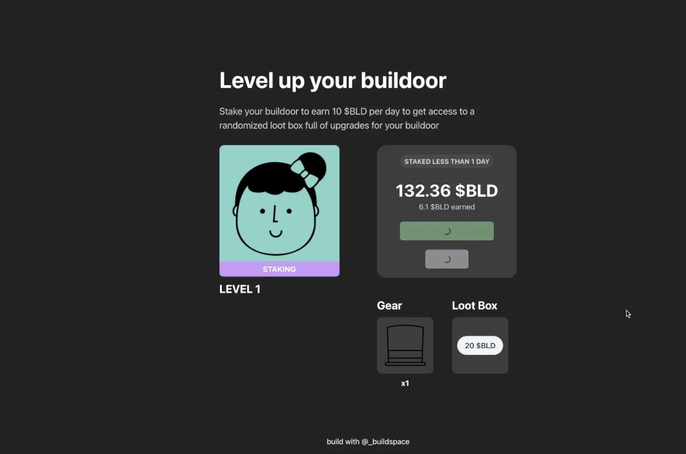

# 🚶‍ 最后的作品


## 概述

这是最后的冲刺！恭喜你到达这里！对每个人来说，这都是一段疯狂的旅程。无论你的NFT项目处于什么状态，都要深呼吸，给自己鼓励。你真棒！

现在，评估一下你目前所拥有的，并考虑一下为了让你的项目准备好进行交付，你可以做的最少工作量。如果这意味着暂时跳过`Switchboard`的事情，那就这样吧。

现在是时候将您的用户界面与您的战利品箱和装备指示连接起来，然后进行任何最后的润饰工作，然后将这个东西发货！

在我们的情况下，这意味着：

- 用 `GearItem` 和 `Lootbox` 组件替换我们在UI的那部分使用的模拟 `ItemBox`
- 添加一个`instructions.ts`文件，在这个文件中我们创建函数来：
- 创建所有必需的指令来初始化我们的战利品箱和交换机
- 创建打开战利品箱所需的所有说明
- 注意：这个有点激烈，哈哈 - 看看我们的解决方案代码，但也试试自己的方法
- 进行大量的调试和优化

说实话，这个列表还有很多。我们添加了很多组件，以确保在交易和链上变化之后状态得到更新。即便如此，它还不完美。总是有更多的空间可以做得更好，但不要让完美主义成为你的敌人。尽力而为，然后发货！

## 解决方案代码

我们的解决方案位于[Buildoors代码库](https://github.com/CreatorsDAO/buildspace-buildoors/tree/solution-lootboxes)的 `solution-lootboxes` 分支上。在那里有一些提交使其与您上次看到的不同，所以如果您想查看所有更改，请确保从上周的[分支查看差异](https://github.com/CreatorsDAO/buildspace-buildoors/compare/solution-core-5...solution-lootboxes)。

有一些指南，但你可以先自己开始。祝你好运！

## 概述

最后一个项目所需的一切都在上一课中。从现在开始，只有你和这段文字了，宝贝。我们开始吧！

这就是最终产品的样子，这个截图是这个项目的一个工作示例。



在这个部分，我们将专注于使战利品箱和装备功能正常工作。最终的代码可能需要一些润色，并且还有一些小的错误需要解决，你可以在发货之前随意处理。

几点注意事项，请确保每次更改程序时都复制并粘贴新的IDL。仔细检查您的React hooks和依赖项。尽可能将所有内容分解为小块。

我们现在要深入研究一些代码的变动。让我们开始`/components/WorkspaceProvider.tsx`吧。

只有一些小的变动，主要是为了加入`switchboard program.`。

有一个新的`useState`。

```tsx
const [switchboardProgram, setProgramSwitchboard] = useState<any>()
```

然后我们加载`switchboard program`，并使用`useEffect`设置`the program switchboard`，这样我们的工作区始终可以及时更新我们所需的所有程序。除非你是React专家，否则这可能会有些挑战，所以请随意深入参考这段代码。

```tsx
async function program() {
    let response = await loadSwitchboardProgram(
      "devnet",
      connection,
      ((provider as AnchorProvider).wallet as AnchorWallet).payer
    )
    return response
  }

useEffect(() => {
    program().then((result) => {
      setProgramSwitchboard(result)
      console.log("result", result)
    })
  }, [connection])
```

好的，接下来我们进入 `instructions.ts` 文件夹中的 `utils` 文件，这是一个新文件。这里有两个公共函数，分别是 `createOpenLootboxInstructions` 指令和 `createInitSwitchboardInstructions` 指令。后者用于打包交换机程序的初始化内容，并初始化抽奖箱程序中的用户。

```tsx
export async function createOpenLootboxInstructions(
  connection: Connection,
  stakingProgram: Program<AnchorNftStaking>,
  switchboardProgram: SwitchboardProgram,
  lootboxProgram: Program<LootboxProgram>,
  userPubkey: PublicKey,
  nftTokenAccount: PublicKey,
  box: number
): Promise<TransactionInstruction[]> {
  const [userStatePda] = PublicKey.findProgramAddressSync(
    [userPubkey.toBytes()],
    lootboxProgram.programId
  )

  const state = await lootboxProgram.account.userState.fetch(userStatePda)

  const accounts = await getAccountsAndData(
    lootboxProgram,
    switchboardProgram,
    userPubkey,
    state.vrf
  )

  return await createAllOpenLootboxInstructions(
    connection,
    stakingProgram,
    lootboxProgram,
    switchboardProgram,
    accounts,
    nftTokenAccount,
    box
  )
}
```

进一步往下，有一个 `getAccountsAndData` 函数，它接受四个字段，正如你所见，对于最后一个字段，你需要事先生成或获取`vrf`账户。这个函数的作用是获取一些账户、增加和其他数据，将它们打包起来，并作为一个对象返回。

```tsx
async function getAccountsAndData(
  lootboxProgram: Program<LootboxProgram>,
  switchboardProgram: SwitchboardProgram,
  userPubkey: PublicKey,
  vrfAccount: PublicKey
): Promise<AccountsAndDataSuperset> {
  const [userStatePda] = PublicKey.findProgramAddressSync(
    [userPubkey.toBytes()],
    lootboxProgram.programId
  )

  // required switchboard accoount
  const [programStateAccount, stateBump] =
    ProgramStateAccount.fromSeed(switchboardProgram)

  // required switchboard accoount
  const queueAccount = new OracleQueueAccount({
    program: switchboardProgram,
    // devnet permissionless queue
    publicKey: new PublicKey("F8ce7MsckeZAbAGmxjJNetxYXQa9mKr9nnrC3qKubyYy"),
  })

  // required switchboard accoount
  const queueState = await queueAccount.loadData()
  // wrapped SOL is used to pay for switchboard VRF requests
  const wrappedSOLMint = await queueAccount.loadMint()

  // required switchboard accoount
  const [permissionAccount, permissionBump] = PermissionAccount.fromSeed(
    switchboardProgram,
    queueState.authority,
    queueAccount.publicKey,
    vrfAccount
  )

  // required switchboard accoount
  // escrow wrapped SOL token account owned by the VRF account we will initialize
  const escrow = await spl.getAssociatedTokenAddress(
    wrappedSOLMint.address,
    vrfAccount,
    true
  )

  const size = switchboardProgram.account.vrfAccountData.size

  return {
    userPubkey: userPubkey,
    userStatePda: userStatePda,
    vrfAccount: vrfAccount,
    escrow: escrow,
    wrappedSOLMint: wrappedSOLMint,
    programStateAccount: programStateAccount,
    stateBump: stateBump,
    permissionBump: permissionBump,
    queueAccount: queueAccount,
    queueState: queueState,
    permissionAccount: permissionAccount,
    size: size,
  }
}
```

该对象在文件底部被定义为一个接口，这只是为了确保你拥有所需的一切，并能够适当地调用它们。虽然每个指令不需要对象中的每个字段，但这将使每个指令能够轻松地访问所需的数据。

```tsx
interface AccountsAndDataSuperset {
  userPubkey: PublicKey
  userStatePda: PublicKey
  vrfAccount: PublicKey
  escrow: PublicKey
  wrappedSOLMint: spl.Mint
  programStateAccount: ProgramStateAccount
  stateBump: number
  permissionBump: number
  queueAccount: OracleQueueAccount
  queueState: any
  permissionAccount: PermissionAccount
  size: number
}
```

让我们深入了解 `createInitSwitchboardInstructions` 。它首先生成一个`vrf`密钥对，然后调用 `getAccountsAndData` 来获取我们所需的所有账户。然后，通过 `initSwitchboardLootboxUser` ，它组装指令。然后返回指令，以及用于签名的`vrf`密钥对。

```tsx
export async function createInitSwitchboardInstructions(
  switchboardProgram: SwitchboardProgram,
  lootboxProgram: Program<LootboxProgram>,
  userPubkey: PublicKey
): Promise<{
  instructions: Array<TransactionInstruction>
  vrfKeypair: Keypair
}> {
  const vrfKeypair = Keypair.generate()

  const accounts = await getAccountsAndData(
    lootboxProgram,
    switchboardProgram,
    userPubkey,
    vrfKeypair.publicKey
  )

  const initInstructions = await initSwitchboardLootboxUser(
    switchboardProgram,
    lootboxProgram,
    accounts,
    vrfKeypair
  )

  return { instructions: initInstructions, vrfKeypair: vrfKeypair }
}
```

关于 `initSwitchboardLootboxUser` ，我们首先获得一个`PDA`和`state bump`。

```tsx
async function initSwitchboardLootboxUser(
  switchboardProgram: SwitchboardProgram,
  lootboxProgram: Program<LootboxProgram>,
  accountsAndData: AccountsAndDataSuperset,
  vrfKeypair: Keypair
): Promise<Array<TransactionInstruction>> {
  // lootbox account PDA
  const [lootboxPointerPda] = await PublicKey.findProgramAddress(
    [Buffer.from("lootbox"), accountsAndData.userPubkey.toBytes()],
    lootboxProgram.programId
  )

  const stateBump = accountsAndData.stateBump
```

然后我们开始组装一系列的指令。首先，我们需要做的是创建一个与托管相关的令牌账户，由vrf密钥对拥有。

```tsx
const txnIxns: TransactionInstruction[] = [
    // create escrow ATA owned by VRF account
    spl.createAssociatedTokenAccountInstruction(
      accountsAndData.userPubkey,
      accountsAndData.escrow,
      vrfKeypair.publicKey,
      accountsAndData.wrappedSOLMint.address
    ),
```

接下来是设置权限指令。

```tsx
// transfer escrow ATA owner to switchboard programStateAccount
    spl.createSetAuthorityInstruction(
      accountsAndData.escrow,
      vrfKeypair.publicKey,
      spl.AuthorityType.AccountOwner,
      accountsAndData.programStateAccount.publicKey,
      [vrfKeypair]
    ),

```

然后我们调用`create account`来创建vrf账户。

```tsx
// request system program to create new account using newly generated keypair for VRF account
   SystemProgram.createAccount({
     fromPubkey: accountsAndData.userPubkey,
     newAccountPubkey: vrfKeypair.publicKey,
     space: accountsAndData.size,
     lamports:
       await switchboardProgram.provider.connection.getMinimumBalanceForRentExemption(
         accountsAndData.size
       ),
     programId: switchboardProgram.programId,
   }),
```

然后我们使用`switchboard program `方法进行`vrf`初始化，其中我们提供了消耗随机性回调函数。

```tsx
// initialize new VRF account, included the callback CPI into lootbox program as instruction data
await switchboardProgram.methods
  .vrfInit({
    stateBump,
    callback: {
      programId: lootboxProgram.programId,
      accounts: [
        {
          pubkey: accountsAndData.userStatePda,
          isSigner: false,
          isWritable: true,
        },
        {
          pubkey: vrfKeypair.publicKey,
          isSigner: false,
          isWritable: false,
        },
        { pubkey: lootboxPointerPda, isSigner: false, isWritable: true },
        {
          pubkey: accountsAndData.userPubkey,
          isSigner: false,
          isWritable: false,
        },
      ],
      ixData: new BorshInstructionCoder(lootboxProgram.idl).encode(
        "consumeRandomness",
        ""
      ),
    },
  })
  .accounts({
    vrf: vrfKeypair.publicKey,
    escrow: accountsAndData.escrow,
    authority: accountsAndData.userStatePda,
    oracleQueue: accountsAndData.queueAccount.publicKey,
    programState: accountsAndData.programStateAccount.publicKey,
    tokenProgram: spl.TOKEN_PROGRAM_ID,
  })
  .instruction(),
// initialize switchboard permission account, required account
```
接下来我们使用`switchboard`来调用权限初始化。

```tsx
await switchboardProgram.methods
      .permissionInit({})
      .accounts({
        permission: accountsAndData.permissionAccount.publicKey,
        authority: accountsAndData.queueState.authority,
        granter: accountsAndData.queueAccount.publicKey,
        grantee: vrfKeypair.publicKey,
        payer: accountsAndData.userPubkey,
        systemProgram: SystemProgram.programId,
      })
      .instruction(),
```

最后，我们将我们的战利品箱计划称为`init user`，并返回指示，这将由调用者打包成交易。

```tsx
await lootboxProgram.methods
      .initUser({
        switchboardStateBump: accountsAndData.stateBump,
        vrfPermissionBump: accountsAndData.permissionBump,
      })
      .accounts({
        // state: userStatePDA,
        vrf: vrfKeypair.publicKey,
        // payer: publicKey,
        // systemProgram: anchor.web3.SystemProgram.programId,
      })
      .instruction(),
  ]

  return txnIxns
}
```

最后，让我们回顾一下 `createOpenLootboxInstructions` 。首先，我们获取用户状态`PDA`，我们必须实际获取该账户，以便我们可以从中提取`vrf`密钥对。

```tsx
export async function createOpenLootboxInstructions(
  connection: Connection,
  stakingProgram: Program<AnchorNftStaking>,
  switchboardProgram: SwitchboardProgram,
  lootboxProgram: Program<LootboxProgram>,
  userPubkey: PublicKey,
  nftTokenAccount: PublicKey,
  box: number
): Promise<TransactionInstruction[]> {
  const [userStatePda] = PublicKey.findProgramAddressSync(
    [userPubkey.toBytes()],
    lootboxProgram.programId
  )

  const state = await lootboxProgram.account.userState.fetch(userStatePda)
```

在这里，我们称之为 `getAccountsAndData` 来获取我们所需的所有账户。接下来是 `createAllOpenLootboxInstructions` ，我们将深入探讨。

```tsx
const accounts = await getAccountsAndData(
    lootboxProgram,
    switchboardProgram,
    userPubkey,
    state.vrf
  )

  return await createAllOpenLootboxInstructions(
    connection,
    stakingProgram,
    lootboxProgram,
    switchboardProgram,
    accounts,
    nftTokenAccount,
    box
  )
}
```
我们获得了包装的代币账户，其中包含了包装的SOL，因为这是我们用来支付请求随机数的必需品。


```tsx
async function createAllOpenLootboxInstructions(
  connection: Connection,
  stakingProgram: Program<AnchorNftStaking>,
  lootboxProgram: Program<LootboxProgram>,
  switchboardProgram: SwitchboardProgram,
  accountsAndData: AccountsAndDataSuperset,
  nftTokenAccount: PublicKey,
  box: number
): Promise<TransactionInstruction[]> {
  // user Wrapped SOL token account
  // wSOL amount is then transferred to escrow account to pay switchboard oracle for VRF request
  const wrappedTokenAccount = await spl.getAssociatedTokenAddress(
    accountsAndData.wrappedSOLMint.address,
    accountsAndData.userPubkey
  )
```

接下来我们获得与`BLD`相关的 `stakeTokenAccount` ，因此您可以使用`BLD`代币来换取开启战利品箱。然后是质押账户，以确保您通过质押获得足够的`BLD`来开启战利品箱。

```tsx
// user BLD token account, used to pay BLD tokens to call the request randomness instruction on Lootbox program
  const stakeTokenAccount = await spl.getAssociatedTokenAddress(
    STAKE_MINT,
    accountsAndData.userPubkey
  )

  const [stakeAccount] = PublicKey.findProgramAddressSync(
    [accountsAndData.userPubkey.toBytes(), nftTokenAccount.toBuffer()],
    stakingProgram.programId
  )
```

这里开始组装说明。如果没有封装的令牌账户，我们会添加一个创建它的指令。

```tsx
let instructions: TransactionInstruction[] = []
  // check if a wrapped SOL token account exists, if not add instruction to create one
  const account = await connection.getAccountInfo(wrappedTokenAccount)
  if (!account) {
    instructions.push(
      spl.createAssociatedTokenAccountInstruction(
        accountsAndData.userPubkey,
        wrappedTokenAccount,
        accountsAndData.userPubkey,
        accountsAndData.wrappedSOLMint.address
      )
    )
  }
```

然后我们推送一个转账指令，将SOL转移到`wrapped SOL`。然后是一个同步`wrapped SOL`余额的指令。

```tsx
// transfer SOL to user's own wSOL token account
 instructions.push(
   SystemProgram.transfer({
     fromPubkey: accountsAndData.userPubkey,
     toPubkey: wrappedTokenAccount,
     lamports: 0.002 * LAMPORTS_PER_SOL,
   })
 )
 // sync wrapped SOL balance
 instructions.push(spl.createSyncNativeInstruction(wrappedTokenAccount))
```

最后，我们制作并返回了打开战利品箱的说明书，这样呼叫者就可以将它们打包并发送出去。

```tsx
// Lootbox program request randomness instruction
  instructions.push(
    await lootboxProgram.methods
      .openLootbox(new BN(box))
      .accounts({
        user: accountsAndData.userPubkey,
        stakeMint: STAKE_MINT,
        stakeMintAta: stakeTokenAccount,
        stakeState: stakeAccount,
        state: accountsAndData.userStatePda,
        vrf: accountsAndData.vrfAccount,
        oracleQueue: accountsAndData.queueAccount.publicKey,
        queueAuthority: accountsAndData.queueState.authority,
        dataBuffer: accountsAndData.queueState.dataBuffer,
        permission: accountsAndData.permissionAccount.publicKey,
        escrow: accountsAndData.escrow,
        programState: accountsAndData.programStateAccount.publicKey,
        switchboardProgram: switchboardProgram.programId,
        payerWallet: wrappedTokenAccount,
        recentBlockhashes: SYSVAR_RECENT_BLOCKHASHES_PUBKEY,
      })
      .instruction()
  )

  return instructions
}
```

这就是说明的全部内容，让我们去看看新的战利品箱组件，这些说明将会被用到那里。
