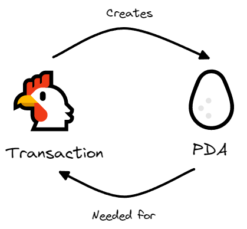
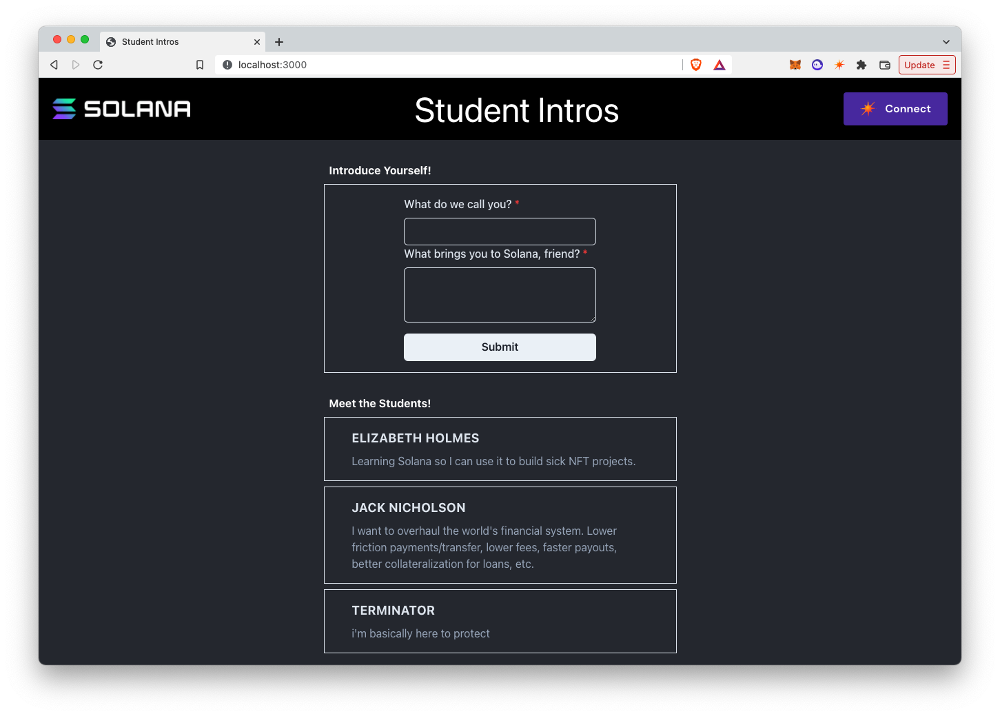

# 🎥 构建一个电影评论应用

现在我们已经完成了钱包连接的设置，让我们让我们的ping按钮真正有用起来吧！为了将所有内容整合在一起，我们将构建一个基于区块链的电影评论应用——它将允许任何人提交他们最喜欢的电影的评论，有点类似于烂番茄网站。

在你的Solana工作空间中设置起始代码

```bash
git clone https://github.com/RustyCab/solana-movie-frontend.git
cd solana-movie-frontend
git checkout starter
npm i
```

如果您运行 `npm run dev` 您应该在 `localhost:3000` 上看到以下内容：


这是一个普通的 Next.js 应用程序，安装了一些模板组件和一些 Solana 依赖项，以帮助您节省时间。那里有一些模拟评论，请查看各个组件以感受该应用程序。

您会注意到我们已将钱包上下文提供程序从 `_app.tsx` 移至其自己的组件。它的工作原理是一样的，只是将其与更大的应用程序分开，性能更高。应用程序现在所做的就是将您的评论记录到控制台中，我们将在 `Form.tsx` 中设置 `handleTransactionSubmit` 函数。我们走吧呜呜呜呜

## 🗺 定义架构


序列化的第一步是为我们要序列化的数据创建一个模式/映射。我们需要告诉Borsh数据将被称为什么以及每个项目的大小。


首先安装 `borsh` ，在终端中运行：

```bash
npm install @project-serum/borsh --force
```

接下来前往 `Movie.ts` 导入 borsh 并在 Movie 类中添加架构（不要复制粘贴此内容）：

```ts
// We're importing borsh
import * as borsh from '@project-serum/borsh'

export class Movie {
    title: string;
    rating: number;
    description: string;

    // The constructor and the mocks will remain the same
    constructor(title: string, rating: number, description: string) {}
    static mocks: Movie[] = []

    // Here's our schema!
    borshInstructionSchema = borsh.struct([
		borsh.u8('variant'),
		borsh.str('title'),
		borsh.u8('rating'),
		borsh.str('description'),
	])

}
```

电影评论程序期望指令数据包含：

- 1. `variant` 作为无符号的 8 位整数，表示应执行哪条指令（换句话说，应调用程序上的哪个函数）。
- 2. `title` 作为表示您正在查看的电影标题的字符串。
- 3. `rating` 作为无符号 8 位整数，表示您对正在评论的电影的评分（满分 5 分）。
- 4. `description` 作为一个字符串，表示您为电影留下的评论的书面部分。

模式需要与程序期望的匹配 - 包括结构中项目的顺序。当程序读取您的数据时，它将按照定义的顺序进行反序列化，如果您的顺序不同，它创建的数据将无效。由于我们正在使用已部署的程序，我已经给您提供了模式。通常，您会阅读文档或自己查看程序代码！

## 🌭 创建serialize方法

现在我们知道数据是什么样子，我们需要编写将其序列化的方法。将其添加到 Movie 类中架构的正下方：

```ts
serialize(): Buffer {
		const buffer = Buffer.alloc(1000)
		this.borshInstructionSchema.encode({ ...this, variant: 0 }, buffer)
		return buffer.slice(0, this.borshInstructionSchema.getSpan(buffer))
}
```

首先，我们创建一个超大缓冲区 - 这个缓冲区为 1000 字节。为什么是 1000 字节？因为我知道它足以容纳我想要的所有东西，并在最后留下额外的空间。

接下来，我们使用创建的模式对数据进行编码。 `encode` 接受两个值 - 我们想要编码的数据以及我们想要存储它的位置。 `this` 指的是我们所在的当前对象 - 因此我们解构电影对象并将其与 `...this` 一起传递，就像传递 `{ title, rating, description, variant }` 一样。

最后 - 我们删除缓冲区中的额外空间。 `getSpan` 有点像 `array.length` - 它根据模式为我们提供缓冲区中最后使用的项目的索引，因此我们的缓冲区只包含我们需要的数据，而不包含其他数据。

这是我的最终 `Movie.ts` 的样子：

```ts
import * as borsh from '@project-serum/borsh'

export class Movie {
    title: string;
    rating: number;
    description: string;

    constructor(title: string, rating: number, description: string) {
        this.title = title;
        this.rating = rating;
        this.description = description;
    }

    static mocks: Movie[] = [
        new Movie('The Shawshank Redemption', 5, `For a movie shot entirely in prison where there is no hope at all, Shawshank redemption's main message and purpose is to remind us of hope, that even in the darkest places hope exists, and only needs someone to find it. Combine this message with a brilliant screenplay, lovely characters, and Martin freeman, and you get a movie that can teach you a lesson every time you watch it. An all-time Classic!!!`),
        new Movie('The Godfather', 5, `One of Hollywood's greatest critical and commercial successes, The Godfather gets everything right; not only did the movie transcend expectations, it established new benchmarks for American cinema.`),
        new Movie('The Godfather: Part II', 4, `The Godfather: Part II is a continuation of the saga of the late Italian-American crime boss, Francis Ford Coppola, and his son, Vito Corleone. The story follows the continuing saga of the Corleone family as they attempt to successfully start a new life for themselves after years of crime and corruption.`),
        new Movie('The Dark Knight', 5, `The Dark Knight is a 2008 superhero film directed, produced, and co-written by Christopher Nolan. Batman, in his darkest hour, faces his greatest challenge yet: he must become the symbol of the opposite of the Batmanian order, the League of Shadows.`),
    ]

    borshInstructionSchema = borsh.struct([
		borsh.u8('variant'),
		borsh.str('title'),
		borsh.u8('rating'),
		borsh.str('description'),
	])

    serialize(): Buffer {
		const buffer = Buffer.alloc(1000)
		this.borshInstructionSchema.encode({ ...this, variant: 0 }, buffer)
		return buffer.slice(0, this.borshInstructionSchema.getSpan(buffer))
	}
}
```

就是这样！我们已经完成了序列化部分。来回顾一下几部电影吧🍿

## 🤝 用数据创建交易

拼图的最后一块就是获取用户的数据，使用我们刚刚创建的方法进行序列化，并用它创建一个交易。


首先更新 `Form.tsx` 中的导入：

```tsx
import { FC } from 'react'
import { Movie } from '../models/Movie'
import { useState } from 'react'
import { Box, Button, FormControl, FormLabel, Input, NumberDecrementStepper, NumberIncrementStepper, NumberInput, NumberInputField, NumberInputStepper, Textarea } from '@chakra-ui/react'
import * as web3 from '@solana/web3.js'
import { useConnection, useWallet } from '@solana/wallet-adapter-react'
```

我们需要在 `handleSubmit` 函数之前建立 RPC 连接并获取钱包详细信息：

```tsx
const { connection } = useConnection();
const { publicKey, sendTransaction } = useWallet();
```

现在是重点， `handleTransactionSubmit` 函数。除了序列化位之外，这对于您之前的交易看起来非常熟悉：进行交易、制定指令、提交交易。

前半部分如下所示：

```tsx
const handleTransactionSubmit = async (movie: Movie) => {
    if (!publicKey) {
        alert('Please connect your wallet!')
        return
    }

    const buffer = movie.serialize()
    const transaction = new web3.Transaction()

    const [pda] = await web3.PublicKey.findProgramAddress(
        [publicKey.toBuffer(), new TextEncoder().encode(movie.title)],
        new web3.PublicKey(MOVIE_REVIEW_PROGRAM_ID)
    )
}
```

除了 `pda` 之外，你应该都能认识到这些。回想一下指令的要求。它需要与之交互的程序ID，可选的数据，以及它将从中读取或写入的账户列表。由于我们要将数据提交到网络上进行存储，将会创建一个新的账户来存储它（记住《海绵宝宝》中的Patrick - 程序是无状态的，一切都在账户中）。

`Patrick`在提到PDA（程序派生地址）！这是一个用来存储我们电影评论的账户。你可能会开始注意到，我们遇到了经典的“先有鸡还是先有蛋”的情况...



我们需要知道帐户地址才能进行有效交易，并且需要处理交易才能创建帐户。解决方案？一个理论蛋。如果交易创建者和程序都使用相同的过程来选择地址，我们可以在交易处理之前导出地址。

这就是 `web3.PublicKey.findProgramAddress` 方法正在做的事情。它接受两个变量：种子和生成种子的程序（电影评论程序）。在我们的例子中，种子是发件人的地址和电影的标题。通过这个应用程序，我告诉您种子要求，通常您要么阅读文档，查看程序代码，要么对其进行逆向工程。

要完成 `handleTransactionSubmit` 功能，您所需要做的就是创建一条指令并发送它，以下是完整代码：

```tsx
const handleTransactionSubmit = async (movie: Movie) => {
      if (!publicKey) {
          alert('Please connect your wallet!')
          return
      }

      const buffer = movie.serialize()
      const transaction = new web3.Transaction()

      const [pda] = await web3.PublicKey.findProgramAddress(
          [publicKey.toBuffer(), new TextEncoder().encode(movie.title)],
          new web3.PublicKey(MOVIE_REVIEW_PROGRAM_ID)
      )

      const instruction = new web3.TransactionInstruction({
          keys: [
              {
                  // Your account will pay the fees, so it's writing to the network
                  pubkey: publicKey,
                  isSigner: true,
                  isWritable: false,
              },
              {
                  // The PDA will store the movie review
                  pubkey: pda,
                  isSigner: false,
                  isWritable: true
              },
              {
                  // The system program will be used for creating the PDA
                  pubkey: web3.SystemProgram.programId,
                  isSigner: false,
                  isWritable: false
              }
          ],
          // Here's the most important part!
          data: buffer,
          programId: new web3.PublicKey(MOVIE_REVIEW_PROGRAM_ID)
      })

      transaction.add(instruction)

      try {
          let txid = await sendTransaction(transaction, connection)
          console.log(`Transaction submitted: https://explorer.solana.com/tx/${txid}?cluster=devnet`)
      } catch (e) {
          alert(JSON.stringify(e))
      }
  }
```

仔细阅读代码注释，我会解释为什么我们需要指令键数组中的每个地址。

就这样了！确保你的钱包在开发网络上，并且你有开发网络的SOL，然后前往 `localhost:3000` 。提交评论并访问控制台中记录的浏览器链接。向下滚动到底，你会看到你的电影名称以及其他一些内容：


哇。您刚刚将自定义数据写入 Solana 网络。

给自己一个鼓励，这可不是简单的事情！到这个阶段，可能有些人已经退出了这个项目，给他们一些动力，展示一下你所建立的东西！如果你已经走到这一步，我毫不怀疑你会一直坚持到最后 :)

## 🚢 船舶挑战

是时候让大脑多折几道皱纹了 🧠

继续创建一个应用程序，让 Solana Core 中的构建者进行自我介绍！我们将在这个地址 `HdE95RSVsdb315jfJtaykXhXY478h53X6okDupVfY9yf` 处使用 Solana 程序。它最终看起来与电影评论应用程序类似：



### 起始代码

您可以设置使用

```bash
git clone https://github.com/RustyCab/solana-student-intros-frontend
cd solana-student-intros-frontend
git checkout starter
npm i
```

提示：
程序期望指令数据按顺序包含以下内容：

- 1. `variant` 作为无符号 8 位整数，表示要调用的指令（在本例中应为 0）
- 2. `name` 作为字符串
- 3. `message` 作为字符串

请注意，该程序使用连接钱包的公钥（而不是其他任何信息）来生成每个学生介绍账户。这意味着每个公钥只能初始化一个学生介绍账户，如果您使用相同的公钥提交两次，交易将失败。

与往常一样，首先尝试独立执行此操作，但如果您陷入困境或只是想将您的解决方案与我们的解决方案进行比较，请查看[此存储库](https://github.com/RustyCab/solana-student-intros-frontend/tree/solution-serialize-instruction-data)中的 `solution-serialize-instruction-data` 分支。
