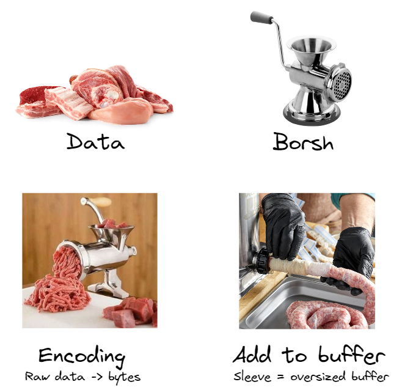

# 🤔 自定义指令

既然我们已经完成了钱包连接的设置，让我们让我们的ping按钮真正有所作为吧！你现在知道如何读取数据并通过简单的交易写入网络。几乎立即，你会发现自己想要通过交易发送数据。那么让我们看看如何向Solana区块链讲述你的故事。

Solana中关于数据的棘手之处在于程序是无状态的。与以太坊等其他区块链中的智能合约不同，程序不存储任何数据，只存储逻辑


图为：Solana 创始人 `Anatoly Yakovenko` 正在制作 Solana。

Solana 程序中绝对不存储任何内容。它不知道所有者是谁，甚至不知道是谁部署了它。一切都存储在帐户内。

## 📧 指令数据

我们要稍微看一下引擎盖下面的东西。在这一部分，很多工作实际上会由像`Anchor`这样的库来处理，但是了解原子指令级别上发生的事情是很重要的。

让我们退后一步，看看指令数据的位置。


交易可以有一个或多个指令，每个指令可以有数据。

关于指令数据的重要之处在于其格式 - 它是**8位数据**。 "位" 意味着它是机器码：1和0。8只是指大小，就像32位或64位一样。如果您的指令数据不符合这个格式，Solana运行时将无法识别它。

这就是为什么Solana如此快速！它不是让网络转换你的数据，而是你提供已经转换好的数据，然后网络只需处理它。想象一下，如果你在开始烹饪之前已经准备好了所有菜肴的食材，你将能够更快地烹饪，因为你不需要切割食材。

你不需要知道机器码是如何工作的。你只需要记住指令数据是某种类型的，当你想要将数据包含在指令中时，你需要将你的数据转换为该类型。


> 这段话在解释 Solana 网络如何处理事务和指令数据的。在 Solana 中，一个事务可以包含一条或多条指令，每条指令都可以携带一些数据。
>
> 重点是，这些指令数据需要以特定格式提供，即 8 位数据。这里的 “8位” 不是指数据的大小，而是指数据的格式，这种格式是机器代码格式，用 1 和 0 表示。如果你提供的指令数据不是这种格式，Solana 运行时就无法识别和处理它。
>
> 这种处理方式是 Solana 能够高速运行的一个原因。你不需要让网络转换你的数据，而是自己转换数据并提供给网络，网络只负责处理它。这就像在开始烹饪前就准备好所有食材，这样你就能更快地烹饪，因为你不需要在烹饪过程中去切东西。
>
> 作者强调的是，你并不需要了解机器代码是如何工作的。你需要记住的是，当你想要在指令中包含一些数据时，这些数据需要是特定类型的，你需要把你的数据转换为这种类型。这就意味着在你编写和提交给 Solana 网络的代码中，你需要负责把你的数据转换为适当的格式。
>
> 这是低级别编程的一个常见特性。虽然很多高级编程语言（比如 Python 或 JavaScript）会自动处理这些类型转换，但在低级语言（比如 Rust，这也是 Solana 主要使用的语言）中，你需要自己处理这些转换。然而，有些库，如 Anchor，可以帮助你处理这些转换，让编程更简单。

## 🔨 序列化和borsh


这就是序列化的作用 - 它是将常规的代码或数据转换为字节数组（机器代码：1和0）。

我们将在我们的项目中使用 [Borsh](https://borsh.io/) 序列化格式，因为它有一个方便我们使用的库。

让我们通过一个例子来看看它是如何工作的——目标是装备一个链上游戏物品。为此，我们需要三个数据

- `variant` - 我们要调用的命令的名称（即装备或删除）
- `playerId` - 装备该物品的玩家的ID
- `itemId` - 我们想要装备的物品

序列化此数据有四个步骤：

1. 创建数据模式/映射，以确定数据的预期结构
2. 为数据分配一个比实际需要的要大得多的缓冲区
3. 将我们的数据进行编码并添加到缓冲区中
4. 去掉缓冲区末尾的额外空格

作为网络开发人员，我们永远不需要处理这样的低级内容，所以我这样做是为了让它感觉不那么抽象：



我希望这是有道理的，哈哈。让我们看一些代码以了解其实际情况。

```ts
import * as Borsh from "@project-serum/borsh"

const equipPlayerSchema = Borsh.struct([
  Borsh.u8("variant"),
  Borsh.u8("playerId"),
  Borsh.u8("itemId"),
])
```

我们将从为装备物品指令创建一个模式开始。我们正在创建一个包含三个数据片段的borsh结构，它们都是无符号整数，但大小不同 - 8位、16位和256位。

由于我们的数据将变成一长串的1和0，我们需要知道每个数据项的起始和结束位置。这就是为什么我们给每个项分配一个特定的大小。当程序需要读取这些数据时，它将知道 `variant` 的结束位置和 `playerId` 的起始位置。

想象一下蒙着眼睛试图从链接上切香肠。只有知道每根香肠的长度，才能在正确的位置切。


在我们的例子中，第二根和第三根香肠会长很多，但我想你明白了，哈哈。


```ts
import * as Borsh from "@project-serum/borsh"

const equipPlayerSchema = Borsh.struct([
  Borsh.u8("variant"),
  Borsh.u8("playerId"),
  Borsh.u8("itemId"),
])

const buffer = Buffer.alloc(1000)
equipPlayerSchems.encode({ variant: 2, playerId: 1435, itemId: 737498}, buffer)

const instructBuffer = buffer.slice(0, equipPlayerSchems.getSpan(buffer))
```

这里发生第二步、第三步和第四步。我们创建一个 1000 字节长的缓冲区。我们对数据进行编码并将其添加到缓冲区中。然后我们将末端切成薄片，使其长度达到需要的长度。

```ts
const endpoint = clusterApiUrl("devnet")
const connection = new Connection(endpoint)

const transaction = new Transaction().add({
  key: [
    {
      pubkey: player.Publickey,
      isSigner: true,
      isWritable: false,
    },
    {
      pubkey: playerInfoAccount,
      isSigner: false,
      isWritable: true,
    },
    {
      pubkey: SystemProgram.programId,
      isSigner: false,
      isWritable: false,
    },
  ],
  data: instructBuffer,
  programId: PROGRAM_ID,
})

sendAndConfirmTransaction(connection, transaction, [player])
```

一旦我们有了正确格式的数据，剩下的就是小菜一碟！这个交易应该看起来很熟悉。唯一的“新”东西就是我们以前没有的可选项 `data` 。

我在这里对你的知识做了一些假设 - 你大致了解机器码是什么，以及内存分配如何发挥作用。你不需要了解所有这些东西，我自己也不需要。只需在YouTube上观看一两个视频，直到你对正在发生的事情有一个大致的感觉即可。


现代开发人员很少经常处理字节缓冲区 - 这被认为是低级别的，所以如果你对此感到陌生或新奇，不用担心。接下来我们将使用它构建，这样你就可以称自己为软件工程师了 😎
