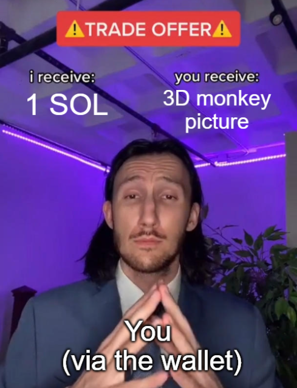
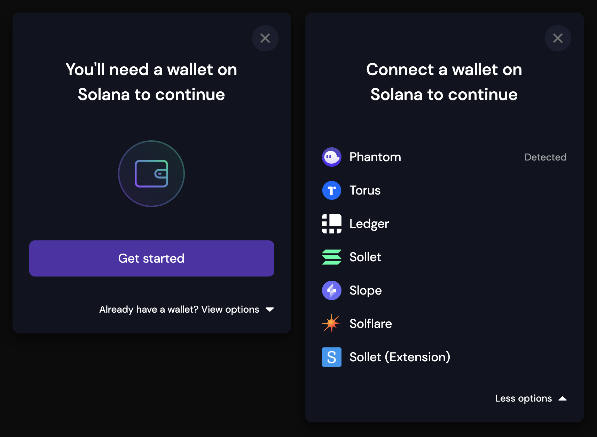

# 🔌 连接到钱包 (TODO by davirain)

我们现在对通过代码与网络进行交互有了很多了解。为了进行交易，我们使用了私钥。这对用户来说行不通哈哈。为了让人们用真钱从我们这里购买JPEG图像，我们需要与钱包合作。

“钱包”这个名字有点奇怪，因为它们不仅仅是用来存放东西的。钱包是指任何能够安全存储密钥并允许用户签署交易的东西。它们有很多形式，最常见的是浏览器扩展，它们为你（开发者）提供API，以向用户建议交易。钱包使你能够安全地进行以下操作：



我们将使用 Phantom 浏览器扩展程序，因为它是最受欢迎的，如果您愿意，您可以使用另一个:)

让我们将我们的网络应用程序与钱包连接起来，让它为用户提供交易报价！

## 🛠 Solana 钱包适配器

那里有几十个钱包。他们每个人都以自己的方式做事。想象一下，如果您必须为每个单独的钱包 API 进行构建，那将是一场噩梦。值得庆幸的是，我们有 [Solana Wallet-Adapter](https://github.com/solana-labs/wallet-adapter?utm_source=buildspace.so&utm_medium=buildspace_project) - 它是一套库，为您提供几乎通用的 API，可与大量钱包一起使用（[完整列表见此处](https://github.com/solana-labs/wallet-adapter#wallets?utm_source=buildspace.so&utm_medium=buildspace_project)）。


您将主要使用 `wallet-adapter-base` 和 `wallet-adapter-react` 库。您可以选择您想要支持的特定钱包，或者只支持所有钱包。这里的区别在于您要使用哪些库 - 特定的钱包库或 `wallet-adapter-wallets` 。由于我们要使用 Phantom，因此我们可以只使用 Phantom 库！

这是我们需要安装的内容（您现在不需要运行它）：

```bash
npm install @solana/wallet-adapter-base \
    @solana/wallet-adapter-react \
    @solana/wallet-adapter-phantom \
    @solana/wallet-adapter-react-ui
```

`wallet-adapter-react-ui` 为我们处理整个 UI - 连接、选择钱包、断开连接，一切都已排序！



多亏了这些牛逼的库，我们在Solana上再也不用自己构建钱包连接的东西了！趁此机会，感谢那些维护者为你节省了时间和头发。

## 👜 创建一个钱包连接按钮

让我们来看看这些库吧！在您的工作区中设置一个新项目：

```bash
git clone https://github.com/RustyCab/solana-ping-frontend.git
cd solana-ping-frontend
git checkout starter
npm i
```

该模板继承了我们上次构建的内容 - 我们为 `ping` 客户端提供了一个前端，用于将数据写入区块链。使用 `npm run dev` 你会在本地主机上看到这个：


这是一个准系统 UI - 让我们将其连接到 `wallet-adapter-react` 库。

拉起 `_app.tsx` 并使其看起来像这样：

```ts
import React, { useMemo } from "react";
import { WalletAdapterNetwork } from "@solana/wallet-adapter-base";
import { WalletModalProvider } from "@solana/wallet-adapter-react-ui";
import { ConnectionProvider, WalletProvider } from "@solana/wallet-adapter-react";
import {
  GlowWalletAdapter,
  PhantomWalletAdapter
} from "@solana/wallet-adapter-wallets";
import { clusterApiUrl } from "@solana/web3.js";

require("@solana/wallet-adapter-react-ui/styles.css");
require("../styles/globals.css");
require ("../styles/Home.module.css");

const App = ({ Component, pageProps }) => {
  // Can be set to 'devnet', 'testnet', or 'mainnet-beta'
  const network = WalletAdapterNetwork.Devnet;

  // You can provide a custom RPC endpoint here
  const endpoint = useMemo(() => clusterApiUrl(network), [network]);

  // @solana/wallet-adapter-wallets includes all the adapters but supports tree shaking and lazy loading --
  // Only the wallets you configure here will be compiled into your application, and only the dependencies
  // of wallets that your users connect to will be loaded
  const wallets = useMemo(
    () => [
      new PhantomWalletAdapter(),
      new GlowWalletAdapter()
    ],
    [network]
  );

  return (
    <ConnectionProvider endpoint={endpoint}>
      <WalletProvider wallets={wallets} autoConnect>
        <WalletModalProvider>
          <Component {...pageProps} />
        </WalletModalProvider>
      </WalletProvider>
    </ConnectionProvider>
  );
};

export default App;
```

这是很多的导入。别担心，你只需要知道每个导入是用来做什么的，不需要深入了解它们的工作原理。下面是每个部分的简要概述。

我们从 `React` 开始。 `useMemo()` 是一个钩子，仅当依赖项之一发生更改时才加载内容。在我们的例子中，只有当用户连接的网络发生变化时， `clusterApiUrl` 的值才会发生变化。

我们首先导入的Solana引用是 `wallet-adapter-network` 来自 `@solana/wallet-adapter-base` 。这只是一个可枚举的对象，用于表示可用的网络。

`WalletModalProvider` 就是这样，哈哈 - 它是一个奇特的 React 组件，会提示用户选择他们的钱包。埃兹普兹。

 `ConnectionProvider` 接收一个RPC端点，并让我们直接与Solana区块链上的节点进行通信。我们将在整个应用程序中使用它来发送交易。

`WalletProvider` 为我们提供了一个连接各种钱包的标准接口，因此我们不必费心阅读每个钱包的文档呵呵。

接下来您将看到来自 `wallet-adapter-wallets` 的一堆钱包适配器。我们将使用从中导入的内容来创建我们将提供给 `WalletProvider` 的钱包列表。还有许多其他钱包适配器可用，甚至有些是为其他区块链制作的！在这里查看它们。我刚刚选择了 Phantom 和 Glow。

最后，我们有 `clusterApiURL` ，它只是一个根据我们提供的网络为我们生成 RPC 端点的函数。

对于 `React App` 组件内的 return 语句，我们用一些上下文提供程序包装子组件（应用程序的其余部分）。

总结一下：这个文件是我们网页应用程序的核心。我们在这里提供的任何内容都可以被我们应用程序的其他部分访问到。我们将所有的钱包和网络工具都放在这里，这样我们就不需要在每个子组件中重新初始化它们。


我从官方 `wallet-adapter Next.js` 模板复制了所有这些代码，所以不要对复制/粘贴（这次）感到难过。

## 🧞‍♂️ 使用提供商连接钱包

唷，那是一堆设置！现在您可以看到与钱包交互是多么容易。我们所要做的就是在 `components/AppBar.tsx` 中设置一个 React hook：

```ts
import { FC } from 'react'
import styles from '../styles/Home.module.css'
import Image from 'next/image'
import { WalletMultiButton } from '@solana/wallet-adapter-react-ui'

export const AppBar: FC = () => {
    return (
        <div className={styles.AppHeader}>
            <Image src="/solanaLogo.png" height={30} width={200} />
            <span>Wallet-Adapter Example</span>
            <WalletMultiButton/>
        </div>
    )
}
```

挺简单的，是吧？ `WalletMultiButton` 为我们做了很多魔法，处理了所有的连接细节。如果你现在强制刷新应用程序，你应该能看到一个漂亮的紫色按钮在右上角！
