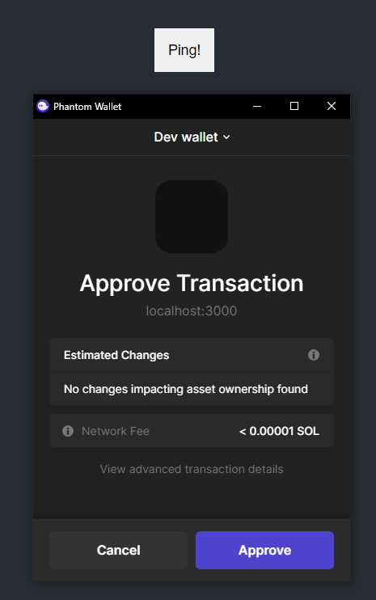

# 🦺 与程序交互

现在我们已经设置了钱包连接，让我们的 ping 按钮实际执行一些操作！

“PingButton.tsx”应如下所示：

```ts
import { useConnection, useWallet } from '@solana/wallet-adapter-react';
import * as Web3 from '@solana/web3.js'
import { FC } from 'react'
import styles from '../styles/PingButton.module.css'

const PROGRAM_ID = new Web3.PublicKey("ChT1B39WKLS8qUrkLvFDXMhEJ4F1XZzwUNHUt4AU9aVa")
const PROGRAM_DATA_PUBLIC_KEY = new Web3.PublicKey("Ah9K7dQ8EHaZqcAsgBW8w37yN2eAy3koFmUn4x3CJtod")

export const PingButton: FC = () => {
	const { connection } = useConnection();
	const { publicKey, sendTransaction } = useWallet();

	const onClick = () => {
		if (!connection || !publicKey) {
			alert("Please connect your wallet first lol")
			return
		}

		const transaction = new Web3.Transaction()

		const instruction = new Web3.TransactionInstruction({
			keys: [
				{
					pubkey: PROGRAM_DATA_PUBLIC_KEY,
					isSigner: false,
					isWritable: true
				},
			],
			programId: PROGRAM_ID,
		});

		transaction.add(instruction)
		sendTransaction(transaction, connection).then(sig => {
			console.log(`Explorer URL: https://explorer.solana.com/tx/${sig}?cluster=devnet`)
		})
	}

	return (
		<div className={styles.buttonContainer} onClick={onClick}>
			<button className={styles.button}>Ping!</button>
		</div>
	)
}
```

其中的一大堆内容对您来说应该非常熟悉 - 我们正在做与我们在本地客户端上所做的完全相同的事情，只是使用了 React hooks！


是时候测试一下了。确保您的钱包位于开发网络上 - 设置 -> 开发者设置 -> 更改网络。连接您的钱包并点击 ping 按钮，您将看到以下内容：



如果您点击确认，您的控制台将打印出交易链接。就像以前一样，滚动到底部，您会看到数字上升了🚀

您现在可以让用户与应用程序交互！您上一节制作的价值 1 万美元的产品？现在它是价值百万美元的产品。想想现有的所有程序 - Metaplex、Serum、Solana 程序库中的任何程序 - 您现在拥有将它们连接到 UI 并让人们使用它们的技能。我的朋友，你可以创造未来。

## 🚢 船舶挑战 - SOL 发送者

是时候锻炼一下肌肉了。

在此挑战中，使用[此起始代码](https://github.com/buildspace/solana-send-sol-frontend/tree/starter?utm_source=buildspace.so&utm_medium=buildspace_project)创建一个应用程序，让用户连接其 Phantom 钱包并将 SOL 发送到另一个帐户。确保克隆后使用 git checkout starter 切换到起始分支。

通过两个关键步骤来做到这一点：
- 将启动应用程序包装在适当的上下文提供程序中。
- 在表单组件中，设置交易并将其发送到用户的钱包以供批准。
最后它应该看起来像这样！


不要忘记验证地址！

完成后，将您的解决方案与此处的[解决方案代码](https://github.com/buildspace/solana-send-sol-frontend/tree/main?utm_source=buildspace.so&utm_medium=buildspace_project)进行比较。
