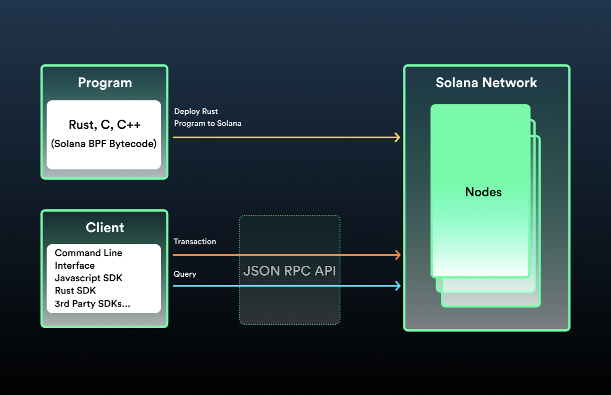
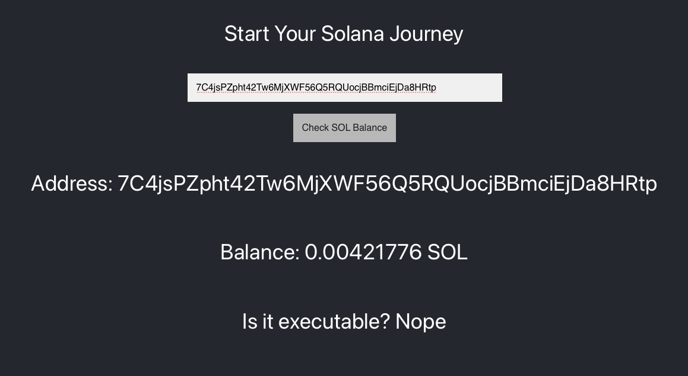

# 从 Solana 🤓 区块链读取数据

是时候回去了。一路回到幼儿园。还记得你学到的第一件事是什么吗？字母表。一旦你征服了全部 26 个，你就学会了如何阅读。这就是您成为 Solana 开发人员的旅程开始的地方。阅读英语的独特技能使您成为现在的咀嚼玻璃的超级大脑。

是时候再做一次了。我们将继续您好心的老师应该停下来的地方 - 从区块链中读取数据。

TL; DR

- 帐户(Accounts)就像 Solana 网络分类帐中的文件。**所有状态数据都存储在帐户中**。帐户可用于很多用途，但现在我们将重点关注存储 SOL 的帐户方面。
- SOL 是 Solana 原生代币的名称。
- Lamports 是分数 SOL，以 [Leslie Lamport](https://en.wikipedia.org/wiki/Leslie_Lamport) 命名。
- 公钥（通常称为地址）指向 Solana 网络上的帐户。虽然您必须拥有特定的密钥才能在帐户内执行某些功能，但任何人都可以使用公钥读取帐户数据。
- JSON RPC API：与 Solana 网络的所有交互都通过 [JSON RPC API](https://docs.solana.com/api/http) 进行。这实际上是一个带有 JSON 正文的 HTTP POST，表示您要调用的方法。
- @solana/web3.js 是 JSON RPC API 之上的抽象。它可以与 npm 一起安装，并允许您将 Solana 方法作为 JavaScript 函数调用。例如，您可以使用它来查询任何帐户的SOL余额：

```typescript
async function getBalanceUsingWeb3(address: PublicKey): Promise<number> {
    const connection = new Connection(clusterApiUrl('devnet'));
    return connection.getBalance(address);
}

const publicKey = new PublicKey('7C4jsPZpht42Tw6MjXWF56Q5RQUocjBBmciEjDa8HRtp')
getBalanceUsingWeb3(publicKey).then(balance => {
    console.log(balance)
})
```

## 概述

### Accounts

从 Solana 字母表开始，A 代表账户。我们从帐户开始，因为 Solana 上的智能合约（称为“程序”）是无状态的 - 这意味着它们除了代码之外不存储任何内容。一切都发生在账户中，因此它们是 Solana 的核心，它们用于存储、合约和本机区块链程序。

在本课程中，除了存储 SOL（Solana 的原生代币 - 稍后详细介绍）的能力之外，我们不会过多考虑帐户。但是，帐户还用于存储自定义数据结构和可以作为程序运行的可执行代码。您使用 Solana 所做的一切都会涉及到账户。

Solana 上有三种类型的账户
- 数据帐户 - 这些存储数据, LOL
- 程序帐户 - 这些存储可执行程序（又称智能合约）
- 原生账户 - 这些用于核心区块链功能，例如权益、投票

原生账户是区块链运行所需的，我们稍后将深入探讨。目前，我们将仅使用数据和程序帐户。

在数据帐户中，您还有两种类型

- 系统拥有的帐户
- PDA（程序派生地址）帐户

我们很快就会知道这些到底是什么™️，现在就继续吧。


每个帐户都带有许多您应该了解的字段：

| FIELD | 描述 |
| --- | --- |
| lamports |  该账户拥有的lamports数量 |
| 所有者 |  该帐户的程序所有者 |
| 可执行文件	| 该账户是否可以处理指令（可执行） |
| 数据	|  该账户存储的原始数据字节数组 |
| 租金纪元 | 该帐户将欠租金的下一个纪元 |

我们将只关注我们现在需要了解的内容，因此，如果某些内容没有意义，请继续前进 - 我们将在前进过程中开始填补空白。

Lamports 是 Solana 的最小单位。如果您熟悉以太坊生态系统，这有点像 Gwei。 1 lamport = 0.000000001 SOL，所以这个字段只是告诉我们该账户有多少 SOL。

每个帐户都有一个公钥 - 它就像帐户的地址一样。你知道你的钱包里有一个用来接收那些辛辣的 NFT 的地址吗？一样！ Solana 地址只是 base58 编码的字符串。

executable 是一个布尔字段，告诉我们该帐户是否包含可执行数据。数据是存储在帐户中的内容，租金我们稍后会支付！

现在让我们继续简单的事情:)

### Public Key

公钥通常称为地址。这些地址指向 Solana 网络上的帐户。如果您想运行特定程序或传输 SOL，则需要提供必要的公钥（或多个密钥）来执行此操作。

公钥为 256 位，通常显示为 base-58 编码字符串，例如 7C4jsPZpht42Tw6MjXWF56Q5RQUocjBBmciEjDa8HRtp。

### Solana JSON RPC API

好吧，我们知道什么是账户，我们如何阅读它们呢？我们将使用 JSON RPC 端点！查看此图，您将是这里的客户端，尝试从 Solana 网络读取内容。



您可以使用您想要的东西对 JSON RPC 进行 API 调用，它会与网络进行通信并为您提供好处。

与 Solana 网络的所有客户端交互都通过 Solana 的 [JSON RPC API](https://docs.solana.com/api/http) 进行。

根据 [JSON-RPC 2.0 规范](https://www.jsonrpc.org/specification)

> JSON-RPC 是一种无状态、轻量级远程过程调用 (RPC) 协议。该规范主要定义了几种数据结构及其处理规则。它与传输无关，因为这些概念可以在同一进程中、通过套接字、通过 http 或在许多不同的消息传递环境中使用。它使用 [JSON](https://www.json.org/) ([RFC 4627](https://www.ietf.org/rfc/rfc4627.txt)) 作为数据格式。

这里正在发生很多事情。我们正在发出一个 post 请求，其中主体具有告诉 RPC 做什么的特定参数。我们需要指定 RPC 的版本、id、方法（在本例中为 getBalance）以及该方法所需的参数（在本例中为地址）。


实际上，此规范仅涉及发送表示您要调用的方法的 JSON 对象。您可以使用套接字、http 等来实现此目的。

该 JSON 对象需要四个成员：

- jsonrpc - JSON RPC 版本号。这需要恰好是“2.0”。
- id - 您选择用于识别呼叫的标识符。这可以是字符串或整数。
- method - 您要调用的方法的名称。
- params - 包含方法调用期间要使用的参数的数组。

因此，如果您想在 Solana 网络上调用 getBalance 方法，您可以向 Solana 集群发送 HTTP 调用，如下所示：

```typescript
async function getBalanceUsingJSONRPC(address: string): Promise<number> {
    const url = clusterApiUrl('devnet')
    console.log(url);
    return fetch(url, {
        method: 'POST',
        headers: { 'Content-Type': 'application/json' },
        body: JSON.stringify({
            "jsonrpc": "2.0",
            "id": 1,
            "method": "getBalance",
            "params": [
                address
            ]
        })
    }).then(response => response.json())
    .then(json => {
        if (json.error) {
            throw json.error
        }

        return json['result']['value'] as number;
    })
    .catch(error => {
        throw error
    })
}
```

我们有一堆非常简单方法的样板，因此我们可以使用 Solana 的 Web3.js SDK。需要做的是：

```typescript
async function getBalanceUsingWeb3(address: PublicKey): Promise<number> {
    const connection = new Connection(clusterApiUrl('devnet'));
    return connection.getBalance(address);
}
```

那不是很漂亮吗？要获取某人的 Solana 余额，我们需要做的就是这三行。想象一下，获取任何人的银行余额是否都那么容易。

现在您知道如何从 Solana 上的帐户读取数据了！我知道这可能看起来微不足道，但仅使用这一功能，您就可以获取 Solana 上任何帐户的余额。想象一下，能够获得地球上任何银行账户的银行余额，这就是多么强大。


## Solana 的 Web3.js SDK

虽然 JSON-RPC API 足够简单，但它涉及大量繁琐的样板文件。为了简化通信过程，Solana Labs 创建了 @solana/web3.js SDK 作为 JSON-RPC API 之上的抽象。

Web3.js 允许您使用 JavaScript 函数调用 JSON-RPC API 方法。 SDK 提供了一套辅助函数和对象。我们将在本课程中逐步介绍很多 SDK，但我们不会深入讨论所有内容，因此请务必在某个时候查看[文档](https://docs.solana.com/developing/clients/javascript-reference)。


### 安装

在本课程中，我们将主要使用 npm。如何使用 npm 超出了本课程的范围，我们假设它是您经常使用的工具。如果情况并非如此，[请检查一下](https://nodesource.com/blog/an-absolute-beginners-guide-to-using-npm/)。

要安装 @solana/web3.js，请按照通常使用的方式设置项目：

npm 安装@solana/web3.js。

### 连接到网络

使用 @solana/web3.js 与 Solana 网络的每次交互都将通过 Connection 对象进行。该对象与 Solana 集群建立 JSON-RPC 连接（稍后将详细介绍集群）。现在，我们将使用 Devnet 集群的 url，而不是 Mainnet。顾名思义，该集群是为开发人员使用和测试而设计的。

```typescript
const connection = new Connection(clusterApiUrl('devnet'));
```

### 从网络读取

一旦有了 Connection 对象，查询网络就像调用适当的方法一样简单。例如，要获取特定地址的余额，您可以执行以下操作：

```typescript
async function getBalanceUsingWeb3(address: PublicKey): Promise<number> {
    const connection = new Connection(clusterApiUrl('devnet'));
    return connection.getBalance(address);
}
```

返回的余额采用小数 SOL 形式，称为“lamports”。单个 lamport 代表 0.000000001 SOL。大多数时候，在处理 SOL 时，系统会使用 lamports 而不是 SOL。 Web3.js 提供了常量 LAMPORTS_PER_SOL 来进行快速转换。

...就像这样，现在您知道如何从 Solana 区块链读取数据了！一旦我们进入自定义数据，事情就会变得更加复杂。但现在，让我们练习一下到目前为止所学到的知识。


## 🤑 构建一个余额获取器

是时候构建一个通用平衡获取器了（假设整个宇宙都在 Solana 上）。这将是一个简单但功能强大的应用程序，可以获取 Solana 上任何帐户的余额。


在工作区的某个位置创建一个文件夹。我把我的放在桌面上。克隆起始存储库并进行设置：

```bash
git clone https://github.com/buildspace/solana-intro-frontend.git
cd solana-intro-frontend
git checkout starter
npm i
```

这是一个简单的 Next.js 应用程序，因此一旦安装了所有依赖项，您就可以在终端中使用 npm run dev 启动它。您应该在本地主机上看到此内容：


我们为您提供了一个带有一些样式的普通 Next.js 应用程序，如果您在地址字段中输入一些内容并点击“检查 SOL 余额”按钮，您将看到余额为 1,000 SOL。是时候让它发挥作用了。

为了保持主题不变，我们不会完全从头开始工作。您可以在此处找到起始代码。入门项目使用 Next.js 和 Typescript。如果您习惯了不同的堆栈，请不要担心！您将在这些课程中学到的 web3 和 Solana 原则适用于您最熟悉的任何前端堆栈。

### 1. 确定方向

获得起始代码后，请四处查看。使用 `npm install` 安装依赖项，然后使用 `npm run dev` 运行应用程序。请注意，无论您在地址字段中输入什么内容，当您单击“检查 SOL 余额”时，余额都将是占位符值 1000。

从结构上讲，该应用程序由`index.tsx`和`AddressForm.tsx`组成。当用户提交表单时，`index.tsx` 中的 `addressSubscribedHandler` 被调用。这就是我们将添加逻辑来更新 UI 其余部分的地方。

### 2.安装依赖


使用 `npm install @solana/web3.js` 安装对 Solana Web3 库的依赖项。

### 3.设置地址余额

首先，在index.tsx顶部导入@solana/web3.js。

现在该库已可用，让我们进入 addressSubscribedHandler 并使用表单输入中的地址值创建 PublicKey 的实例。接下来，创建 Connection 的实例并使用它来调用 getBalance。传入您刚刚创建的公钥的值。最后调用setBalance，传入getBalance的结果。如果您愿意，请独立尝试，而不是从下面的代码片段中复制。

```typescript
import type { NextPage } from 'next'
import { useState } from 'react'
import styles from '../styles/Home.module.css'
import AddressForm from '../components/AddressForm'
import * as Web3 from '@solana/web3.js'

const Home: NextPage = () => {
  const [balance, setBalance] = useState(0)
  const [address, setAddress] = useState('')

  const addressSubmittedHandler = (address: string) => {
    const key = new Web3.PublicKey(address)
    setAddress(key.toBase58())

    const connection = new Web3.Connection(Web3.clusterApiUrl('devnet'))
    connection.getBalance(key).then(balance => {
      setBalance(balance / Web3.LAMPORTS_PER_SOL)
    })
  }

...

}
```

这里有一些新东西

- 我们使用 key.toBase58 设置地址。这是 Solana 地址作为字符串的编码。
- 我们正在连接到 devnet 网络。共有三个网络 - 主网、测试网和开发网。我们将使用 devnet 来处理所有事情。
- 我们将余额从 Lamports 转换为 SOL - 余额返回到 Lamports，而不是 SOL。

我们就完成了！如果您在此处粘贴地址，您将看到余额。确保您的帐户上有 devnet SOL！如果没有，您可以使用我的帐户来测试您的应用 - B1aLAAe4vW8nSQCetXnYqJfRxzTjnbooczwkUJAr7yMS 。


请注意，我们将 Solana 返回的余额除以 LAMPORTS_PER_SOL。 Lamport 是分数 SOL (0.000000001 SOL)。大多数时候，在处理 SOL 时，系统会使用 lamports 而不是 SOL。在这种情况下，网络返回的余额以 lamports 为单位。在将其设置为我们的状态之前，我们使用 LAMPORTS_PER_SOL 常量将其转换为 SOL。

此时，您应该能够在表单字段中输入有效地址，然后单击“检查 SOL 余额”以查看下面填充的地址和余额。

### 4. 处理无效地址

我们即将完成。唯一剩下的问题是，使用无效地址不会显示任何错误消息或更改显示的余额。如果打开开发者控制台，您将看到错误：无效的公钥输入。使用 PublicKey 构造函数时，需要传入有效的地址，否则会出现此错误。


为了解决这个问题，让我们将所有内容包装在 try-catch 块中，并在用户输入无效时提醒用户。

```typescript
const addressSubmittedHandler = (address: string) => {
  try {
    setAddress(address)
    const key = new Web3.PublicKey(address)
    const connection = new Web3.Connection(Web3.clusterApiUrl('devnet'))
    connection.getBalance(key).then(balance => {
      setBalance(balance / Web3.LAMPORTS_PER_SOL)
    })
  } catch (error) {
    setAddress('')
    setBalance(0)
    alert(error)
  }
}
```

请注意，在 catch 块中，我们还清除了地址和余额以避免混淆。

我们做到了！我们有一个正常运行的站点，可以从 Solana 网络读取 SOL 余额。您正在 Solana 上实现您的宏伟抱负。如果您需要花更多时间查看此代码以更好地理解它，请查看[完整的解决方案代码](https://github.com/Unboxed-Software/solana-intro-frontend)。坚持住，这些课程会很快增加。

## 挑战

由于这是第一个挑战，我们将保持简单。继续添加到我们已经创建的前端，在“余额”之后添加一个行项目。让行项目显示该帐户是否是可执行帐户。提示：有一个 getAccountInfo 方法。



要查明帐户是否可执行，您将：
- 使用方法 getAccountInfo 获取包含帐户信息的 JSON 对象
- 检查其属性以查明其是否可执行
- 添加另一个对 useState 的调用，让您可以根据帐户信息设置可执行属性值并将其显示在 UI 中


您的标准钱包地址将无法执行，因此如果您想要一个可执行测试的地址，请使用 CenYq6bDRB7p73EjsPEpiYN7uveyPUTdXkDkgUduboaN。

在您自己做出可靠的尝试之前，不要查看解决方案！这是 ezpz 柠檬汁。

如果您遇到困难，请随时查看[解决方案代码](https://github.com/Unboxed-Software/solana-intro-frontend/tree/challenge-solution)。
